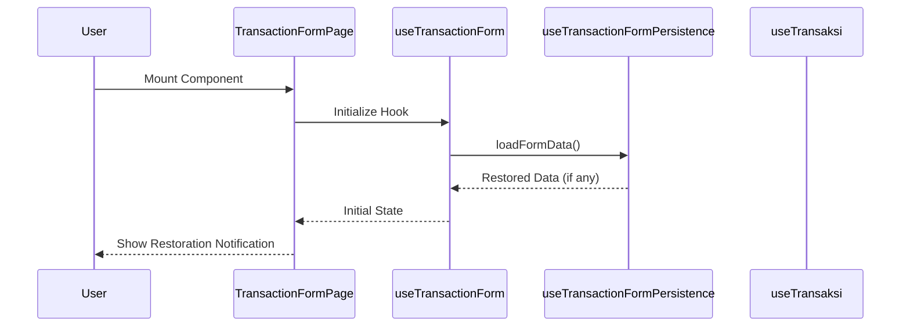
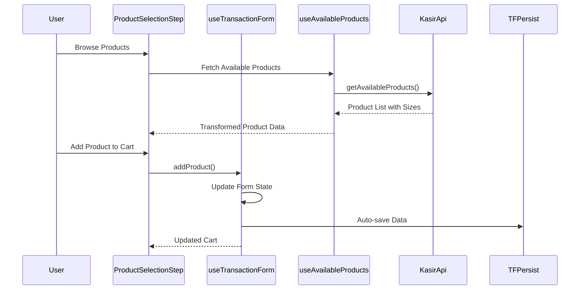
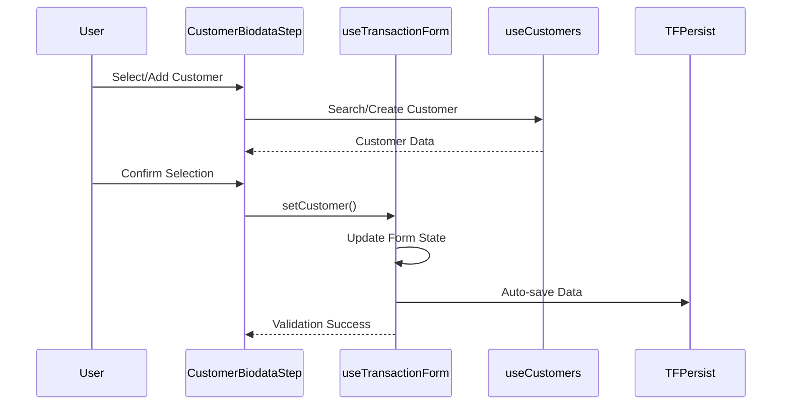
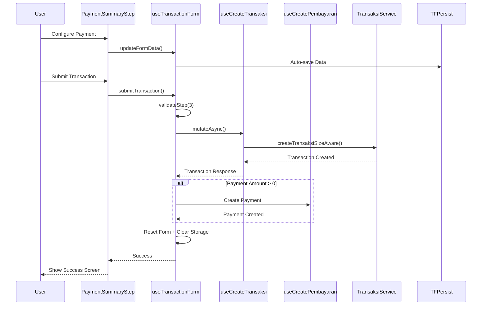

# Transaction Form System Analysis Report

## 📋 Executive Summary

Transaction Form adalah sistem inti dari fitur Kasir yang mengelola alur pembuatan transaksi rental pakaian. Sistem ini dirancang dengan arsitektur 3-tier modular monolith dengan fokus pada user experience, data persistence, error handling, dan inventory management yang size-aware.

## 🏗️ System Architecture Overview

### Frontend Layer (Presentation)
```
TransactionFormPage.tsx (Container)
├── Stepper Navigation
├── ProductSelectionStep.tsx (Step 1)
├── CustomerBiodataStep.tsx (Step 2)
└── PaymentSummaryStep.tsx (Step 3)
```

### State Management Layer (Business Logic)
```
useTransactionForm.ts (Central State)
├── Form Validation & Navigation
├── Product Management (add/remove/update)
├── Customer Data Handling
├── Payment Processing
└── Transaction Submission
```

### Data Persistence Layer
```
useTransactionFormPersistence.ts
├── Session Storage Management
├── Form Data Validation
├── Auto-save with Debouncing
└── Data Restoration Logic
```

### API Integration Layer
```
useTransaksi.ts + api.ts
├── React Query Cache Management
├── HTTP Client with Error Handling
├── Input Sanitization
├── Circuit Breaker Pattern
└── Retry Logic with Exponential Backoff
```

## 🔄 Complete Data Flow Analysis

### 1. Initialization Flow


### 2. Product Selection Flow (Step 1)


### 3. Customer Selection Flow (Step 2)


### 4. Payment & Submission Flow (Step 3)


## 🧠 Core Business Logic Analysis

### Size-Aware Inventory Management (RPK-51)

**TransaksiService.createTransaksiSizeAware()** mengimplementasikan pattern:

1. **Pre-validation Pattern**: Validasi stock di luar transaction
2. **Dual Inventory Update**: Update both legacy `Product.rentedStock` dan new `ProductSize.quantity`
3. **Race Condition Protection**: Double-check availability sebelum update
4. **Retry Logic**: Fallback mechanism untuk stock update failures

```typescript
// Phase 2: Pre-validation OUTSIDE transaction
await this.validateStockAvailability(data.items)

// Phase 3: Create transaction with MINIMAL operations INSIDE transaction
const transaksi = await this.prisma.$transaction(async (tx) => {
  // Create main transaction + items
  await Promise.all([
    this.updateProductSizeQuantities(tx, data.items),  // New system
    this.updateProductQuantities(tx, data.items)      // Legacy system
  ])
})
```

### Transaction Rollback Mechanism

**useTransactionForm.submitTransaction()** mengimplementasikan:

1. **Atomic Operations**: Transaction + Payment creation
2. **Retry Logic**: 3 attempts dengan exponential backoff
3. **Automatic Rollback**: Cancel transaction jika payment gagal
4. **Error Classification**: Payment error vs Transaction error vs Rollback error

```typescript
try {
  const createdTransaction = await createTransaksiMutation.mutateAsync(createRequest)

  // Payment creation with rollback
  await createPembayaranMutation.mutateAsync(paymentRequest)

  return true
} catch (error) {
  if (isPaymentError) {
    // Automatic rollback
    await updateTransaksiMutation.mutateAsync({
      kode: createdTransaction.kode,
      data: { status: 'cancelled' }
    })
  }
  return false
}
```

## 📦 Form State Management Patterns

### 1. Centralized State Architecture
```typescript
interface TransactionFormData {
  products: ProductSelection[]
  customer?: Customer
  pickupDate: string
  returnDate: string
  paymentMethod: 'cash' | 'qris' | 'transfer'
  paymentAmount: number
  paymentStatus: 'paid' | 'unpaid'
  notes?: string
}
```

### 2. Persistence Strategy
- **Session Storage**: Temporary data persistence
- **Auto-save**: 1 second debouncing
- **Version Control**: Storage versioning untuk compatibility
- **Age-based Cleanup**: Hapus data > 24 jam
- **Validation**: Strict data validation pada restore

### 3. Cache Management
```typescript
// React Query configuration
staleTime: 30 * 1000,      // 30 seconds for frequent updates
gcTime: 5 * 60 * 1000,     // 5 minutes garbage collection

// Cache invalidation on transaction success
queryClient.invalidateQueries({
  queryKey: queryKeys.kasir.produk.all(),
})
```

## 🛡️ Error Handling & Resilience Patterns

### 1. Circuit Breaker Pattern
```typescript
class CircuitBreaker {
  private failureCount = 0
  private state: 'CLOSED' | 'OPEN' | 'HALF_OPEN' = 'CLOSED'

  async execute<T>(operation: () => Promise<T>): Promise<T> {
    if (this.state === 'OPEN') {
      // Fail fast if circuit is open
      throw new KasirApiError('CIRCUIT_BREAKER_OPEN', ...)
    }
    // Execute operation with failure tracking
  }
}
```

### 2. Input Sanitization
```typescript
function sanitizePenyewaInput(input: Record<string, unknown>) {
  // Remove HTML tags, normalize whitespace
  // Validate phone numbers, emails
  // Length limits untuk prevent DoS
}
```

### 3. Retry Logic with Exponential Backoff
```typescript
for (let attempt = 0; attempt <= maxRetries; attempt++) {
  try {
    return await apiRequest<T>(endpoint, options)
  } catch (error) {
    const delay = baseDelay * Math.pow(2, attempt) + Math.random() * 1000
    await new Promise(resolve => setTimeout(resolve, delay))
  }
}
```

## 🔍 Component Interaction Analysis

### TransactionFormPage.tsx (Orchestrator)
**Responsibilities:**
- Stepper navigation management
- Error boundary handling
- Success/error screen display
- Data restoration notifications

**Key Features:**
- Responsive design dengan mobile cart toggle
- Progressive enhancement dengan fallback displays
- Comprehensive error mapping untuk user-friendly messages

### ProductSelectionStep.tsx (Product Management)
**Responsibilities:**
- Product browsing dengan filtering & pagination
- Cart management dengan size-aware selection
- Real-time stock validation
- Duplicate detection untuk size variants

**Key Features:**
- Dynamic pagination optimization
- Size-aware product display
- Cart sidebar dengan quantity controls
- Enhanced error handling untuk inventory conflicts

### PaymentSummaryStep.tsx (Payment Processing)
**Responsibilities:**
- Order review dengan detailed breakdown
- Payment method selection
- Currency formatting dengan auto-status calculation
- Form validation sebelum submission

**Key Features:**
- Quick payment buttons
- Automatic return date calculation
- Payment status auto-detection
- Comprehensive validation logic

## 📊 Performance Optimizations

### 1. Frontend Optimizations
- **React Query**: Intelligent caching dengan background refetch
- **Debounced Persistence**: Reduce storage operations
- **Component Memoization**: Prevent unnecessary re-renders
- **Lazy Loading**: Load product data on demand

### 2. Backend Optimizations
- **Pre-validation Pattern**: Reduce transaction timeout
- **Dual Inventory Updates**: Maintain consistency
- **Bulk Operations**: Minimize database queries
- **Connection Pooling**: Optimize database connections

### 3. Network Optimizations
- **Circuit Breaker**: Prevent cascade failures
- **Retry Logic**: Handle temporary failures
- **Request Batching**: Group related operations
- **Compression**: Optimize payload sizes

## 🔐 Security Considerations

### 1. Input Validation
- **XSS Prevention**: HTML tag removal
- **SQL Injection Prevention**: Parameterized queries via Prisma
- **Length Limits**: Prevent DoS attacks
- **Type Validation**: Runtime type checking

### 2. Data Protection
- **Session Storage**: Client-side only, non-sensitive data
- **API Authentication**: Clerk middleware protection
- **Input Sanitization**: Clean all user inputs
- **Error Message Sanitization**: Prevent information leakage

## 🚀 Scalability Assessment

### Current Strengths
- **Modular Architecture**: Easy feature extension
- **Separation of Concerns**: Maintainable codebase
- **Type Safety**: Comprehensive TypeScript usage
- **Error Boundaries**: Graceful failure handling

### Scaling Considerations
- **Database Indexing**: Critical for transaction queries
- **Cache Distribution**: Redis for multi-instance deployments
- **Load Balancing**: API route distribution
- **Background Jobs**: Async payment processing

## 📈 Monitoring & Analytics

### 1. Performance Metrics
```typescript
// Transaction completion tracking
const transactionDuration = Date.now() - transactionStartTime

// Cache hit/miss tracking
queryClient.invalidateQueries({ queryKey: queryKeys.kasir.produk.all() })
```

### 2. Error Tracking
```typescript
// Structured error logging
console.error('❌ Transaction submission failed', {
  errorType: 'TRANSACTION_FAILURE',
  errorMessage: error.message,
  timestamp: new Date().toISOString(),
  userId: clerkUser?.id
})
```

### 3. User Behavior Analytics
- Form abandonment rates
- Step completion times
- Error frequency analysis
- Feature usage patterns

## 🎯 Recommendations

### Immediate Improvements
1. **Implement Toast Notifications**: Replace console.error dengan user feedback
2. **Add Loading States**: Improve perceived performance
3. **Enhanced Mobile Experience**: Optimize cart for mobile devices
4. **Payment Gateway Integration**: Real payment processing

### Medium-term Enhancements
1. **Real-time Inventory**: WebSocket updates for stock changes
2. **Advanced Search**: Product search dengan filters
3. **Customer History**: Quick repeat customer selection
4. **Transaction Templates**: Pre-configured rental packages

### Long-term Architecture
1. **Microservices**: Separate transaction, inventory, and payment services
2. **Event Sourcing**: Immutable transaction logs
3. **CQRS Pattern**: Separate read/write models
4. **Multi-tenant**: Support untuk multiple rental businesses

## 📝 Conclusion

Transaction Form system demonstrates sophisticated architecture dengan comprehensive error handling, intelligent caching, and user-centric design. Size-aware inventory management dan transaction rollback mechanisms showcase production-ready patterns. Code base mengikuti best practices untuk maintainability, scalability, dan security.

Key strengths:
- **Resilient Architecture**: Circuit breakers, retry logic, error boundaries
- **User Experience**: Form persistence, validation feedback, progressive enhancement
- **Performance**: Intelligent caching, optimized queries, debounced operations
- **Maintainability**: Modular design, type safety, comprehensive logging

System siap untuk production deployment dengan recommended enhancements untuk improved user experience dan operational scalability.