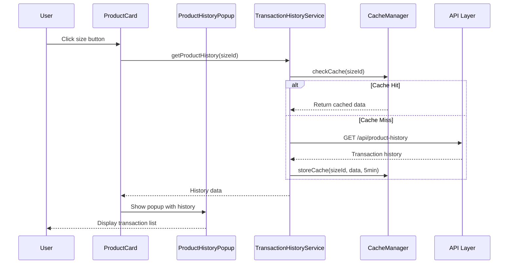

# Design Document

## Overview

The Availability Product View feature transforms the current rental inventory management system from immediate stock deduction to date-aware availability checking. This design implements a reservation-based system where stock is only deducted during pickup operations, enabling better inventory utilization for overlapping rental periods.

The system introduces a transaction history popup for product sizes and maintains full backward compatibility with existing workflows while adding sophisticated date-range availability validation.

## Architecture

### System Components

```mermaid
graph TB
    A[ProductCard Component] --> B[ProductHistoryPopup]
    A --> C[AvailabilityService]
    C --> D[TransactionHistoryService]
    C --> E[DateRangeValidator]
    D --> F[CacheManager]
    E --> G[OverlapDetector]
    
    H[TransaksiService] --> I[ModifiedStockFlow]
    I --> J[PickupService]
    I --> K[InventoryService]
    
    L[API Layer] --> M[/api/product-history]
    L --> N[/api/availability-check]
    
    subgraph "Existing Services (Preserved)"
        O[Current TransaksiService]
        P[Current PickupService]
        Q[Current InventoryService]
    end
```

### Data Flow Architecture



## Components and Interfaces

### 1. ProductHistoryPopup Component

**Purpose:** Display transaction history for a specific product size

**Interface:**
```typescript
interface ProductHistoryPopupProps {
  productSizeId: string
  productName: string
  size: string
  isOpen: boolean
  onClose: () => void
}

interface TransactionHistoryItem {
  transactionCode: string
  quantity: number
  startDate: Date
  endDate: Date
  status: 'active' | 'diambil' | 'selesai'
}
```

**Key Features:**
- 5-minute caching per product size
- Status filtering (active, diambil, selesai only)
- Date proximity sorting (closest to current date first)
- Loading states and error handling
- Responsive popup design

### 2. TransactionHistoryService

**Purpose:** Manage transaction history retrieval and caching

**Interface:**
```typescript
class TransactionHistoryService {
  async getProductSizeHistory(
    productSizeId: string,
    options?: {
      statuses?: TransactionStatus[]
      limit?: number
      sortBy?: 'date_proximity' | 'date_asc' | 'date_desc'
    }
  ): Promise<TransactionHistoryItem[]>
  
  async clearCache(productSizeId?: string): Promise<void>
  
  private formatTransactionDisplay(transaction: Transaction): string
  private calculateDateProximity(date: Date): number
}
```

**Caching Strategy:**
- In-memory cache with 5-minute TTL per product size
- Automatic cache invalidation on transaction updates
- Batch cache warming for frequently accessed sizes

### 3. Enhanced AvailabilityService (FIXED - ProductSize Support)

**Purpose:** Extend existing availability service with date-aware checking and ProductSize-specific validation

**New Methods:**
```typescript
interface DateRangeAvailabilityCheck {
  productId?: string      // Legacy support
  productSizeId?: string  // NEW: Size-specific validation
  requestedQuantity: number
  startDate: Date
  endDate: Date
}

class EnhancedAvailabilityService extends AvailabilityService {
  // FIXED: Now supports both productId and productSizeId
  async checkDateRangeAvailability(
    checks: Array<{ productId?: string; productSizeId?: string; quantity: number }>
  ): Promise<AvailabilityResult[]>
  
  // LEGACY: Product-level overlap detection
  async getOverlappingTransactions(
    productId: string,
    startDate: Date,
    endDate: Date
  ): Promise<OverlappingTransaction[]>
  
  // NEW: ProductSize-specific overlap detection
  async getOverlappingTransactionsByProductSize(
    productSizeId: string,
    startDate: Date,
    endDate: Date
  ): Promise<OverlappingTransaction[]>
  
  private detectDateOverlap(
    range1: DateRange,
    range2: DateRange
  ): boolean
}
```

**Key Improvements:**
- ✅ **ProductSize-Aware Validation:** Checks availability per specific size (M, L, XL) instead of entire product
- ✅ **Backward Compatibility:** Still supports legacy productId validation
- ✅ **Accurate Overlap Detection:** Uses `kondisiAwal` field to match exact productSizeId
- ✅ **Size-Specific Conflicts:** Error messages show which specific size has conflicts

### 4. Modified Stock Management Flow

**Current Flow (to be changed):**
```typescript
// OLD: Stock deducted immediately on transaction creation
POST /api/transaksi -> TransaksiService.create() -> InventoryService.updateStockOnCreate()
```

**New Flow:**
```typescript
// NEW: Stock deducted only on pickup
POST /api/transaksi -> TransaksiService.create() -> [NO STOCK DEDUCTION]
POST /api/pickup -> PickupService.process() -> InventoryService.updateStockOnCreate()
```

## Data Models

### Transaction History Cache Model

```typescript
interface CachedTransactionHistory {
  productSizeId: string
  data: TransactionHistoryItem[]
  cachedAt: Date
  expiresAt: Date
  version: number // For cache invalidation
}
```

### Date Range Overlap Model

```typescript
interface DateRange {
  startDate: Date
  endDate: Date
}

interface OverlapResult {
  hasOverlap: boolean
  overlapStart?: Date
  overlapEnd?: Date
  conflictingTransactions: string[] // Transaction codes
}
```

### Availability Check Result (FIXED)

```typescript
interface AvailabilityCheckResult {
  productId?: string        // Legacy support
  productSizeId?: string    // NEW: Size-specific result
  totalStock: number
  availableQuantity: number
  reservedQuantity: number // Reserved but not picked up
  conflicts: ConflictDetail[]
  canBook: boolean
}

interface ConflictDetail {
  transactionCode: string
  conflictQuantity: number
  conflictPeriod: DateRange
  productSizeId?: string    // NEW: Which specific size has conflict
}
```

## Correctness Properties

*A property is a characteristic or behavior that should hold true across all valid executions of a system-essentially, a formal statement about what the system should do. Properties serve as the bridge between human-readable specifications and machine-verifiable correctness guarantees.*

### Property Reflection

After analyzing all acceptance criteria, I identified several areas where properties can be consolidated:

**Redundancy Analysis:**
- Properties 1.2 and 4.2 both test status filtering - can be combined into one comprehensive property
- Properties 1.4 and 4.4 both test date proximity sorting - can be combined
- Properties 1.5 and 4.5 both test 5-minute caching - can be combined
- Properties 2.3, 2.4, 7.1, 7.2, 7.5 all test backward compatibility - can be combined
- Properties 5.1, 5.2, 5.4 all test error handling - can be combined into comprehensive error property
- Properties 6.1 and 6.4 both test caching behavior - can be combined

**Final Property Set (after consolidation):**

### Property 1: Transaction History Display
*For any* product size with transaction history, clicking the size button should display a popup containing only transactions with status 'active', 'diambil', or 'selesai', formatted as "TXN-XXX (N item) untuk DD-DD MMM", and sorted by date proximity to current date
**Validates: Requirements 1.1, 1.2, 1.3, 1.4**

### Property 2: Stock Management Flow Separation
*For any* transaction creation, the available stock quantities should remain unchanged, and stock should only be deducted during pickup operations
**Validates: Requirements 2.1, 2.2**

### Property 3: Date Range Availability Validation
*For any* set of booking requests with date ranges, the system should correctly detect overlapping periods and calculate available quantities based on existing active bookings using tglMulai and tglSelesai fields
**Validates: Requirements 3.1, 3.2, 3.4, 3.5**

### Property 4: API Response Structure and Caching
*For any* product size history request, the API should return transactions filtered by specified statuses, include transaction code/quantity/date range, sort by date proximity, and implement 5-minute caching
**Validates: Requirements 4.1, 4.2, 4.3, 4.4, 4.5**

### Property 5: Comprehensive Error Handling
*For any* error condition (availability check failure, API errors, network timeouts), the system should display appropriate user-friendly error messages with specific details and provide retry options where applicable
**Validates: Requirements 5.1, 5.2, 5.3, 5.4, 5.5**

### Property 6: Performance and Caching Behavior
*For any* availability data request, the system should cache results for 5 minutes per product size, support batch checking for multiple sizes, refresh data automatically on cache expiration, and handle concurrent checks without race conditions
**Validates: Requirements 6.1, 6.2, 6.3, 6.4, 6.5**

### Property 7: Backward Compatibility Preservation
*For any* existing transaction creation, pickup operation, or return process, all current APIs, service interfaces, database schema, rental durations (4-day/7-day), and inventory service functionality should remain unchanged and fully functional
**Validates: Requirements 7.1, 7.2, 7.3, 7.4, 7.5**

### Property 8: UI Integration Consistency
*For any* ProductCard component interaction, the new history functionality should integrate seamlessly while maintaining current layout, displaying loading states during availability checks, and using the existing error handling system
**Validates: Requirements 8.1, 8.2, 8.3, 8.4, 8.5**

### Property 9: Cache Invalidation Consistency
*For any* transaction status change or pickup operation, related product size caches should be invalidated automatically to ensure data consistency
**Validates: Requirements 6.4, 1.5**

### Property 10: Date Overlap Detection Accuracy
*For any* two date ranges, the overlap detection algorithm should correctly identify overlapping periods and calculate the exact overlap duration
**Validates: Requirements 3.1, 3.5**

## Error Handling

### Error Classification

```typescript
enum AvailabilityErrorType {
  PRODUCT_NOT_FOUND = 'PRODUCT_NOT_FOUND',
  INSUFFICIENT_STOCK = 'INSUFFICIENT_STOCK',
  DATE_OVERLAP_CONFLICT = 'DATE_OVERLAP_CONFLICT',
  CACHE_ERROR = 'CACHE_ERROR',
  NETWORK_TIMEOUT = 'NETWORK_TIMEOUT',
  API_ERROR = 'API_ERROR'
}

interface AvailabilityError {
  type: AvailabilityErrorType
  message: string
  details?: Record<string, unknown>
  retryable: boolean
}
```

### Error Handling Strategy

1. **Network Errors:** Automatic retry with exponential backoff (max 3 attempts)
2. **Cache Errors:** Fallback to direct API calls, log for monitoring
3. **Availability Conflicts:** Clear error messages with available quantities
4. **API Errors:** User-friendly messages with technical details in logs
5. **Timeout Errors:** Retry options with loading indicators

### User Experience Error Patterns

```typescript
// Error message templates
const ERROR_MESSAGES = {
  INSUFFICIENT_STOCK: (available: number, requested: number) => 
    `Stok tidak mencukupi. Tersedia: ${available}, Diminta: ${requested}`,
  
  DATE_CONFLICT: (conflictingTransactions: string[]) =>
    `Produk sudah dibooking untuk periode ini: ${conflictingTransactions.join(', ')}`,
    
  NETWORK_ERROR: () =>
    'Koneksi bermasalah. Silakan coba lagi.',
    
  LOADING_TIMEOUT: () =>
    'Memuat data terlalu lama. Coba refresh halaman.'
}
```

## Testing Strategy

### Dual Testing Approach

The system requires both unit tests and property-based tests to ensure comprehensive coverage:

**Unit Tests:** Focus on specific examples, edge cases, and integration points
- Component rendering with different data states
- API endpoint responses with known data
- Cache behavior with specific timing scenarios
- Error handling with known error conditions

**Property-Based Tests:** Verify universal properties across all inputs
- Transaction history formatting for any valid transaction data
- Date overlap detection for any two date ranges
- Stock management flow for any transaction creation/pickup sequence
- Caching behavior for any product size and timing combination

### Property Test Configuration

Each property test will run a minimum of 100 iterations using a property-based testing library:

**For TypeScript/JavaScript:** Use `fast-check` library
```typescript
// Example property test structure
import fc from 'fast-check'

describe('Availability Product View Properties', () => {
  it('Property 1: Transaction History Display', () => {
    fc.assert(fc.property(
      fc.array(transactionGenerator()),
      fc.string(), // product size ID
      (transactions, sizeId) => {
        // Test that history display works for any transaction set
        const result = formatTransactionHistory(transactions, sizeId)
        return result.every(item => 
          ['active', 'diambil', 'selesai'].includes(item.status) &&
          item.displayText.match(/^TXN-\w+ \(\d+ item\) untuk \d+-\d+ \w+$/)
        )
      }
    ))
  })
})
```

**Test Tags:** Each property test will include a comment referencing the design property:
```typescript
// Feature: availability-product-view, Property 1: Transaction History Display
// Feature: availability-product-view, Property 2: Stock Management Flow Separation
```

### Integration Testing Strategy

1. **API Integration:** Test all new endpoints with real database
2. **Component Integration:** Test ProductCard with ProductHistoryPopup
3. **Service Integration:** Test AvailabilityService with TransactionHistoryService
4. **Cache Integration:** Test caching behavior across service boundaries
5. **Backward Compatibility:** Test existing workflows remain functional

### Performance Testing

1. **Cache Performance:** Verify 5-minute cache TTL and hit rates
2. **Query Performance:** Ensure transaction history queries complete within 500ms
3. **Concurrent Access:** Test multiple users accessing same product size
4. **Memory Usage:** Monitor cache memory consumption
5. **API Response Times:** Ensure all endpoints respond within 2 seconds

### Error Scenario Testing

1. **Network Failures:** Simulate API timeouts and connection errors
2. **Cache Failures:** Test fallback behavior when cache is unavailable
3. **Database Errors:** Test handling of database connection issues
4. **Invalid Data:** Test with malformed transaction data
5. **Concurrent Conflicts:** Test race conditions in availability checking