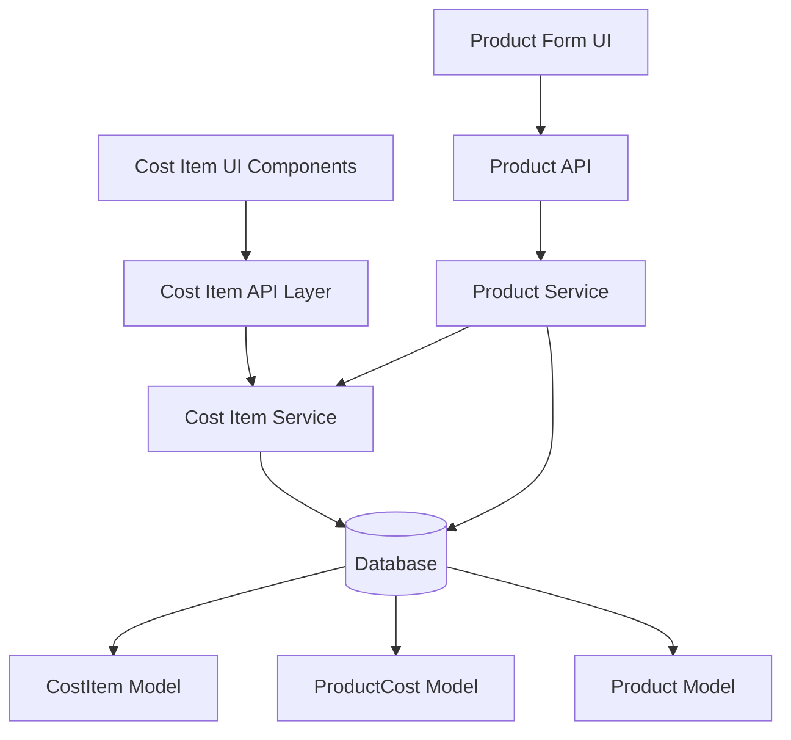

# Design Document: Cost Item Management System

## Overview

The Cost Item Management System replaces the limited Material system with a flexible solution for managing various production costs. The system supports materials, transportation, tailoring, catering, and other expenses through a unified interface with automatic modal awal calculation.

## Architecture

### System Components



### Data Flow

1. **Cost Item Management**: Users create and manage cost items through dedicated UI
2. **Product Integration**: Product forms use cost item selector to assign costs
3. **Automatic Calculation**: Modal awal is calculated automatically from sum of product costs
4. **Real-time Updates**: UI updates modal awal immediately when costs change

## Components and Interfaces

### Database Models

#### CostItem Model
```typescript
interface CostItem {
  id: string
  name: string           // "Kain Katun Premium", "Transport Jakarta", "Penjahit Budi"
  createdAt: Date
  updatedAt: Date
  createdBy: string
}
```

#### ProductCost Model
```typescript
interface ProductCost {
  id: string
  productId: string
  costItemId: string
  amount: number         // Direct cost amount input by user
  notes?: string         // Optional notes
  createdAt: Date
  updatedAt: Date
}
```

### Service Layer

#### CostItemService
```typescript
class CostItemService {
  // CRUD operations
  createCostItem(request: CreateCostItemRequest): Promise<CostItem>
  updateCostItem(id: string, request: UpdateCostItemRequest): Promise<CostItem>
  getCostItems(query: CostItemQueryParams): Promise<CostItemListResponse>
  getCostItemById(id: string): Promise<CostItem>
  deleteCostItem(id: string): Promise<boolean>
  
  // Business operations
  getActiveCostItems(): Promise<CostItem[]>
  getCostItemUsage(id: string): Promise<CostItemWithUsage>
}
```

#### ProductCostService
```typescript
class ProductCostService {
  // Product cost management
  addProductCost(productId: string, request: AddProductCostRequest): Promise<ProductCost>
  updateProductCost(id: string, request: UpdateProductCostRequest): Promise<ProductCost>
  removeProductCost(id: string): Promise<boolean>
  getProductCosts(productId: string): Promise<ProductCost[]>
  
  // Modal calculation
  calculateModalAwal(productId: string): Promise<number>
  recalculateModalAwal(productId: string): Promise<Product>
}
```

### API Endpoints

#### Cost Item Endpoints
- `GET /api/cost-items` - List cost items with pagination and search
- `POST /api/cost-items` - Create new cost item
- `GET /api/cost-items/:id` - Get cost item by ID
- `PUT /api/cost-items/:id` - Update cost item
- `DELETE /api/cost-items/:id` - Delete cost item

#### Product Cost Endpoints
- `GET /api/products/:id/costs` - Get product costs
- `POST /api/products/:id/costs` - Add cost to product
- `PUT /api/product-costs/:id` - Update product cost
- `DELETE /api/product-costs/:id` - Remove product cost

### UI Components

#### CostItemSelector Component
```typescript
interface CostItemSelectorProps {
  selectedCosts: ProductCostFormData[]
  onCostsChange: (costs: ProductCostFormData[]) => void
  onModalAwalChange: (amount: number) => void
}
```

Features:
- Searchable dropdown for cost item selection
- Add/remove multiple cost items
- Amount input with currency formatting
- Real-time modal awal calculation display
- Validation for positive amounts

#### CostItemManagement Pages
- **List Page**: Paginated table with search and actions
- **Create/Edit Form**: Simple form with name field only
- **Delete Confirmation**: Warning if cost item is used in products

## Data Models

### Database Schema Changes

#### New Models
```sql
-- CostItem table
CREATE TABLE cost_items (
  id UUID PRIMARY KEY DEFAULT uuid_generate_v4(),
  name VARCHAR(255) NOT NULL UNIQUE,
  created_at TIMESTAMP DEFAULT NOW(),
  updated_at TIMESTAMP DEFAULT NOW(),
  created_by VARCHAR(255) NOT NULL
);

-- ProductCost table  
CREATE TABLE product_costs (
  id UUID PRIMARY KEY DEFAULT uuid_generate_v4(),
  product_id UUID NOT NULL REFERENCES products(id) ON DELETE CASCADE,
  cost_item_id UUID NOT NULL REFERENCES cost_items(id) ON DELETE RESTRICT,
  amount DECIMAL(12,2) NOT NULL CHECK (amount > 0),
  notes TEXT,
  created_at TIMESTAMP DEFAULT NOW(),
  updated_at TIMESTAMP DEFAULT NOW(),
  UNIQUE(product_id, cost_item_id)
);
```

#### Indexes
```sql
-- Performance indexes
CREATE INDEX idx_cost_items_name ON cost_items(name);
CREATE INDEX idx_cost_items_created_by ON cost_items(created_by);
CREATE INDEX idx_product_costs_product_id ON product_costs(product_id);
CREATE INDEX idx_product_costs_cost_item_id ON product_costs(cost_item_id);
```

#### Product Model Changes
```sql
-- Remove material-related fields
ALTER TABLE products DROP COLUMN material_id;
ALTER TABLE products DROP COLUMN material_quantity;
ALTER TABLE products DROP COLUMN material_cost;

-- Modal awal remains but becomes calculated field
-- (no schema change needed, just business logic change)
```

### Migration Strategy

#### Phase 1: Create New Models
1. Create CostItem and ProductCost tables
2. Add indexes for performance
3. Migrate existing Material data to CostItem

#### Phase 2: Update Application Logic
1. Implement CostItemService and ProductCostService
2. Update ProductService to use ProductCost for modal calculation
3. Create new UI components

#### Phase 3: Remove Old System
1. Remove Material model and related code
2. Clean up unused imports and functions
3. Update all references to use new system

## Error Handling

### Business Logic Errors
- **Duplicate Cost Item**: Return 409 Conflict when creating cost item with existing name
- **Cost Item In Use**: Return 409 Conflict when trying to delete cost item used in products
- **Invalid Amount**: Return 400 Bad Request for negative or zero amounts
- **Not Found**: Return 404 for non-existent cost items or product costs

### Validation Errors
- **Empty Name**: Reject cost items with empty or whitespace-only names
- **Name Length**: Enforce maximum 255 character limit for cost item names
- **Amount Format**: Validate decimal format and positive values
- **Required Fields**: Validate all required fields are present

### Error Response Format
```typescript
interface ErrorResponse {
  error: string
  message: string
  details?: Record<string, string>
  timestamp: string
}
```

## Testing Strategy

### Unit Testing
- Test CostItemService CRUD operations
- Test ProductCostService modal calculation logic
- Test validation schemas and error handling
- Test UI component behavior and state management

### Integration Testing
- Test API endpoints with database operations
- Test modal awal calculation across service boundaries
- Test migration scripts with sample data
- Test UI integration with backend services

### Property-Based Testing
Property-based tests will validate universal correctness properties across all inputs using a minimum of 100 iterations per test.

## Correctness Properties

*A property is a characteristic or behavior that should hold true across all valid executions of a system-essentially, a formal statement about what the system should do. Properties serve as the bridge between human-readable specifications and machine-verifiable correctness guarantees.*

### Core CRUD Properties

**Property 1: Cost Item CRUD Operations Integrity**
*For any* valid cost item data, all CRUD operations (create, read, update, delete) should maintain data integrity and return consistent results
**Validates: Requirements 1.1**

**Property 2: Cost Item Creation with Name Only**
*For any* valid name string, cost item creation should succeed with only the name field provided
**Validates: Requirements 1.2**

**Property 3: Case-Insensitive Search**
*For any* cost item name and any case variation of that name, search should return the same results regardless of case
**Validates: Requirements 1.3**

**Property 4: Pagination Consistency**
*For any* dataset and any valid page size configuration, pagination should return consistent results and correct metadata
**Validates: Requirements 1.4**

### Business Logic Properties

**Property 5: Deletion Prevention for Used Cost Items**
*For any* cost item that is referenced by product costs, deletion attempts should be rejected with appropriate error
**Validates: Requirements 1.5, 6.3**

**Property 6: Multiple Cost Items Per Product**
*For any* product and any set of cost items, the system should allow adding multiple cost items to the same product
**Validates: Requirements 2.1**

**Property 7: Decimal Amount Acceptance**
*For any* valid decimal number, the system should accept it as a cost amount with proper precision
**Validates: Requirements 2.2**

**Property 8: Modal Awal Automatic Recalculation**
*For any* product with cost items, when any cost amount is added, modified, or removed, modal awal should immediately reflect the sum of all current cost amounts
**Validates: Requirements 2.3, 2.5**

**Property 9: Modal Awal Sum Calculation**
*For any* product with associated cost items, modal awal should always equal the mathematical sum of all product cost amounts
**Validates: Requirements 2.4**

### Migration Properties

**Property 10: Material to Cost Item Migration Integrity**
*For any* material data, migration to cost item should preserve all essential information without data loss
**Validates: Requirements 3.1**

**Property 11: Material Name Preservation**
*For any* material with a name, migration should create a cost item with exactly the same name
**Validates: Requirements 3.2**

**Property 12: Migration Data Integrity**
*For any* data state before migration, all relationships and constraints should remain valid after migration completion
**Validates: Requirements 3.5**

### API Properties

**Property 13: RESTful API Compliance**
*For any* cost item operation, API endpoints should follow REST conventions for HTTP methods, status codes, and resource naming
**Validates: Requirements 4.1**

**Property 14: Input Validation Consistency**
*For any* API request, input data should be validated against schemas with consistent acceptance/rejection behavior
**Validates: Requirements 4.2**

**Property 15: Error Response Consistency**
*For any* error condition, the system should return appropriate HTTP status codes and consistent error message formats
**Validates: Requirements 4.3, 4.4**

**Property 16: API Response Format Consistency**
*For any* successful API response, the format should follow consistent structure patterns across all endpoints
**Validates: Requirements 4.5**

### UI Properties

**Property 17: Cost Item Search in Dropdown**
*For any* search query in the cost item selector, results should include all cost items matching the query case-insensitively
**Validates: Requirements 5.2**

**Property 18: Currency Formatting Consistency**
*For any* valid amount input, the system should format it consistently as currency according to locale standards
**Validates: Requirements 5.3**

**Property 19: Real-time Modal Awal Display**
*For any* cost modification in the UI, the modal awal display should update immediately to reflect the new total
**Validates: Requirements 5.4**

**Property 20: Add/Remove Cost Item Operations**
*For any* valid cost item, the UI should allow adding it to and removing it from any product without errors
**Validates: Requirements 5.5**

### Validation Properties

**Property 21: Cost Item Name Uniqueness**
*For any* existing cost item name, attempts to create another cost item with the same name should be rejected
**Validates: Requirements 6.1**

**Property 22: Positive Amount Validation**
*For any* non-positive number (zero or negative), cost amount input should be rejected with appropriate validation error
**Validates: Requirements 6.2**

**Property 23: Name Content Validation**
*For any* string that is empty or contains only whitespace characters, cost item name validation should reject it
**Validates: Requirements 6.4**

**Property 24: Name Length Validation**
*For any* string exceeding the maximum length limit, cost item name validation should reject it with appropriate error
**Validates: Requirements 6.5**

### System Properties

**Property 25: Error Logging Consistency**
*For any* error condition that occurs, appropriate error information should be logged with consistent format and detail level
**Validates: Requirements 7.5**
