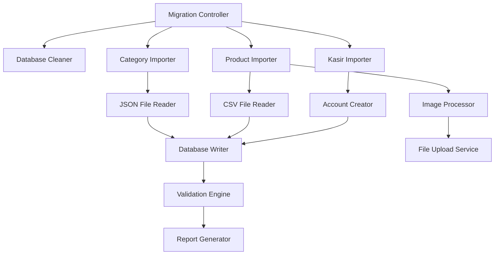

# Database Real Data Migration Design

## Overview

The database real data migration system provides a comprehensive solution for transitioning from development/test data to production-ready real data. The system consists of multiple import scripts that handle categories, products, images, and kasir accounts, with robust error handling, validation, and reporting capabilities.

## Architecture

The migration system follows a modular architecture with the following components:



## Components and Interfaces

### 1. Migration Controller
- **Purpose**: Orchestrates the entire migration process
- **Interface**: Command-line interface with dry-run and production modes
- **Dependencies**: All importer components

### 2. Database Cleaner
- **Purpose**: Safely removes existing test data
- **Interface**: `cleanDatabase(): Promise<CleanupResult>`
- **Features**: 
  - Respects foreign key constraints
  - Creates backup before deletion
  - Provides detailed cleanup report

### 3. Category Importer
- **Purpose**: Imports categories from JSON files
- **Interface**: `importCategories(): Promise<ImportResult>`
- **Data Source**: `prisma/seed/categories.json`
- **Features**: Duplicate detection, validation

### 4. Product Importer
- **Purpose**: Imports products from CSV files with image processing
- **Interface**: `importProducts(productType: string): Promise<ImportResult>`
- **Data Sources**: 
  - CSV files in `public/CSV/`
  - Images in `public/products/`
- **Features**: Image upload, size normalization, relationship management

### 5. Kasir Importer
- **Purpose**: Creates initial kasir accounts
- **Interface**: `importKasir(): Promise<ImportResult>`
- **Features**: Creates accounts for Ina, Naya, Tiara with proper defaults

### 6. File Upload Service
- **Purpose**: Handles image uploads to Supabase storage
- **Interface**: `uploadProductImage(buffer: Buffer, filename: string): Promise<UploadResult>`
- **Features**: Fallback to default images, error handling

## Data Models

### ImportResult Interface
```typescript
interface ImportResult {
  success: boolean
  total: number
  imported: number
  skipped: number
  failed: number
  errors: Array<{
    id: string
    name: string
    error: string
  }>
}
```

### Migration Configuration
```typescript
interface MigrationConfig {
  isDryRun: boolean
  productType?: string
  userId: string
  backupEnabled: boolean
  validateIntegrity: boolean
}
```

## Correctness Properties

*A property is a characteristic or behavior that should hold true across all valid executions of a system-essentially, a formal statement about what the system should do. Properties serve as the bridge between human-readable specifications and machine-verifiable correctness guarantees.*

### Property 1: Database Cleanup Completeness
*For any* database cleanup operation, all test data should be removed while preserving database structure and constraints
**Validates: Requirements 1.1**

### Property 2: Category Import Integrity
*For any* valid categories JSON file, all categories should be imported with correct relationships and no data corruption
**Validates: Requirements 1.2**

### Property 3: Product-Category Relationship Consistency
*For any* imported product, the categoryId should reference an existing category in the database
**Validates: Requirements 2.5**

### Property 4: Image Upload Fallback Behavior
*For any* product with missing or failed image upload, the system should use the default placeholder image
**Validates: Requirements 2.3, 2.4**

### Property 5: CSV Data Parsing Accuracy
*For any* valid CSV file in the specified directory, all product records should be parsed and imported with correct data types
**Validates: Requirements 2.1**

### Property 6: Dry-Run Mode Safety
*For any* migration operation in dry-run mode, the database state should remain unchanged after execution
**Validates: Requirements 3.2**

### Property 7: Error Logging and Continuation
*For any* import error during processing, the system should log detailed error information and continue with remaining records
**Validates: Requirements 3.3**

### Property 8: Kasir Account Default Values
*For any* created kasir account, the isActive field should be set to true by default
**Validates: Requirements 4.2**

### Property 9: Duplicate Handling Idempotency
*For any* migration run multiple times, no duplicate records should be created in the database
**Validates: Requirements 4.4, 5.3**

### Property 10: Database Integrity Validation
*For any* completed migration, all foreign key constraints and database relationships should remain valid
**Validates: Requirements 5.5**

## Error Handling

### 1. File System Errors
- Missing CSV files: Log error and skip product type
- Missing images: Use default placeholder image
- Permission errors: Provide clear error messages with resolution steps

### 2. Database Errors
- Connection failures: Retry with exponential backoff
- Constraint violations: Log detailed error and continue with next record
- Transaction failures: Rollback and provide recovery instructions

### 3. Data Validation Errors
- Invalid CSV format: Log line number and error details
- Missing required fields: Skip record and log error
- Invalid relationships: Validate before import and provide clear error messages

### 4. Upload Errors
- Supabase upload failures: Fall back to default image and log error
- Network timeouts: Retry with exponential backoff
- Storage quota exceeded: Provide clear error message and fallback

## Testing Strategy

### Unit Testing
- Test individual importer functions with mock data
- Validate CSV parsing with various input formats
- Test error handling with simulated failures
- Verify data transformation and normalization functions

### Property-Based Testing
- Use **fast-check** library for TypeScript property testing
- Configure each property test to run minimum 100 iterations
- Test with randomly generated valid and invalid data
- Verify system behavior across wide range of inputs

**Property Testing Requirements:**
- Each correctness property must be implemented as a single property-based test
- Tests must be tagged with format: **Feature: database-real-data-migration, Property {number}: {property_text}**
- Tests should generate realistic test data that matches production scenarios
- Error conditions should be tested with invalid inputs and simulated failures

### Integration Testing
- Test complete migration workflow end-to-end
- Verify database state after each import phase
- Test rollback and recovery procedures
- Validate cross-component interactions

### Performance Testing
- Test import performance with large datasets
- Verify memory usage during bulk operations
- Test concurrent access scenarios
- Validate system behavior under resource constraints