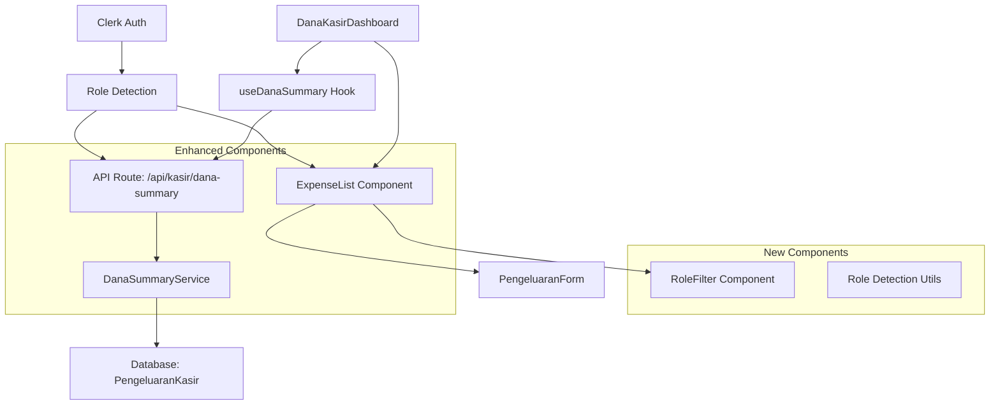
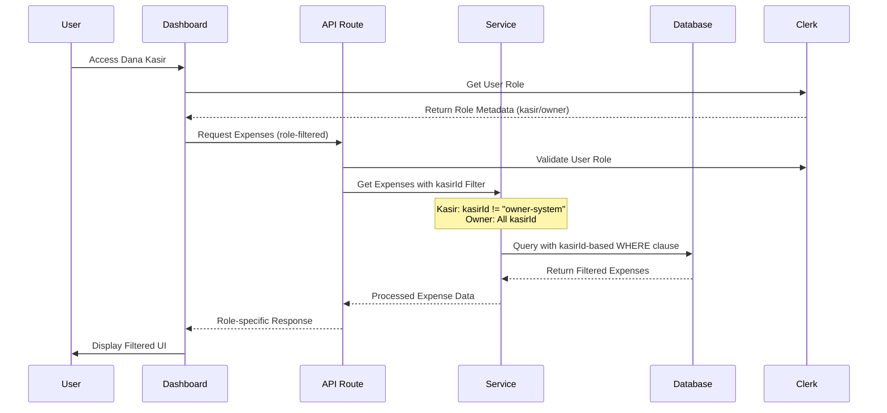

# Design Document

## Overview

Role-based Expense Management extends the existing Dana Kasir system to provide role-specific expense visibility and management. The design leverages existing database schema with a special "Owner" kasir account (kasirId: "owner-system") and Clerk authentication to implement granular access control without requiring major architectural changes.

The system uses kasirId-based filtering for visibility (Kasir users see only kasirId != "owner-system", Owner users see all) while maintaining createdBy-based ownership for edit/delete permissions.

## Architecture

### System Components



### Data Flow



## Components and Interfaces

### 1. Enhanced ExpenseList Component

**New Props:**
```typescript
interface ExpenseListProps {
  // Existing props...
  expenses: PengeluaranKasir[]
  isLoading?: boolean
  canWrite?: boolean
  onAdd?: () => void
  onEdit?: (expense: PengeluaranKasir) => void
  onDelete?: (expense: PengeluaranKasir) => void
  onRefresh?: () => void
  selectedKasirName?: string | null
  
  // New props for role-based functionality
  userRole: 'kasir' | 'owner'
  onRoleFilterChange?: (role: 'all' | 'kasir' | 'owner') => void
  selectedRoleFilter?: 'all' | 'kasir' | 'owner'
}
```

**UI Structure Enhancement:**
```typescript
// Header layout with role filter
<div className="flex items-center justify-between">
  <div className="flex items-center gap-2">
    <ShoppingCart className="w-5 h-5 text-orange-600" />
    <h2 className="text-lg font-semibold text-gray-900">Pengeluaran</h2>
  </div>
  <div className="flex items-center gap-3">
    <span className="text-sm font-medium text-gray-600">{filteredCount} item</span>
    
    {/* NEW: Role Filter (Owner only) */}
    {userRole === 'owner' && (
      <RoleFilter 
        value={selectedRoleFilter} 
        onChange={onRoleFilterChange}
      />
    )}
    
    {canWrite && (
      <button onClick={onAdd} className="...">
        <Plus className="w-4 h-4" />
        Tambah
      </button>
    )}
  </div>
</div>
```

### 2. New RoleFilter Component

```typescript
interface RoleFilterProps {
  value: 'all' | 'kasir' | 'owner'
  onChange: (role: 'all' | 'kasir' | 'owner') => void
  disabled?: boolean
}

export function RoleFilter({ value, onChange, disabled }: RoleFilterProps) {
  const options = [
    { value: 'all', label: 'Semua' },
    { value: 'kasir', label: 'Kasir' },
    { value: 'owner', label: 'Owner' }
  ]
  
  return (
    <select 
      value={value}
      onChange={(e) => onChange(e.target.value as 'all' | 'kasir' | 'owner')}
      disabled={disabled}
      className="text-sm border border-gray-300 rounded-lg px-3 py-2 bg-white"
    >
      {options.map(option => (
        <option key={option.value} value={option.value}>
          {option.label}
        </option>
      ))}
    </select>
  )
}
```

### 3. Enhanced DanaSummaryService

**New Method Signatures:**
```typescript
class DanaSummaryService {
  // Enhanced methods with role-based filtering
  async getDailySummary(
    date: Date, 
    kasirId?: string, 
    userRole?: 'kasir' | 'owner'
  ): Promise<DailySummary>
  
  async getExpenseList(
    date: Date, 
    kasirId?: string, 
    userRole?: 'kasir' | 'owner',
    roleFilter?: 'all' | 'kasir' | 'owner'
  ): Promise<PengeluaranKasir[]>
  
  async getDailyData(
    date: Date, 
    kasirId?: string, 
    userRole?: 'kasir' | 'owner',
    roleFilter?: 'all' | 'kasir' | 'owner'
  )
  
  // New utility methods
  private buildKasirIdBasedWhereClause(
    baseWhere: any, 
    userRole: 'kasir' | 'owner',
    roleFilter?: 'all' | 'kasir' | 'owner'
  ): any
  private isOwnerExpense(kasirId: string): boolean
}
}
```

### 4. Role Detection Utilities

```typescript
// utils/roleDetection.ts
export interface UserRole {
  userId: string
  role: 'kasir' | 'owner'
  name?: string
}

export async function getUserRole(userId: string): Promise<UserRole> {
  const user = await clerkClient.users.getUser(userId)
  const role = user.publicMetadata.role as 'kasir' | 'owner'
  
  if (!role || !['kasir', 'owner'].includes(role)) {
    throw new Error('Invalid or missing user role')
  }
  
  return {
    userId,
    role,
    name: user.firstName || user.username || 'Unknown'
  }
}

export async function getUsersByRole(role: 'kasir' | 'owner'): Promise<string[]> {
  // Implementation to get all users with specific role
  // This might require caching for performance
  const users = await clerkClient.users.getUserList({
    limit: 100 // Adjust as needed
  })
  
  return users
    .filter(user => user.publicMetadata.role === role)
    .map(user => user.id)
}
```

## Data Models

### Enhanced API Response Types

```typescript
// Existing types remain unchanged
interface DailySummary {
  totalIncome: number
  totalExpense: number  // Now role-filtered
  netBalance: number    // Now role-calculated
  date: string
}

interface PengeluaranKasir {
  id: string
  kasirId: string
  harga: number
  kategori: ExpenseCategory
  deskripsi?: string
  isActive: boolean
  createdAt: Date
  updatedAt: Date
  createdBy: string  // Used for role determination
  kasir?: {
    id: string
    nama: string
  }
}

// New types for role-based functionality
interface RoleBasedExpenseQuery {
  date: Date
  kasirId?: string
  userRole: 'kasir' | 'owner'
  roleFilter?: 'all' | 'kasir' | 'owner'
}

interface ExpenseVisibilityRules {
  canView: boolean
  canEdit: boolean
  canDelete: boolean
  canCreate: boolean
}
```

### Database Query Patterns

```typescript
// kasirId-based WHERE clause building for visibility
const buildExpenseWhereClause = (
  baseWhere: any,
  userRole: 'kasir' | 'owner',
  roleFilter?: 'all' | 'kasir' | 'owner'
) => {
  let roleBasedWhere = { ...baseWhere }
  
  if (userRole === 'kasir') {
    // Kasir can only see non-owner expenses
    roleBasedWhere.kasirId = {
      not: 'owner-system'
    }
  } else if (userRole === 'owner') {
    // Owner can see all, but can filter by role
    if (roleFilter === 'kasir') {
      roleBasedWhere.kasirId = {
        not: 'owner-system'
      }
    } else if (roleFilter === 'owner') {
      roleBasedWhere.kasirId = 'owner-system'
    }
    // If roleFilter === 'all' or undefined, no additional filtering
  }
  
  return roleBasedWhere
}

// Permission checking for edit/delete operations
const canUserModifyExpense = (
  expense: PengeluaranKasir,
  userRole: 'kasir' | 'owner',
  userClerkId: string
): boolean => {
  // Must be created by the same user
  if (expense.createdBy !== userClerkId) {
    return false
  }
  
  // Role-based kasirId validation
  if (userRole === 'kasir') {
    return expense.kasirId !== 'owner-system'
  } else if (userRole === 'owner') {
    return expense.kasirId === 'owner-system'
  }
  
  return false
}
  }
  
  return roleBasedWhere
}
```

## Correctness Properties

*A property is a characteristic or behavior that should hold true across all valid executions of a system-essentially, a formal statement about what the system should do. Properties serve as the bridge between human-readable specifications and machine-verifiable correctness guarantees.*

### Property Reflection

After analyzing all acceptance criteria, I identified several properties that can be consolidated to eliminate redundancy:

- Properties 1.1 and 1.2 (expense creation for different roles) can be combined into a single property about expense creation integrity
- Properties 3.1 and 3.2 (kasir edit/delete permissions) can be combined into a single permission property
- Properties 3.3 and 3.4 (owner edit/delete permissions) can be combined into a single permission property
- Properties 5.3 and 5.4 (net balance calculations) can be combined with 5.1 and 5.2 (summary calculations) as they test the same underlying logic
- Properties 8.2 and 8.3 (API compatibility) can be combined into a single backward compatibility property

### Core Properties

**Property 1: Expense Creation Integrity**
*For any* user with valid role (kasir or owner), when creating an expense, the createdBy field should contain the user's Clerk ID and kasirId should be set appropriately (owner-system for owners, selected kasir for kasir users)
**Validates: Requirements 1.1, 1.2, 1.6**

**Property 2: Category Access Equality**
*For any* user role (kasir or owner), all existing expense categories should be available for selection
**Validates: Requirements 1.5**

**Property 3: Role-based Expense Visibility**
*For any* kasir user, the expense list should contain only expenses where kasirId != "owner-system", and for any owner user, the expense list should contain all expenses regardless of kasirId
**Validates: Requirements 2.1, 2.2**

**Property 4: Income Filter Preservation**
*For any* user role, the kasir filter functionality for income data should work identically to the original system
**Validates: Requirements 2.4, 8.3**

**Property 5: Combined Filter Behavior**
*For any* kasir user applying kasir filter, the results should be filtered within their visible expense scope (kasirId != "owner-system") only
**Validates: Requirements 2.5**

**Property 6: Role-based Edit Permissions**
*For any* user, edit operations should only be allowed on expenses where createdBy matches user's Clerk ID and kasirId matches user's role scope (kasir: kasirId != "owner-system", owner: kasirId = "owner-system")
**Validates: Requirements 3.1, 3.2, 3.3, 3.4**

**Property 7: Owner Role Filter Functionality**
*For any* owner user, selecting "Semua" should show all expenses, "Kasir" should show only expenses where kasirId != "owner-system", and "Owner" should show only expenses where kasirId = "owner-system"
**Validates: Requirements 4.3, 4.4, 4.5**

**Property 8: Role Filter State Persistence**
*For any* role filter selection, the filter should persist when changing dates but reset when changing kasir filter
**Validates: Requirements 4.7**

**Property 9: Role-based Summary Calculations**
*For any* kasir user, totalExpense and netBalance should include only expenses where kasirId != "owner-system", and for any owner user, totalExpense and netBalance should include all expenses
**Validates: Requirements 5.1, 5.2, 5.3, 5.4**

**Property 10: Income Calculation Preservation**
*For any* user role, income calculations should remain identical to the original system
**Validates: Requirements 5.5**

**Property 11: API Role Detection**
*For any* authenticated API request, the system should correctly extract and validate user role from Clerk metadata
**Validates: Requirements 6.1, 6.4**

**Property 12: API Data Filtering**
*For any* API request from kasir users, only expenses where kasirId != "owner-system" should be returned, and for any API request from owner users, all expenses should be returned
**Validates: Requirements 6.2, 6.3**

**Property 13: UI Count Consistency**
*For any* role filter selection, the displayed expense count should match the number of filtered expense items
**Validates: Requirements 7.3**

**Property 14: Feature Preservation**
*For any* existing expense list functionality (categories, amounts, descriptions, timestamps), the behavior should remain unchanged
**Validates: Requirements 7.4**

**Property 15: Graceful Legacy Handling**
*For any* existing expense without clear role attribution, the system should handle it without errors by treating kasirId != "owner-system" as kasir expenses
**Validates: Requirements 8.1**

**Property 16: API Backward Compatibility**
*For any* existing API endpoint and response format, the structure should remain unchanged
**Validates: Requirements 8.2**

<function_calls>
<invoke name="prework">
<parameter name="featureName">role-based-expense-management

## Error Handling

### API Level Error Handling

**Role Detection Errors:**
```typescript
// 401 Unauthorized - Invalid or missing authentication
{
  success: false,
  error: {
    message: 'Authentication required',
    code: 'UNAUTHORIZED'
  }
}

// 403 Forbidden - Invalid role or role mismatch
{
  success: false,
  error: {
    message: 'Invalid user role or insufficient permissions',
    code: 'INVALID_ROLE'
  }
}
```

**Data Access Errors:**
```typescript
// 400 Bad Request - Invalid role filter parameter
{
  success: false,
  error: {
    message: 'Invalid role filter value',
    code: 'INVALID_ROLE_FILTER',
    details: 'Role filter must be one of: all, kasir, owner'
  }
}
```

### Client Level Error Handling

**Role Detection Failures:**
- Graceful fallback to read-only mode if role cannot be determined
- Clear error messages for users with invalid or missing roles
- Automatic retry mechanism for transient Clerk API failures

**Permission Errors:**
- Hide action buttons for unauthorized operations
- Show contextual messages when users attempt unauthorized actions
- Graceful degradation when role-based features fail

### Legacy Data Handling

**Existing Expenses Without Clear Role Attribution:**
```typescript
const handleLegacyExpense = (expense: PengeluaranKasir) => {
  // Strategy 1: Try to match createdBy with known user IDs
  const userRole = await getUserRoleByClerkId(expense.createdBy)
  if (userRole) {
    return userRole
  }
  
  // Strategy 2: Fallback to kasir role for backward compatibility
  return 'kasir'
}
```

## Testing Strategy

### Dual Testing Approach

The system will use both unit tests and property-based tests to ensure comprehensive coverage:

**Unit Tests:**
- Specific role-based scenarios and edge cases
- UI component behavior with different role props
- API endpoint responses for specific user roles
- Error handling for invalid role scenarios
- Legacy data migration scenarios

**Property-Based Tests:**
- Universal properties across all user roles and expense combinations
- Role-based filtering behavior with randomized data sets
- Permission validation across all possible user-expense combinations
- Summary calculation correctness with varied expense distributions
- API response consistency across different role configurations

### Property Test Configuration

**Testing Framework:** Jest with fast-check for property-based testing
**Minimum Iterations:** 100 per property test
**Test Data Generation:**
- Random user roles (kasir/owner)
- Random expense data with varied creators
- Random date ranges and kasir filters
- Random role filter combinations

**Property Test Tags:**
Each property test must reference its design document property:
- **Feature: role-based-expense-management, Property 1: Expense Creation Integrity**
- **Feature: role-based-expense-management, Property 2: Category Access Equality**
- And so on for all 16 properties...

### Integration Testing

**End-to-End Scenarios:**
- Complete user workflows for both kasir and owner roles
- Role filter interactions with existing kasir filters
- Summary calculation accuracy across role transitions
- Permission enforcement across all CRUD operations

**Performance Testing:**
- Role-based query performance with large datasets
- Clerk API integration performance under load
- UI responsiveness during role filter changes

### Security Testing

**Role Validation:**
- Attempt to access data with mismatched roles
- Verify role parameter tampering protection
- Test role escalation prevention
- Validate Clerk metadata integrity

**Data Isolation:**
- Verify kasir users cannot access owner expenses
- Test API endpoint security with role-based access
- Validate client-side permission enforcement

## Implementation Notes

### Database Considerations

**No Schema Changes Required:**
- Leverage existing `createdBy` field for role determination
- Use Clerk user metadata for role information
- Maintain backward compatibility with existing data

**Query Optimization:**
- Add composite indexes for role-based queries if needed
- Consider caching user role mappings for performance
- Optimize role-based WHERE clause generation

### Performance Considerations

**Clerk API Integration:**
- Cache user role information to reduce API calls
- Implement efficient role lookup mechanisms
- Handle Clerk API rate limits gracefully

**Database Query Efficiency:**
- Use efficient kasirId-based filtering in database queries
- Leverage existing kasirId indexes for optimal performance
- Implement proper pagination for large expense lists
- Consider adding composite index on (kasirId, createdAt) if needed

### Security Considerations

**Role-based Access Control:**
- Validate roles server-side, never trust client-side role information
- Implement proper authorization checks at API level
- Use Clerk's built-in security features for role management

**Data Privacy:**
- Ensure kasir users cannot access expenses with kasirId = "owner-system"
- Implement proper audit logging for role-based operations
- Validate all role-based operations against user permissions and kasirId scope

## Migration Strategy

### Existing Data Compatibility

**Phase 1: Backward Compatible Implementation**
- Implement role-based features without breaking existing functionality
- Handle legacy expenses gracefully by treating kasirId != "owner-system" as kasir expenses
- Maintain existing API contracts and response formats
- Ensure Owner_Kasir_Account ("owner-system") exists in kasir table

**Phase 2: Data Enhancement (Optional)**
- Optionally enhance existing expense records with proper kasirId attribution
- Implement data migration scripts if needed
- Provide admin tools for role-based data management

### Deployment Strategy

**Feature Flags:**
- Use feature flags to enable role-based functionality gradually
- Allow rollback to original behavior if issues arise
- Test role-based features with subset of users initially

**Monitoring:**
- Monitor kasirId-based query performance
- Track role detection success rates
- Alert on role-based permission errors
- Monitor Owner_Kasir_Account usage patterns
- Track role detection success rates
- Alert on role-based permission errors

This design provides a comprehensive foundation for implementing role-based expense management while maintaining system stability and backward compatibility.