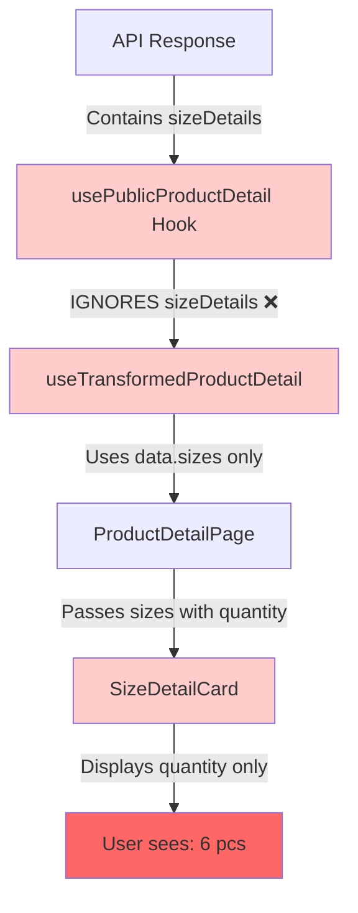
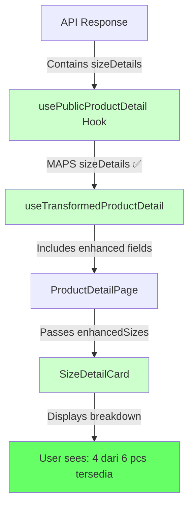
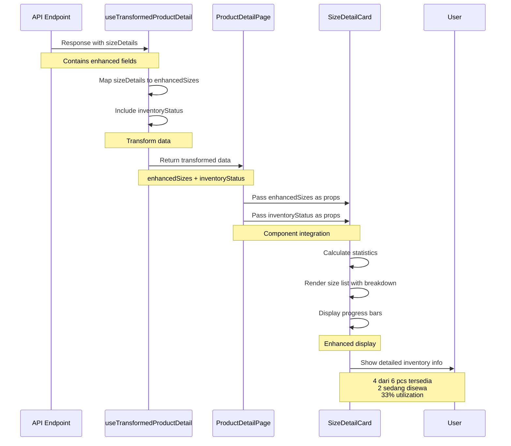
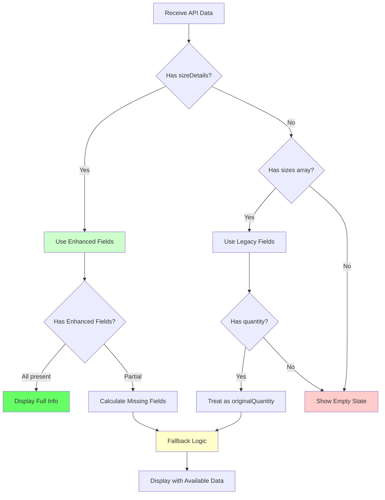

# Size Detail Card Inventory Enhancement - Visual Diagrams

## 1. Current vs Expected Data Flow

### Current Flow (INCORRECT)



### Expected Flow (CORRECT)



## 2. Component Architecture

```mermaid
graph LR
    A[ProductDetailPage] -->|productId| B[useTransformedProductDetail]
    B -->|API call| C[/api/public/products/id]
    C -->|Response| D[API Data]
    D -->|Transform| E[Enhanced Data]
    E -->|Props| F[SizeDetailCard]
    
    subgraph "API Response"
        D -->|sizeDetails| G[Enhanced Fields]
        D -->|inventoryStatus| H[Overall Status]
    end
    
    subgraph "Transformed Data"
        E -->|enhancedSizes| I[Mapped Sizes]
        E -->|inventoryStatus| J[Status Info]
    end
    
    subgraph "Component Display"
        F -->|Render| K[Size List]
        F -->|Render| L[Statistics]
        F -->|Render| M[Progress Bars]
    end
```

## 3. Data Structure Transformation

### API Response Structure

```
┌─────────────────────────────────────────────────────────┐
│ API Response: /api/products/[id]                 │
├─────────────────────────────────────────────────────────┤
│ {                                                        │
│   id: "3fa344e0-...",                                   │
│   name: "Dress Pesta Merah",                            │
│   sizes: [                          ← Legacy array      │
│     {                                                    │
│       id: "d0b09c4c-...",                               │
│       ageCategory: "ADULT",                             │
│       size: "XL",                                       │
│       quantity: 6,              ← Legacy field          │
│       originalQuantity: 6,      ← Enhanced field        │
│       rentedQuantity: 2,        ← Enhanced field        │
│       availableQuantity: 4      ← Enhanced field        │
│     }                                                    │
│   ],                                                     │
│   sizeDetails: [                    ← Enhanced array    │
│     {                                                    │
│       id: "d0b09c4c-...",                               │
│       ageCategory: "ADULT",                             │
│       size: "XL",                                       │
│       originalQuantity: 6,                              │
│       rentedQuantity: 2,                                │
│       availableQuantity: 4,                             │
│       utilizationRate: 33.33,                           │
│       isAvailable: true                                 │
│     }                                                    │
│   ],                                                     │
│   inventoryStatus: {                ← Overall status    │
│     totalOriginal: 20,                                  │
│     totalAvailable: 16,                                 │
│     totalRented: 4,                                     │
│     utilizationRate: 20,                                │
│     isHealthy: true                                     │
│   }                                                      │
│ }                                                        │
└─────────────────────────────────────────────────────────┘
```

### Hook Transformation (CURRENT - INCORRECT)

```
┌─────────────────────────────────────────────────────────┐
│ useTransformedProductDetail (CURRENT)                    │
├─────────────────────────────────────────────────────────┤
│ const transformedData = {                                │
│   ...data,                                               │
│   totalQuantity: data.sizes.reduce(                      │
│     (sum, size) => sum + size.quantity, 0                │
│   ),                                  ← Uses legacy      │
│   availabilityInfo: {                                    │
│     isInStock: data.sizes.some(                          │
│       size => size.quantity > 0                          │
│     )                                 ← Uses legacy      │
│   }                                                       │
│   // ❌ sizeDetails NOT MAPPED                           │
│   // ❌ inventoryStatus NOT INCLUDED                     │
│ }                                                         │
└─────────────────────────────────────────────────────────┘
```

### Hook Transformation (EXPECTED - CORRECT)

```
┌─────────────────────────────────────────────────────────┐
│ useTransformedProductDetail (EXPECTED)                   │
├─────────────────────────────────────────────────────────┤
│ const transformedData = {                                │
│   ...data,                                               │
│   enhancedSizes: data.sizeDetails?.map(detail => ({     │
│     id: detail.id,                                       │
│     size: detail.size,                                   │
│     ageCategory: detail.ageCategory,                     │
│     originalQuantity: detail.originalQuantity,           │
│     rentedQuantity: detail.rentedQuantity,               │
│     availableQuantity: detail.availableQuantity,         │
│     utilizationRate: detail.utilizationRate,             │
│     isAvailable: detail.isAvailable,                     │
│     quantity: detail.originalQuantity  ← Backward compat │
│   })) || data.sizes,              ← Fallback to legacy  │
│   inventoryStatus: data.inventoryStatus,  ← Include     │
│   availabilityInfo: {                                    │
│     isInStock: data.inventoryStatus?.totalAvailable > 0  │
│   }                               ← Use enhanced         │
│ }                                                         │
└─────────────────────────────────────────────────────────┘
```

## 4. Component Interface Evolution

### Current Interface (INCORRECT)

```typescript
┌─────────────────────────────────────────────────────────┐
│ interface SizeItem {                                     │
│   size: string                                           │
│   ageCategory: string                                    │
│   quantity: number        ← Only legacy field            │
│ }                                                         │
│                                                           │
│ interface SizeDetailCardProps {                          │
│   sizes: SizeItem[]                                      │
│   title?: string                                         │
│   showStats?: boolean                                    │
│   showProgress?: boolean                                 │
│   context?: 'public' | 'admin'                           │
│   editable?: boolean                                     │
│ }                                                         │
└─────────────────────────────────────────────────────────┘
```

### Expected Interface (CORRECT)

```typescript
┌─────────────────────────────────────────────────────────┐
│ interface EnhancedSizeItem {                             │
│   size: string                                           │
│   ageCategory: string                                    │
│   quantity: number        ← Legacy support               │
│   originalQuantity?: number    ← Enhanced field          │
│   rentedQuantity?: number      ← Enhanced field          │
│   availableQuantity?: number   ← Enhanced field          │
│   utilizationRate?: number     ← Enhanced field          │
│   isAvailable?: boolean        ← Enhanced field          │
│ }                                                         │
│                                                           │
│ interface SizeDetailCardProps {                          │
│   sizes: EnhancedSizeItem[]                              │
│   inventoryStatus?: {          ← New prop                │
│     totalOriginal: number                                │
│     totalAvailable: number                               │
│     totalRented: number                                  │
│     utilizationRate: number                              │
│     isHealthy: boolean                                   │
│   }                                                       │
│   title?: string                                         │
│   showStats?: boolean                                    │
│   showProgress?: boolean                                 │
│   context?: 'public' | 'admin'                           │
│   editable?: boolean                                     │
│ }                                                         │
└─────────────────────────────────────────────────────────┘
```

## 5. Display Logic Comparison

### Current Display Logic

```
┌─────────────────────────────────────────────────────────┐
│ Current Display (INCORRECT)                              │
├─────────────────────────────────────────────────────────┤
│                                                           │
│ <Badge variant={size.quantity > 0 ? "secondary" : "outline"}>
│   {size.quantity} pcs                                    │
│ </Badge>                                                 │
│                                                           │
│ Result: "6 pcs"                                          │
│                                                           │
│ ❌ No breakdown                                          │
│ ❌ No rented info                                        │
│ ❌ No utilization                                        │
└─────────────────────────────────────────────────────────┘
```

### Expected Display Logic

```
┌─────────────────────────────────────────────────────────┐
│ Expected Display (CORRECT)                               │
├─────────────────────────────────────────────────────────┤
│                                                           │
│ <div className="space-y-2">                              │
│   {/* Availability Info */}                              │
│   <div className="flex justify-between">                 │
│     <span className="font-medium">                       │
│       {availableQuantity} dari {originalQuantity} pcs   │
│       tersedia                                           │
│     </span>                                              │
│     <Badge variant={availableQuantity > 0 ? "success" : "destructive"}>
│       {availableQuantity > 0 ? "Tersedia" : "Habis"}    │
│     </Badge>                                             │
│   </div>                                                 │
│                                                           │
│   {/* Rented Info */}                                    │
│   {rentedQuantity > 0 && (                               │
│     <div className="text-sm text-orange-600">           │
│       {rentedQuantity} sedang disewa                     │
│     </div>                                               │
│   )}                                                     │
│                                                           │
│   {/* Utilization Progress */}                           │
│   <div className="space-y-1">                            │
│     <Progress value={utilizationRate} className="h-2" />│
│     <div className="text-xs text-gray-500">             │
│       {utilizationRate.toFixed(0)}% utilization          │
│     </div>                                               │
│   </div>                                                 │
│ </div>                                                   │
│                                                           │
│ Result:                                                  │
│ "4 dari 6 pcs tersedia"                                 │
│ "2 sedang disewa"                                        │
│ [████░░░░░░] 33% utilization                            │
│                                                           │
│ ✅ Clear breakdown                                       │
│ ✅ Shows rented info                                     │
│ ✅ Visual utilization                                    │
└─────────────────────────────────────────────────────────┘
```

## 6. Visual Mockup Comparison

### Current UI (INCORRECT)

```
┌─────────────────────────────────────────────────────────┐
│ 📦 Detail Ketersediaan Ukuran                           │
├─────────────────────────────────────────────────────────┤
│ Statistics:                                             │
│ 4 Variasi | 4 Tersedia | 20 Total Stok                │
├─────────────────────────────────────────────────────────┤
│ 👥 Dewasa                                    4 ukuran   │
│ ┌─────────────────────────────────────────────────────┐ │
│ │ Dewasa - Size M                      [✓]   5 pcs   │ │
│ │                                                     │ │
│ ├─────────────────────────────────────────────────────┤ │
│ │ Dewasa - Size L                      [✓]   4 pcs   │ │
│ │                                                     │ │
│ ├─────────────────────────────────────────────────────┤ │
│ │ Dewasa - Size XL                     [✓]   6 pcs   │ │
│ │                                                     │ │
│ └─────────────────────────────────────────────────────┘ │
├─────────────────────────────────────────────────────────┤
│ 🧒 Anak                                      1 ukuran   │
│ ┌─────────────────────────────────────────────────────┐ │
│ │ Anak - Size XS                       [✓]   5 pcs   │ │
│ │                                                     │ │
│ └─────────────────────────────────────────────────────┘ │
└─────────────────────────────────────────────────────────┘

❌ Problems:
- Shows "6 pcs" for XL but doesn't clarify 2 are rented
- Shows "5 pcs" for XS but doesn't clarify 2 are rented
- No visual indication of utilization
- User can't tell what's actually available
```

### Expected UI (CORRECT)

```
┌─────────────────────────────────────────────────────────┐
│ 📦 Detail Ketersediaan Ukuran                           │
├─────────────────────────────────────────────────────────┤
│ Statistics:                                             │
│ 4 Variasi | 4 Tersedia | 20 Total Stok                │
│ 💡 Overall: 16 dari 20 pcs tersedia (4 sedang disewa)  │
├─────────────────────────────────────────────────────────┤
│ 👥 Dewasa                            15 pcs (2 disewa)  │
│ ┌─────────────────────────────────────────────────────┐ │
│ │ Dewasa - Size M              [✅ Tersedia]          │ │
│ │ 5 dari 5 pcs tersedia                              │ │
│ │ [██████████] 0% utilization                        │ │
│ ├─────────────────────────────────────────────────────┤ │
│ │ Dewasa - Size L              [✅ Tersedia]          │ │
│ │ 4 dari 4 pcs tersedia                              │ │
│ │ [██████████] 0% utilization                        │ │
│ ├─────────────────────────────────────────────────────┤ │
│ │ Dewasa - Size XL             [⚠️ Sebagian]          │ │
│ │ 4 dari 6 pcs tersedia                              │ │
│ │ 2 sedang disewa                                    │ │
│ │ [████░░░░░░] 33% utilization                       │ │
│ └─────────────────────────────────────────────────────┘ │
├─────────────────────────────────────────────────────────┤
│ 🧒 Anak                               5 pcs (2 disewa)  │
│ ┌─────────────────────────────────────────────────────┐ │
│ │ Anak - Size XS                [⚠️ Sebagian]          │ │
│ │ 3 dari 5 pcs tersedia                              │ │
│ │ 2 sedang disewa                                    │ │
│ │ [████░░░░░░] 40% utilization                       │ │
│ └─────────────────────────────────────────────────────┘ │
└─────────────────────────────────────────────────────────┘

✅ Benefits:
- Clear availability: "4 dari 6 pcs tersedia"
- Shows rented quantity: "2 sedang disewa"
- Visual utilization: Progress bar at 33%
- Color-coded badges: ✅ Tersedia, ⚠️ Sebagian, ❌ Habis
- Better user understanding and decision making
```

## 7. Color Coding System

```
┌─────────────────────────────────────────────────────────┐
│ Availability Status Color Coding                        │
├─────────────────────────────────────────────────────────┤
│                                                           │
│ ✅ FULLY AVAILABLE (Green)                               │
│ Condition: availableQuantity = originalQuantity          │
│ Badge: bg-green-100 text-green-600 border-green-200     │
│ Progress: bg-green-500                                   │
│ Example: 5 dari 5 pcs tersedia (0% utilization)         │
│                                                           │
│ ⚠️ PARTIALLY AVAILABLE (Yellow/Orange)                   │
│ Condition: 0 < availableQuantity < originalQuantity      │
│ Badge: bg-yellow-100 text-yellow-600 border-yellow-200  │
│ Progress: bg-yellow-500 (< 50%) or bg-orange-500 (≥ 50%)│
│ Example: 4 dari 6 pcs tersedia (33% utilization)        │
│                                                           │
│ ❌ OUT OF STOCK (Red)                                    │
│ Condition: availableQuantity = 0                         │
│ Badge: bg-red-100 text-red-600 border-red-200           │
│ Progress: bg-red-500                                     │
│ Example: 0 dari 6 pcs tersedia (100% utilization)       │
│ Additional: Opacity 60%, disabled styling                │
│                                                           │
└─────────────────────────────────────────────────────────┘
```

## 8. Utilization Rate Visualization

```
┌─────────────────────────────────────────────────────────┐
│ Utilization Rate Progress Bar                           │
├─────────────────────────────────────────────────────────┤
│                                                           │
│ 0% - 30% (Low Utilization - Green)                      │
│ [███░░░░░░░] 20%                                         │
│ Status: Healthy, plenty available                        │
│                                                           │
│ 31% - 60% (Medium Utilization - Yellow)                 │
│ [█████░░░░░] 50%                                         │
│ Status: Moderate, some rented                            │
│                                                           │
│ 61% - 80% (High Utilization - Orange)                   │
│ [███████░░░] 70%                                         │
│ Status: High demand, limited availability                │
│                                                           │
│ 81% - 100% (Very High Utilization - Red)                │
│ [█████████░] 90%                                         │
│ Status: Almost full, very limited availability           │
│                                                           │
│ 100% (Fully Rented - Red)                               │
│ [██████████] 100%                                        │
│ Status: Out of stock, all items rented                   │
│                                                           │
└─────────────────────────────────────────────────────────┘
```

## 9. Responsive Layout

```
┌─────────────────────────────────────────────────────────┐
│ Mobile (< 640px)                                         │
├─────────────────────────────────────────────────────────┤
│ ┌─────────────────────┐                                 │
│ │ Dewasa - Size XL    │                                 │
│ │ [⚠️ Sebagian]        │                                 │
│ │                     │                                 │
│ │ 4 dari 6 pcs        │                                 │
│ │ tersedia            │                                 │
│ │                     │                                 │
│ │ 2 sedang disewa     │                                 │
│ │                     │                                 │
│ │ [████░░░░░░]        │                                 │
│ │ 33% utilization     │                                 │
│ └─────────────────────┘                                 │
│                                                           │
│ Stack vertically                                         │
│ Full width                                               │
│ Larger touch targets                                     │
└─────────────────────────────────────────────────────────┘

┌─────────────────────────────────────────────────────────┐
│ Tablet (640px - 1024px)                                  │
├─────────────────────────────────────────────────────────┤
│ ┌──────────────────┐  ┌──────────────────┐             │
│ │ Dewasa - Size M  │  │ Dewasa - Size L  │             │
│ │ [✅ Tersedia]     │  │ [✅ Tersedia]     │             │
│ │ 5 dari 5 pcs     │  │ 4 dari 4 pcs     │             │
│ │ [██████████] 0%  │  │ [██████████] 0%  │             │
│ └──────────────────┘  └──────────────────┘             │
│                                                           │
│ 2-column grid                                            │
│ Balanced layout                                          │
└─────────────────────────────────────────────────────────┘

┌─────────────────────────────────────────────────────────┐
│ Desktop (> 1024px)                                       │
├─────────────────────────────────────────────────────────┤
│ ┌────────────┐ ┌────────────┐ ┌────────────┐           │
│ │ Size M     │ │ Size L     │ │ Size XL    │           │
│ │ [✅]        │ │ [✅]        │ │ [⚠️]        │           │
│ │ 5/5 pcs    │ │ 4/4 pcs    │ │ 4/6 pcs    │           │
│ │ [████] 0%  │ │ [████] 0%  │ │ [██░] 33%  │           │
│ └────────────┘ └────────────┘ └────────────┘           │
│                                                           │
│ 3-column grid                                            │
│ Compact, efficient                                       │
│ All details visible                                      │
└─────────────────────────────────────────────────────────┘
```

## 10. Implementation Sequence



## 11. Error Handling Flow



## Summary

These diagrams illustrate:

1. **Data Flow**: How data moves from API → Hook → Component → User
2. **Architecture**: Component relationships and dependencies
3. **Transformation**: How API data is mapped to component props
4. **Display Logic**: Current vs expected rendering
5. **Visual Design**: UI mockups and color coding
6. **Responsive Layout**: Mobile, tablet, desktop views
7. **Implementation**: Sequence of operations
8. **Error Handling**: Fallback and backward compatibility

The key insight is that **API already provides the correct data**, but the **hook and component need to be updated** to use it properly.
