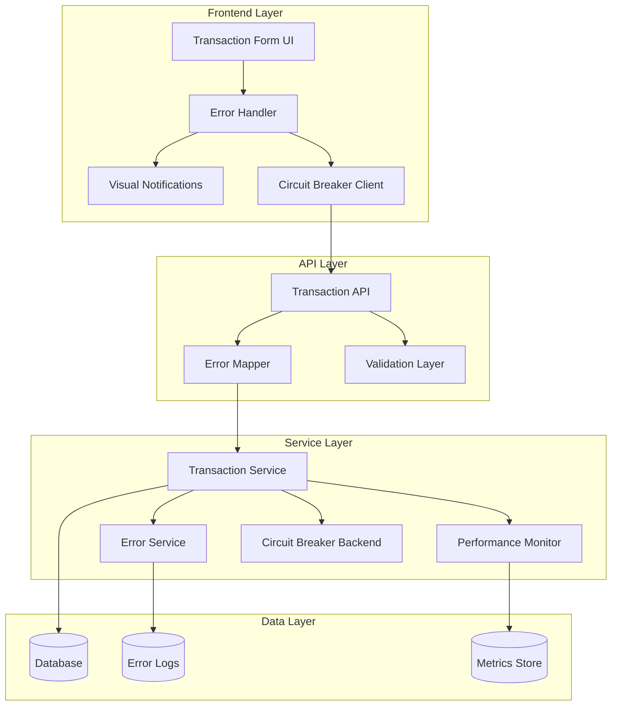

# Design Document

## Overview

This design document outlines the comprehensive improvement of error handling and performance optimization for the transaction creation feature in the rental system. The solution focuses on providing user-friendly error messages in formal Indonesian, visual error categorization, enhanced performance monitoring, and robust error recovery mechanisms.

The design addresses the current issues where technical error messages confuse non-technical kasir users, lack of visual feedback during long operations, and insufficient error recovery mechanisms that lead to poor user experience.

## Architecture

### High-Level Architecture



### Error Flow Architecture

```mermaid
sequenceDiagram
    participant UI as Frontend UI
    participant EH as Error Handler
    participant API as Transaction API
    participant EM as Error Mapper
    participant TS as Transaction Service
    participant ES as Error Service
    participant LOG as Error Logger
    
    UI->>+API: Create Transaction Request
    API->>+TS: Process Transaction
    TS->>TS: Validate & Process
    
    alt Error Occurs
        TS->>+ES: Generate Error Context
        ES->>ES: Map to User Message
        ES->>LOG: Log Technical Details
        ES->>-TS: Return Structured Error
        TS->>-API: Error Response
        API->>+EM: Map to API Format
        EM->>-API: Standardized Error Response
        API->>-UI: HTTP Error Response
        UI->>+EH: Process Error
        EH->>EH: Categorize & Format
        EH->>-UI: Display User Notification
    else Success
        TS->>-API: Success Response
        API->>-UI: Success Response
    end
```

## Components and Interfaces

### 1. Error Handler Component (Frontend)

**Purpose**: Central error processing and user notification management

**Interface**:
```typescript
interface ErrorHandler {
  processError(error: ApiError): void
  displayNotification(notification: ErrorNotification): void
  handleRetry(retryConfig: RetryConfig): Promise<boolean>
  dismissNotification(notificationId: string): void
}

interface ApiError {
  code: string
  message: string
  technical?: string
  context: Record<string, any>
  category: 'CRITICAL' | 'WARNING' | 'INFO'
  actions?: string[]
  transactionId?: string
  timestamp: string
}

interface ErrorNotification {
  id: string
  type: 'critical' | 'warning' | 'info'
  title: string
  message: string
  actions: NotificationAction[]
  duration: number
  dismissible: boolean
}
```

**Key Methods**:
- `processError()`: Maps API errors to user-friendly notifications
- `displayNotification()`: Shows visual notifications with proper styling
- `handleRetry()`: Manages retry logic with exponential backoff
- `dismissNotification()`: Handles notification cleanup

### 2. Error Service (Backend)

**Purpose**: Error generation, mapping, and context management

**Interface**:
```typescript
interface ErrorService {
  createError(code: string, context: ErrorContext): StructuredError
  mapToUserMessage(error: StructuredError): string
  logTechnicalDetails(error: StructuredError): void
  getErrorTemplate(code: string): ErrorTemplate
}

interface ErrorContext {
  productName?: string
  size?: string
  available?: number
  requested?: number
  transactionCode?: string
  dateRange?: { start: Date, end: Date }
  [key: string]: any
}

interface StructuredError {
  code: string
  userMessage: string
  technicalMessage: string
  context: ErrorContext
  category: ErrorCategory
  timestamp: Date
}
```

**Key Methods**:
- `createError()`: Generates structured errors with context
- `mapToUserMessage()`: Converts technical errors to user-friendly messages
- `logTechnicalDetails()`: Logs technical information for debugging
- `getErrorTemplate()`: Retrieves message templates for error codes

### 3. Performance Monitor

**Purpose**: Transaction performance tracking and metrics collection

**Interface**:
```typescript
interface PerformanceMonitor {
  startTransaction(transactionId: string): TransactionTimer
  recordSuccess(timer: TransactionTimer): void
  recordFailure(timer: TransactionTimer, error: StructuredError): void
  getMetrics(): PerformanceMetrics
  getSuccessRate(): number
}

interface TransactionTimer {
  transactionId: string
  startTime: number
  stages: Record<string, number>
}

interface PerformanceMetrics {
  totalTransactions: number
  successRate: number
  averageResponseTime: number
  p95ResponseTime: number
  errorsByCategory: Map<string, number>
  retryAttempts: number
}
```

### 4. Circuit Breaker

**Purpose**: System resilience and failure protection

**Interface**:
```typescript
interface CircuitBreaker {
  execute<T>(operation: () => Promise<T>): Promise<T>
  getState(): CircuitBreakerState
  getRecoveryTime(): number
  reset(): void
}

enum CircuitBreakerState {
  CLOSED = 'CLOSED',
  OPEN = 'OPEN',
  HALF_OPEN = 'HALF_OPEN'
}

interface CircuitBreakerConfig {
  failureThreshold: number // 3
  recoveryTimeout: number  // 15000ms
  halfOpenMaxCalls: number // 1
  monitorWindow: number    // 60000ms
}
```

### 5. Visual Notification Component

**Purpose**: User interface for error display and interaction

**Interface**:
```typescript
interface NotificationComponent {
  show(notification: ErrorNotification): void
  hide(notificationId: string): void
  updateProgress(notificationId: string, progress: number): void
  addAction(notificationId: string, action: NotificationAction): void
}

interface NotificationAction {
  label: string
  onClick: () => void
  variant: 'primary' | 'secondary' | 'danger'
  disabled?: boolean
}
```

## Data Models

### Error Response Format

```typescript
interface ErrorResponse {
  success: false
  error: {
    code: string           // e.g., "STOCK_INSUFFICIENT"
    message: string        // User-friendly Indonesian message
    technical?: string     // Technical details (dev only)
    context: {
      [key: string]: any   // Dynamic context variables
    }
    category: "CRITICAL" | "WARNING" | "INFO"
    actions?: string[]     // Suggested user actions
    transactionId?: string // For tracking
    timestamp: string      // ISO 8601 format
  }
}
```

### API Design

#### Transaction Creation Endpoint

**POST /api/kasir/transaksi**

**Request Schema:**
```typescript
interface CreateTransactionRequest {
  penyewaId: string
  kasirId?: string
  items: Array<{
    produkId: string
    productSizeId: string
    jumlah: number
    durasi: 4 | 7
    kondisiAwal?: string
    linkedSarung?: {
      productId: string
      productSizeId: string
      quantity: number
      selectedSize: ProductSize
    }
  }>
  tglMulai: string // ISO date
  metodeBayar?: string
  catatan?: string
  discountType?: 'percent' | 'nominal'
  discountValue?: number
}
```

**Success Response (201):**
```typescript
interface CreateTransactionResponse {
  success: true
  data: {
    id: string
    kode: string
    status: string
    totalHarga: number
    penyewa: {
      id: string
      nama: string
      telepon: string
    }
    items: Array<{
      id: string
      produk: {
        name: string
        code: string
      }
      jumlah: number
      hargaSewa: number
      subtotal: number
    }>
    createdAt: string
  }
  message: string
}
```

**Error Response (400/500):**
```typescript
// Uses ErrorResponse format defined above
{
  "success": false,
  "error": {
    "code": "STOCK_INSUFFICIENT",
    "message": "Stok Jas M (Ukuran: L) tidak mencukupi. Tersedia: 2, Diminta: 5",
    "technical": "Product inventory check failed: requested=5, available=2",
    "context": {
      "productId": "prod-001",
      "productName": "Jas M Hitam",
      "size": "L",
      "available": 2,
      "requested": 5
    },
    "category": "CRITICAL",
    "actions": ["Kurangi jumlah menjadi 2", "Pilih produk lain"],
    "transactionId": "tx-temp-12345",
    "timestamp": "2025-08-01T10:30:00.000Z"
  }
}
```

### Database Design

#### Index Strategy for Performance Optimization

```sql
-- Product availability queries optimization
CREATE INDEX idx_product_size_active ON product_size(product_id, is_active, available_quantity);
CREATE INDEX idx_product_size_availability ON product_size(id, available_quantity, rented_stock);

-- Date-aware availability queries
CREATE INDEX idx_transaksi_date_range ON transaksi(tgl_mulai, tgl_selesai, status);
CREATE INDEX idx_transaksi_item_dates ON transaksi_item(produk_id, created_at);

-- Transaction lookup optimization
CREATE INDEX idx_transaksi_code ON transaksi(kode);
CREATE INDEX idx_transaksi_status_date ON transaksi(status, created_at);
CREATE INDEX idx_transaksi_penyewa ON transaksi(penyewa_id, status);

-- Performance monitoring queries
CREATE INDEX idx_aktivitas_transaksi_type ON aktivitas_transaksi(tipe, created_at);
CREATE INDEX idx_aktivitas_transaksi_duration ON aktivitas_transaksi(transaksi_id, created_at);
```

#### Query Optimization Patterns

**Single Query for Product and Size Data:**
```sql
SELECT 
  ps.id as product_size_id,
  ps.size,
  ps.age_category,
  ps.available_quantity,
  p.id as product_id,
  p.name as product_name,
  p.current_price,
  c.name as category_name
FROM product_size ps
JOIN product p ON ps.product_id = p.id
JOIN category c ON p.category_id = c.id
WHERE ps.id = ANY($1) 
  AND ps.is_active = true
  AND p.is_active = true;
```

**Date-Aware Availability Check:**
```sql
WITH overlapping_rentals AS (
  SELECT 
    ti.produk_id,
    SUM(ti.jumlah) as total_rented
  FROM transaksi t
  JOIN transaksi_item ti ON t.id = ti.transaksi_id
  WHERE t.status IN ('active', 'diambil')
    AND t.tgl_mulai <= $2  -- end_date
    AND t.tgl_selesai >= $1  -- start_date
    AND ti.produk_id = ANY($3)  -- product_size_ids
  GROUP BY ti.produk_id
)
SELECT 
  ps.id,
  ps.available_quantity,
  COALESCE(or.total_rented, 0) as currently_rented,
  (ps.available_quantity - COALESCE(or.total_rented, 0)) as available_for_period
FROM product_size ps
LEFT JOIN overlapping_rentals or ON ps.id = or.produk_id
WHERE ps.id = ANY($3);
```

#### Transaction Isolation Levels

- **Transaction Creation**: `READ COMMITTED` - Prevents dirty reads while allowing concurrent access
- **Stock Validation**: `REPEATABLE READ` - Ensures consistent stock levels during validation
- **Performance Monitoring**: `READ UNCOMMITTED` - Allows fast metrics collection without blocking

### Frontend Design

#### React Component Hierarchy

```
TransactionFormPage
├── ErrorHandler (Context Provider)
│   ├── NotificationContainer
│   │   ├── ErrorNotification
│   │   │   ├── NotificationIcon
│   │   │   ├── NotificationContent
│   │   │   └── NotificationActions
│   │   └── LoadingNotification
│   └── CircuitBreakerStatus
├── TransactionForm
│   ├── ProductSelectionStep
│   ├── CustomerBiodataStep
│   ├── CashierSelectionStep
│   └── PaymentSummaryStep
└── PerformanceMonitor (Dev only)
```

#### State Management Design

**Error Context:**
```typescript
interface ErrorContextState {
  errors: ErrorNotification[]
  isRetrying: boolean
  retryCount: number
  circuitBreakerState: CircuitBreakerState
  lastError: ApiError | null
}

interface ErrorContextActions {
  addError: (error: ApiError) => void
  dismissError: (errorId: string) => void
  retryLastOperation: () => Promise<void>
  clearAllErrors: () => void
  updateCircuitBreakerState: (state: CircuitBreakerState) => void
}
```

**Loading State Component:**
```typescript
interface LoadingStateProps {
  isLoading: boolean
  duration: number // in seconds
  onTimeout: () => void
  timeoutDuration: number // 30 seconds
}

const LoadingState: React.FC<LoadingStateProps> = ({
  isLoading,
  duration,
  onTimeout,
  timeoutDuration = 30
}) => {
  const getMessage = () => {
    if (duration < 5) return null
    if (duration < 15) return "Memproses transaksi..."
    if (duration < 30) return "Mohon tunggu, proses memakan waktu lebih lama dari biasanya"
    return "Waktu habis. Coba lagi?"
  }
  
  // Implementation with useEffect for timeout handling
}
```

### Error Template Model

```typescript
interface ErrorTemplate {
  code: string
  category: ErrorCategory
  messageTemplate: string
  requiredContext: string[]
  suggestedActions: string[]
  icon: string
  duration: number
}
```

### Performance Metrics Model

```typescript
interface TransactionMetrics {
  transactionId: string
  startTime: Date
  endTime: Date
  duration: number
  stages: {
    validation: number
    stockCheck: number
    databaseTransaction: number
    responseGeneration: number
  }
  success: boolean
  errorCode?: string
  retryAttempts: number
}
```

## Correctness Properties

*A property is a characteristic or behavior that should hold true across all valid executions of a system-essentially, a formal statement about what the system should do. Properties serve as the bridge between human-readable specifications and machine-verifiable correctness guarantees.*

### Property 1: Error Message Localization
*For any* error generated by the system, the user-facing message should be in formal Indonesian language and contain specific contextual information relevant to the error type.
**Validates: Requirements 1.1, 1.2, 9.2, 9.3**

### Property 2: Error Context Completeness
*For any* stock availability error, the error message should contain product name, size, available quantity, and requested quantity.
**Validates: Requirements 1.2, 3.2**

### Property 3: Visual Error Categorization
*For any* error notification displayed to the user, the visual styling (color, icon, duration) should correctly correspond to the error category (CRITICAL=red, WARNING=yellow, INFO=blue).
**Validates: Requirements 2.1, 2.2, 2.3, 14.2, 14.3**

### Property 4: Accessibility Compliance
*For any* error notification component, the color contrast ratio should meet WCAG 2.1 Level AA standards (minimum 4.5:1 for normal text, 3:1 for large text).
**Validates: Requirements 2.4, 8.5**

### Property 5: Error Context Preservation
*For any* error that occurs during transaction processing, technical details should be logged for debugging while only user-friendly information is displayed to the user.
**Validates: Requirements 3.5**

### Property 6: Performance Target Compliance
*For any* transaction creation request, the p95 response time should be less than 10 seconds under normal system load.
**Validates: Requirements 4.1**

### Property 7: Query Optimization
*For any* product and size data retrieval operation, the system should use a single optimized query with proper joins rather than multiple separate queries.
**Validates: Requirements 4.3**

### Property 8: Timeout Configuration
*For any* transaction processing operation, the frontend timeout (30s) should be greater than the backend timeout (20s) to prevent race conditions.
**Validates: Requirements 4.5, 12.5**

### Property 9: Retry Mechanism
*For any* network error encountered during transaction creation, the system should automatically retry up to 3 times using exponential backoff (1s, 2s, 4s delays).
**Validates: Requirements 5.1**

### Property 10: Circuit Breaker State Transitions
*For any* sequence of 3 consecutive failures, the circuit breaker should transition to OPEN state and remain open for 15 seconds before transitioning to HALF_OPEN.
**Validates: Requirements 11.1, 11.3**

### Property 11: Error Recovery Success Notification
*For any* successful retry attempt after an initial failure, the system should display a success notification and clear any previous error messages.
**Validates: Requirements 5.4**

### Property 12: Validation Error Grouping
*For any* form submission with multiple validation errors, all errors should be displayed together in a single notification rather than individually.
**Validates: Requirements 6.5**

### Property 13: Performance Metrics Recording
*For any* transaction creation attempt (successful or failed), the system should record timing metrics for each processing stage and overall duration.
**Validates: Requirements 7.1, 7.4**

### Property 14: Error Message Format Consistency
*For any* error message displayed to users, it should follow the format: [Kategori] [Deskripsi Masalah] [Detail Konteks] [Saran Tindakan].
**Validates: Requirements 9.1**

### Property 15: Progressive Loading Feedback
*For any* transaction processing that takes longer than 5 seconds, the UI should display progressive feedback messages at 5s ("Memproses transaksi...") and 15s ("Mohon tunggu, proses memakan waktu lebih lama").
**Validates: Requirements 12.2, 12.3**

### Property 16: API Error Response Format
*For any* error response from the transaction API, it should include all required fields: code, message, context, category, and timestamp in the standardized format.
**Validates: Requirements 13.1, 13.2, 13.3, 13.4, 13.5**

### Property 17: Notification Dismissal
*For any* error notification displayed to the user, it should be dismissible through both clicking the X button and clicking the notification area.
**Validates: Requirements 14.4**

### Property 18: Keyboard Accessibility
*For any* error notification displayed, it should be navigable and dismissible using keyboard controls (Tab, Enter, Escape keys).
**Validates: Requirements 8.2**

### Property 19: Semantic HTML Structure
*For any* error message displayed in the UI, it should use proper semantic HTML elements (role, aria-label, aria-describedby) for screen reader compatibility.
**Validates: Requirements 8.1, 8.3**

### Property 20: Dynamic Context Variables
*For any* error message template that includes dynamic variables (product name, quantity, dates), all specified variables should be properly substituted with actual values from the error context.
**Validates: Requirements 9.3**

## Error Handling

### Error Classification System

The system implements a comprehensive error classification with three main categories:

1. **CRITICAL Errors**: System failures, validation failures, data not found
   - Color: Red (#DC2626)
   - Icon: ❌ / 🚫
   - Duration: 10 seconds
   - Auto-dismiss: No (requires user action)

2. **WARNING Errors**: Recoverable issues, conflicts, performance degradation
   - Color: Yellow (#F59E0B)
   - Icon: ⚠️ / ⚡
   - Duration: 7 seconds
   - Auto-dismiss: Yes

3. **INFO Errors**: Informational messages, system status updates
   - Color: Blue (#3B82F6)
   - Icon: ℹ️ / 📝
   - Duration: 5 seconds
   - Auto-dismiss: Yes

### Error Recovery Strategies

1. **Automatic Retry**: Network errors with exponential backoff
2. **Circuit Breaker**: System protection with graceful degradation
3. **User Guidance**: Specific actions for each error type
4. **Form Persistence**: Prevent data loss during errors

### Error Message Templates

The system uses a template-based approach for consistent error messaging:

```typescript
const ERROR_TEMPLATES = {
  STOCK_INSUFFICIENT: {
    template: "Stok {productName} (Ukuran: {size}) tidak mencukupi. Tersedia: {available}, Diminta: {requested}",
    category: "CRITICAL",
    actions: ["Kurangi jumlah", "Pilih produk lain"]
  },
  CUSTOMER_NOT_FOUND: {
    template: "Data pelanggan tidak ditemukan. Silakan pilih pelanggan yang valid",
    category: "CRITICAL",
    actions: ["Pilih pelanggan dari dropdown"]
  },
  DATE_CONFLICT: {
    template: "Konflik tanggal dengan transaksi {transactionCode}. Periode: {startDate} s/d {endDate} sudah dipesan",
    category: "WARNING",
    actions: ["Pilih tanggal lain", "Konfirmasi override"]
  }
}
```

### Error Code to Scenario Mapping

| Error Code | Scenario | Property | Template Variables |
|------------|----------|----------|-------------------|
| `ERR_VAL_001` | SC-008 | Property 12 | `{field}` |
| `ERR_VAL_002` | SC-008 | Property 12 | - |
| `ERR_STK_001` | SC-001 | Property 2 | `{productName, size, available, requested}` |
| `ERR_STK_002` | SC-001 | Property 2 | `{productName, size, available}` |
| `ERR_CUST_001` | SC-002 | Property 1 | - |
| `ERR_PROD_001` | SC-003 | Property 1 | `{productName}` |
| `ERR_SIZE_001` | SC-003 | Property 1 | `{size, productName}` |
| `ERR_DATE_001` | SC-004 | Property 15 | `{minDate}` |
| `ERR_DATE_002` | SC-004 | Property 15 | `{transactionCode, startDate, endDate}` |
| `ERR_PAIR_001` | SC-009 | Property 4 | `{jasName, sarungName}` |
| `ERR_DB_001` | SC-005 | Property 8 | - |
| `ERR_DB_002` | SC-005 | Property 8 | - |
| `ERR_PAY_001` | SC-006 | Property 11 | `{reason}` |
| `ERR_SYS_001` | SC-007 | Property 10 | - |
| `ERR_NET_001` | SC-007 | Property 9 | - |
| `ERR_AUTH_001` | SC-010 | Property 1 | - |

### Implementation Details

#### Circuit Breaker Algorithm

```typescript
class CircuitBreaker {
  private state: CircuitBreakerState = 'CLOSED'
  private failureCount = 0
  private lastFailureTime = 0
  private nextAttemptTime = 0
  
  async execute<T>(operation: () => Promise<T>): Promise<T> {
    // Check current state
    if (this.state === 'OPEN') {
      if (Date.now() < this.nextAttemptTime) {
        throw new Error('CIRCUIT_BREAKER_OPEN')
      }
      this.state = 'HALF_OPEN'
    }
    
    try {
      const result = await operation()
      this.onSuccess()
      return result
    } catch (error) {
      this.onFailure()
      throw error
    }
  }
  
  private onSuccess() {
    this.failureCount = 0
    this.state = 'CLOSED'
  }
  
  private onFailure() {
    this.failureCount++
    this.lastFailureTime = Date.now()
    
    if (this.failureCount >= 3) {
      this.state = 'OPEN'
      this.nextAttemptTime = Date.now() + 15000 // 15 seconds
    }
  }
  
  getRecoveryTime(): number {
    if (this.state === 'OPEN') {
      return Math.max(0, this.nextAttemptTime - Date.now())
    }
    return 0
  }
}
```

#### Retry Mechanism with Exponential Backoff

```typescript
class RetryHandler {
  async executeWithRetry<T>(
    operation: () => Promise<T>,
    maxAttempts: number = 3
  ): Promise<T> {
    let lastError: Error
    
    for (let attempt = 1; attempt <= maxAttempts; attempt++) {
      try {
        return await operation()
      } catch (error) {
        lastError = error as Error
        
        // Don't retry on non-retryable errors
        if (!this.isRetryableError(error)) {
          throw error
        }
        
        // Don't wait after the last attempt
        if (attempt < maxAttempts) {
          const delay = this.calculateDelay(attempt)
          await this.sleep(delay)
        }
      }
    }
    
    throw lastError!
  }
  
  private isRetryableError(error: any): boolean {
    const retryableCodes = [
      'ERR_NET_001', 'ERR_DB_001', 'ERR_DB_002'
    ]
    return retryableCodes.includes(error.code)
  }
  
  private calculateDelay(attempt: number): number {
    // Exponential backoff: 1s, 2s, 4s
    const baseDelay = 1000
    const jitter = Math.random() * 200 // Add jitter to prevent thundering herd
    return (baseDelay * Math.pow(2, attempt - 1)) + jitter
  }
  
  private sleep(ms: number): Promise<void> {
    return new Promise(resolve => setTimeout(resolve, ms))
  }
}
```

### Configuration Specification

```yaml
# Error Handling Configuration
errorHandling:
  # Circuit Breaker Settings
  circuitBreaker:
    failureThreshold: 3
    recoveryTimeout: 15000  # 15 seconds
    halfOpenMaxCalls: 1
    monitorWindow: 60000    # 1 minute
  
  # Retry Settings
  retry:
    maxAttempts: 3
    baseDelay: 1000         # 1 second
    maxDelay: 8000          # 8 seconds
    jitterRange: 200        # ±200ms
  
  # Timeout Settings
  timeouts:
    frontend: 30000         # 30 seconds
    backend: 20000          # 20 seconds
    database: 20000         # 20 seconds
  
  # Notification Settings
  notifications:
    durations:
      critical: 10000       # 10 seconds
      warning: 7000         # 7 seconds
      info: 5000            # 5 seconds
    maxVisible: 3           # Maximum notifications shown at once
    position: "top-right"
  
  # Performance Targets
  performance:
    p50Target: 3000         # 3 seconds
    p95Target: 10000        # 10 seconds
    p99Target: 15000        # 15 seconds
    successRateTarget: 0.95 # 95%

# Monitoring Configuration
monitoring:
  # Metrics Collection
  metrics:
    enabled: true
    exportFormat: "prometheus"
    exportInterval: 30000   # 30 seconds
    retentionPeriod: "7d"
  
  # Error Logging
  errorLogs:
    level: "error"
    storage: "database"     # database | file | external
    retentionPeriod: "30d"
    maxLogSize: "100MB"
    rotationPolicy: "daily"
  
  # Performance Monitoring
  performance:
    sampleRate: 1.0         # 100% sampling
    slowQueryThreshold: 5000 # 5 seconds
    memoryThreshold: "512MB"
    cpuThreshold: 80        # 80%

# Localization Configuration
localization:
  defaultLanguage: "id"     # Indonesian
  fallbackLanguage: "en"
  messageFormat: "formal"   # formal | casual
  dateFormat: "DD/MM/YYYY"
  timeFormat: "HH:mm:ss"
```

### Monitoring Integration

#### Metrics Export (Prometheus Format)

```typescript
interface TransactionMetrics {
  // Counter metrics
  transaction_attempts_total: number
  transaction_success_total: number
  transaction_failures_total: number
  circuit_breaker_trips_total: number
  retry_attempts_total: number
  
  // Histogram metrics
  transaction_duration_seconds: number[]
  database_query_duration_seconds: number[]
  api_response_time_seconds: number[]
  
  // Gauge metrics
  active_transactions: number
  circuit_breaker_state: 0 | 1 | 2  // CLOSED=0, OPEN=1, HALF_OPEN=2
  error_rate: number
  success_rate: number
}

class MetricsCollector {
  private metrics: TransactionMetrics
  
  recordTransactionStart(transactionId: string) {
    this.metrics.transaction_attempts_total++
    this.metrics.active_transactions++
  }
  
  recordTransactionSuccess(duration: number) {
    this.metrics.transaction_success_total++
    this.metrics.active_transactions--
    this.metrics.transaction_duration_seconds.push(duration / 1000)
    this.updateSuccessRate()
  }
  
  recordTransactionFailure(duration: number, errorCode: string) {
    this.metrics.transaction_failures_total++
    this.metrics.active_transactions--
    this.metrics.transaction_duration_seconds.push(duration / 1000)
    this.updateSuccessRate()
  }
  
  exportPrometheusFormat(): string {
    return `
# HELP transaction_attempts_total Total number of transaction attempts
# TYPE transaction_attempts_total counter
transaction_attempts_total ${this.metrics.transaction_attempts_total}

# HELP transaction_success_total Total number of successful transactions
# TYPE transaction_success_total counter
transaction_success_total ${this.metrics.transaction_success_total}

# HELP transaction_duration_seconds Transaction processing duration
# TYPE transaction_duration_seconds histogram
${this.formatHistogram('transaction_duration_seconds', this.metrics.transaction_duration_seconds)}
    `.trim()
  }
}
```

#### Error Log Management

```typescript
interface ErrorLogEntry {
  id: string
  timestamp: Date
  level: 'error' | 'warn' | 'info'
  errorCode: string
  message: string
  technicalDetails: string
  context: Record<string, any>
  transactionId?: string
  userId: string
  stackTrace?: string
  resolved: boolean
  resolvedAt?: Date
  resolvedBy?: string
}

class ErrorLogger {
  async logError(error: StructuredError, context: ErrorContext) {
    const logEntry: ErrorLogEntry = {
      id: generateId(),
      timestamp: new Date(),
      level: this.mapCategoryToLevel(error.category),
      errorCode: error.code,
      message: error.userMessage,
      technicalDetails: error.technicalMessage,
      context: context,
      transactionId: context.transactionId,
      userId: context.userId,
      stackTrace: error.stack,
      resolved: false
    }
    
    // Store in database with automatic cleanup
    await this.storeLogEntry(logEntry)
    
    // Export to external monitoring if configured
    if (this.config.externalLogging.enabled) {
      await this.exportToExternal(logEntry)
    }
  }
  
  async cleanupOldLogs() {
    const retentionDate = new Date()
    retentionDate.setDate(retentionDate.getDate() - 30) // 30 days retention
    
    await this.database.errorLog.deleteMany({
      where: {
        timestamp: { lt: retentionDate },
        resolved: true
      }
    })
  }
}
```

## Testing Strategy

### Unit Testing Approach

**Error Handler Tests**:
- Test error categorization and message mapping
- Test notification display and dismissal
- Test retry mechanism with various failure scenarios
- Test accessibility compliance (ARIA labels, keyboard navigation)

**Error Service Tests**:
- Test error template rendering with dynamic variables
- Test context preservation and technical detail logging
- Test message localization and formatting

**Performance Monitor Tests**:
- Test metrics collection and calculation
- Test success/failure rate tracking
- Test performance threshold validation

### Property-Based Testing Configuration

Each property test will run with minimum 100 iterations and be tagged with the corresponding design property:

- **Feature: transaction-error-handling-improvement, Property 1**: Error message localization testing
- **Feature: transaction-error-handling-improvement, Property 6**: Performance target compliance testing
- **Feature: transaction-error-handling-improvement, Property 10**: Circuit breaker state transition testing

### Integration Testing

**End-to-End Error Scenarios**:
- Stock insufficient with various products and quantities
- Database timeout with retry mechanisms
- Network failures with circuit breaker activation
- Multiple validation errors with grouped display
- Accessibility testing with screen readers and keyboard navigation

### Concrete Test Cases

#### SC-001: Stock Insufficient Scenario
```gherkin
Given a product "Jas M Hitam" with size "L" has 2 units available
When kasir attempts to rent 5 units of "Jas M Hitam" size "L"
Then system should display error "Stok Jas M Hitam (Ukuran: L) tidak mencukupi. Tersedia: 2, Diminta: 5"
And error category should be "CRITICAL"
And suggested actions should include "Kurangi jumlah menjadi 2" and "Pilih produk lain"
```

#### SC-004: Date Conflict Scenario
```gherkin
Given transaction "TRX-001" has rented "Jas M Hitam (L)" from "01/08/2025" to "05/08/2025"
When kasir attempts to rent same product for period "03/08/2025" to "07/08/2025"
Then system should display error "Konflik tanggal dengan transaksi TRX-001. Periode: 01/08/2025 s/d 05/08/2025 sudah dipesan"
And error category should be "WARNING"
And suggested actions should include "Pilih tanggal lain"
```

#### SC-006: Payment Failure Scenario
```gherkin
Given a transaction is created successfully
When payment processing fails with "Connection timeout"
Then system should display error "Pembayaran gagal: Connection timeout. Transaksi dibatalkan secara otomatis"
And transaction status should be reverted to "cancelled"
And stock should be restored to original quantities
```

#### SC-008: Multiple Validation Errors
```gherkin
Given kasir submits transaction form with:
  - Empty customer field
  - No products selected
  - Invalid start date
When form validation runs
Then system should display single notification containing:
  - "Silakan pilih pelanggan terlebih dahulu"
  - "Silakan pilih minimal satu produk untuk disewa"
  - "Tanggal mulai sewa tidak valid, silakan pilih tanggal yang benar"
And all errors should be grouped in one notification
```

### Test Data Strategy

#### Test Fixtures
```typescript
const TEST_PRODUCTS = [
  {
    id: "prod-001",
    name: "Jas M Hitam",
    sizes: [
      { id: "size-001", size: "L", available: 2, total: 5 },
      { id: "size-002", size: "XL", available: 0, total: 3 }
    ]
  },
  {
    id: "prod-002", 
    name: "Sarung Hitam",
    sizes: [
      { id: "size-003", size: "L", available: 5, total: 10 }
    ]
  }
]

const TEST_CUSTOMERS = [
  { id: "cust-001", nama: "John Doe", telepon: "081234567890" },
  { id: "cust-002", nama: "Jane Smith", telepon: "081234567891" }
]

const TEST_TRANSACTIONS = [
  {
    id: "tx-001",
    kode: "TRX-001",
    tglMulai: "2025-08-01",
    tglSelesai: "2025-08-05",
    items: [
      { produkId: "prod-001", productSizeId: "size-001", jumlah: 1 }
    ]
  }
]
```

### Performance Testing

**Load Testing with k6:**
```javascript
import http from 'k6/http'
import { check } from 'k6'

export let options = {
  stages: [
    { duration: '2m', target: 10 },   // Ramp up
    { duration: '5m', target: 50 },   // Stay at 50 users
    { duration: '2m', target: 100 },  // Ramp up to 100 users
    { duration: '5m', target: 100 },  // Stay at 100 users
    { duration: '2m', target: 0 },    // Ramp down
  ],
  thresholds: {
    http_req_duration: ['p(95)<10000'], // 95% of requests under 10s
    http_req_failed: ['rate<0.05'],     // Error rate under 5%
  }
}

export default function() {
  const payload = {
    penyewaId: 'cust-001',
    items: [
      {
        produkId: 'prod-001',
        productSizeId: 'size-001',
        jumlah: 1,
        durasi: 4
      }
    ],
    tglMulai: '2025-08-01'
  }
  
  const response = http.post('http://localhost:3000/api/kasir/transaksi', 
    JSON.stringify(payload),
    { headers: { 'Content-Type': 'application/json' } }
  )
  
  check(response, {
    'status is 201': (r) => r.status === 201,
    'response time < 10s': (r) => r.timings.duration < 10000,
    'has transaction code': (r) => JSON.parse(r.body).data.kode !== undefined
  })
}
```

**Circuit Breaker Testing:**
```typescript
describe('Circuit Breaker Behavior', () => {
  test('should open after 3 consecutive failures', async () => {
    const circuitBreaker = new CircuitBreaker()
    
    // Simulate 3 failures
    for (let i = 0; i < 3; i++) {
      try {
        await circuitBreaker.execute(() => Promise.reject(new Error('Test failure')))
      } catch (error) {
        // Expected to fail
      }
    }
    
    expect(circuitBreaker.getState()).toBe('OPEN')
    
    // Next request should fail immediately
    const start = Date.now()
    try {
      await circuitBreaker.execute(() => Promise.resolve('success'))
    } catch (error) {
      expect(error.message).toBe('CIRCUIT_BREAKER_OPEN')
      expect(Date.now() - start).toBeLessThan(100) // Should fail fast
    }
  })
  
  test('should transition to HALF_OPEN after timeout', async () => {
    const circuitBreaker = new CircuitBreaker()
    
    // Force circuit breaker to OPEN state
    for (let i = 0; i < 3; i++) {
      try {
        await circuitBreaker.execute(() => Promise.reject(new Error('Test failure')))
      } catch (error) {}
    }
    
    // Wait for recovery timeout (15s)
    await new Promise(resolve => setTimeout(resolve, 15100))
    
    // Next request should be allowed (HALF_OPEN)
    const result = await circuitBreaker.execute(() => Promise.resolve('success'))
    expect(result).toBe('success')
    expect(circuitBreaker.getState()).toBe('CLOSED')
  })
})
```

### Performance Testing

**Load Testing Targets**:
- p50 latency: < 3 seconds
- p95 latency: < 10 seconds
- p99 latency: < 15 seconds
- Success rate: > 95%
- Circuit breaker recovery: < 30 seconds

**Stress Testing**:
- Concurrent transaction creation (100+ users)
- Database connection pool exhaustion
- Memory usage under high error rates
- Circuit breaker behavior under sustained load

### Accessibility Testing

**WCAG 2.1 Level AA Compliance**:
- Color contrast ratio testing (minimum 4.5:1)
- Keyboard navigation testing
- Screen reader compatibility testing
- Focus management during error states
- Alternative text for error icons

```typescript
describe('Accessibility Compliance', () => {
  test('error notifications should meet WCAG 2.1 color contrast requirements', () => {
    const criticalError = { category: 'CRITICAL' }
    const warningError = { category: 'WARNING' }
    const infoError = { category: 'INFO' }
    
    expect(getContrastRatio('#DC2626', '#FFFFFF')).toBeGreaterThan(4.5) // Critical
    expect(getContrastRatio('#F59E0B', '#1F2937')).toBeGreaterThan(4.5) // Warning
    expect(getContrastRatio('#3B82F6', '#FFFFFF')).toBeGreaterThan(4.5) // Info
  })
  
  test('error notifications should be keyboard navigable', async () => {
    render(<ErrorNotification error={mockError} />)
    
    const notification = screen.getByRole('alert')
    const closeButton = screen.getByRole('button', { name: /tutup/i })
    
    // Tab should focus the close button
    await user.tab()
    expect(closeButton).toHaveFocus()
    
    // Enter should dismiss notification
    await user.keyboard('{Enter}')
    expect(notification).not.toBeInTheDocument()
  })
  
  test('error notifications should have proper ARIA labels', () => {
    render(<ErrorNotification error={mockCriticalError} />)
    
    const notification = screen.getByRole('alert')
    expect(notification).toHaveAttribute('aria-live', 'assertive')
    expect(notification).toHaveAttribute('aria-atomic', 'true')
    
    const icon = screen.getByRole('img')
    expect(icon).toHaveAttribute('aria-label', 'Error kritis')
  })
})
```

### Deployment Architecture

#### Production Environment Setup

```yaml
# docker-compose.production.yml
version: '3.8'
services:
  app:
    image: rental-app:latest
    environment:
      - NODE_ENV=production
      - ERROR_HANDLING_CONFIG=/config/error-handling.yml
      - MONITORING_ENABLED=true
      - CIRCUIT_BREAKER_ENABLED=true
    volumes:
      - ./config:/config:ro
      - ./logs:/app/logs
    
  redis:
    image: redis:7-alpine
    command: redis-server --appendonly yes
    volumes:
      - redis-data:/data
    
  prometheus:
    image: prom/prometheus:latest
    ports:
      - "9090:9090"
    volumes:
      - ./prometheus.yml:/etc/prometheus/prometheus.yml
      - prometheus-data:/prometheus
    
  grafana:
    image: grafana/grafana:latest
    ports:
      - "3001:3000"
    environment:
      - GF_SECURITY_ADMIN_PASSWORD=admin
    volumes:
      - grafana-data:/var/lib/grafana
      - ./grafana/dashboards:/etc/grafana/provisioning/dashboards
```

#### Monitoring Dashboard Configuration

```json
{
  "dashboard": {
    "title": "Transaction Error Handling Metrics",
    "panels": [
      {
        "title": "Transaction Success Rate",
        "type": "stat",
        "targets": [
          {
            "expr": "rate(transaction_success_total[5m]) / rate(transaction_attempts_total[5m]) * 100"
          }
        ]
      },
      {
        "title": "Response Time Percentiles",
        "type": "graph",
        "targets": [
          {
            "expr": "histogram_quantile(0.50, transaction_duration_seconds_bucket)",
            "legendFormat": "p50"
          },
          {
            "expr": "histogram_quantile(0.95, transaction_duration_seconds_bucket)",
            "legendFormat": "p95"
          },
          {
            "expr": "histogram_quantile(0.99, transaction_duration_seconds_bucket)",
            "legendFormat": "p99"
          }
        ]
      },
      {
        "title": "Circuit Breaker State",
        "type": "stat",
        "targets": [
          {
            "expr": "circuit_breaker_state"
          }
        ]
      },
      {
        "title": "Error Rate by Category",
        "type": "piechart",
        "targets": [
          {
            "expr": "sum by (category) (rate(transaction_failures_total[5m]))"
          }
        ]
      }
    ]
  }
}
```

The testing strategy ensures comprehensive coverage of all error scenarios while maintaining performance targets and accessibility standards. The deployment architecture provides production-ready monitoring and observability for the error handling system.