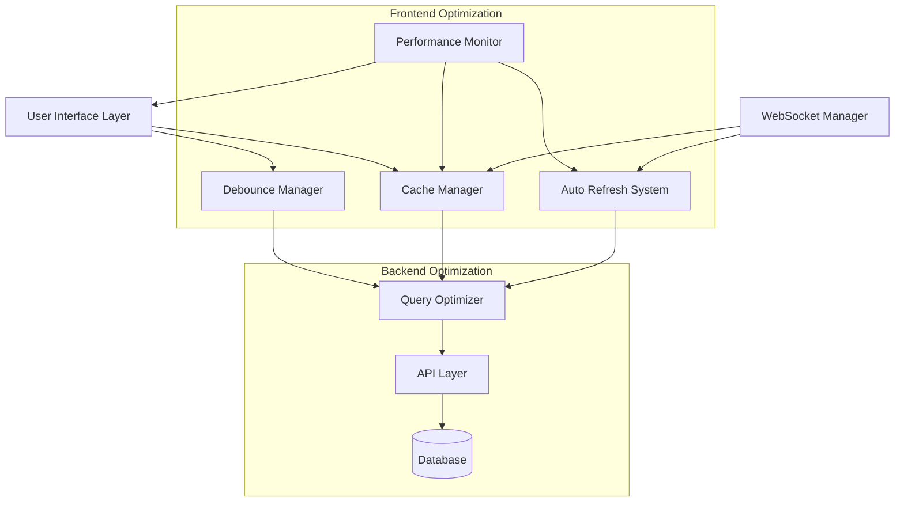
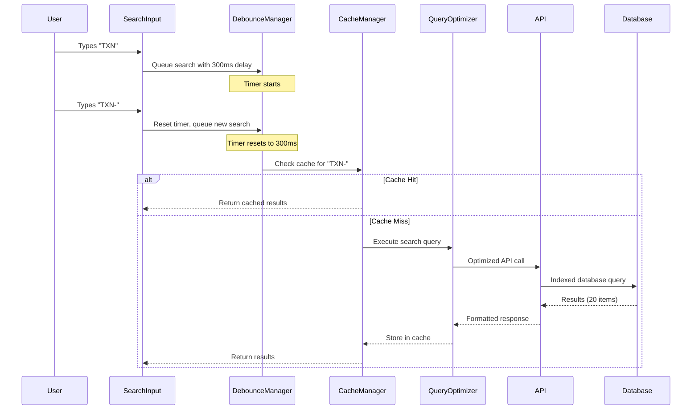

# Design Document

## Overview

This design document outlines the comprehensive optimization of the transaction search system to address critical performance issues identified in the kasir dashboard. The current system suffers from excessive API calls (2.4s - 22.1s response times), lack of search debouncing, and aggressive auto-refresh patterns that degrade user experience and system performance.

The solution implements a multi-layered optimization approach including intelligent debouncing, smart caching, query optimization, and enhanced user experience patterns.

## Architecture

### High-Level Architecture



### Component Interaction Flow



## Components and Interfaces

### 1. Debounce Manager

**Purpose**: Manages search input debouncing to prevent excessive API calls.

**Interface**:
```typescript
interface DebounceManager {
  // Core debounce functionality
  debounceSearch(searchTerm: string, delay: number): Promise<void>
  cancelPendingSearch(): void
  isSearchPending(): boolean
  
  // Configuration
  setDebounceDelay(delay: number): void
  getDebounceDelay(): number
  
  // Events
  onSearchExecuted(callback: (term: string) => void): void
  onSearchCancelled(callback: () => void): void
}

// React Hook Implementation
interface UseDebounceOptions {
  delay: number
  immediate?: boolean
  maxWait?: number
}

function useDebounce<T>(value: T, options: UseDebounceOptions): {
  debouncedValue: T
  isPending: boolean
  cancel: () => void
  flush: () => void
}
```

**Key Features**:
- 300ms default delay with configurable options
- Automatic timer reset on new input
- Immediate execution for clear/empty input
- Loading state management during debounce period

### 2. Cache Manager with Persistent Storage

**Purpose**: Intelligent caching system with persistent storage options to reduce redundant API calls and improve response times across browser sessions.

**Interface**:
```typescript
interface CacheManager {
  // Cache operations
  get<T>(key: string): Promise<T | null>
  set<T>(key: string, value: T, ttl?: number): Promise<void>
  invalidate(pattern: string): Promise<void>
  clear(): Promise<void>
  
  // Cache statistics
  getStats(): CacheStats
  getSize(): number
  
  // LRU management
  evictOldest(): Promise<void>
  setMaxSize(size: number): void
  
  // Persistent storage
  persistToSessionStorage(key: string, value: any): Promise<void>
  restoreFromSessionStorage(key: string): Promise<any | null>
  persistToRedis(key: string, value: any, ttl?: number): Promise<void>
  restoreFromRedis(key: string): Promise<any | null>
  
  // Storage fallback
  setStorageStrategy(strategy: StorageStrategy): void
  getStorageStrategy(): StorageStrategy
}

interface CacheStats {
  hits: number
  misses: number
  hitRate: number
  totalSize: number
  entryCount: number
  persistentHits: number
  persistentMisses: number
}

enum StorageStrategy {
  MEMORY_ONLY = 'memory',
  SESSION_STORAGE = 'session',
  REDIS_PRIMARY = 'redis',
  HYBRID = 'hybrid'
}

// Cache key generation
interface CacheKeyGenerator {
  generateSearchKey(params: SearchParams): string
  generateListKey(filters: TransactionFilters): string
  generateCountKey(status?: TransactionStatus): string
  generatePersistentKey(baseKey: string): string
}
```

**Key Features**:
- 5-minute TTL for search results
- LRU eviction when exceeding 50MB
- Intelligent invalidation on data updates
- Cross-tab cache sharing via BroadcastChannel
- SessionStorage persistence for browser refresh survival
- Optional Redis integration for production environments
- Automatic fallback between storage strategies
- Compression for large cache entries

### 3. Query Optimizer with Request Deduplication

**Purpose**: Optimizes database queries and API requests with intelligent deduplication to prevent redundant processing.

**Interface**:
```typescript
interface QueryOptimizer {
  // Query building
  buildSearchQuery(params: OptimizedSearchParams): DatabaseQuery
  buildCountQuery(filters: TransactionFilters): DatabaseQuery
  buildPaginatedQuery(params: PaginationParams): DatabaseQuery
  
  // Query execution
  executeOptimizedSearch(params: SearchParams): Promise<SearchResult>
  executeCountQuery(filters: TransactionFilters): Promise<CountResult>
  
  // Request deduplication
  deduplicateRequest(requestKey: string, executor: () => Promise<any>): Promise<any>
  isRequestPending(requestKey: string): boolean
  cancelPendingRequest(requestKey: string): void
  
  // Performance monitoring
  getQueryMetrics(): QueryMetrics
  optimizeQuery(query: DatabaseQuery): DatabaseQuery
  getDeduplicationStats(): DeduplicationStats
}

interface OptimizedSearchParams {
  search?: string
  status?: TransactionStatus
  page: number
  limit: number
  sortBy?: string
  sortOrder?: 'asc' | 'desc'
  includeFields?: string[]
}

interface DeduplicationStats {
  totalRequests: number
  deduplicatedRequests: number
  deduplicationRate: number
  averageWaitTime: number
  cacheHits: number
}

interface QueryMetrics {
  averageResponseTime: number
  slowQueries: SlowQuery[]
  indexUsage: IndexUsage[]
  cacheHitRate: number
  deduplicationEfficiency: number
}
```

**Key Features**:
- Database index utilization for text search
- Optimized pagination with cursor-based approach
- Field selection to reduce payload size
- Query result caching at database level
- Enhanced status calculation in SQL
- Request deduplication with 1-second window
- Burst request queuing and single response distribution
- TTL-based deduplication cache cleanup

### 4. Auto Refresh System

**Purpose**: Smart auto-refresh mechanism that adapts to user behavior and system conditions.

**Interface**:
```typescript
interface AutoRefreshSystem {
  // Refresh control
  start(interval?: number): void
  stop(): void
  pause(): void
  resume(): void
  
  // Adaptive behavior
  setInterval(interval: number): void
  adaptToNetworkConditions(condition: NetworkCondition): void
  adaptToUserActivity(activity: UserActivity): void
  
  // State management
  isActive(): boolean
  isPaused(): boolean
  getNextRefreshTime(): Date
  
  // Events
  onRefresh(callback: () => void): void
  onPause(callback: () => void): void
  onResume(callback: () => void): void
}

enum NetworkCondition {
  FAST = 'fast',
  SLOW = 'slow',
  OFFLINE = 'offline'
}

enum UserActivity {
  ACTIVE = 'active',
  TYPING = 'typing',
  IDLE = 'idle',
  AWAY = 'away'
}
```

**Key Features**:
- 60-second default interval (reduced from 30s)
- Pause during user typing or interaction
- Tab visibility detection
- Network-aware refresh intervals
- Battery optimization for mobile devices

### 5. Performance Monitor

**Purpose**: Monitors system performance and provides user feedback and administrative insights.

**Interface**:
```typescript
interface PerformanceMonitor {
  // Performance tracking
  trackApiCall(endpoint: string, duration: number): void
  trackSearchQuery(query: string, resultCount: number, duration: number): void
  trackCacheOperation(operation: CacheOperation, hit: boolean): void
  
  // User feedback
  showPerformanceWarning(message: string): void
  showOfflineMode(): void
  hideOfflineMode(): void
  
  // Analytics
  getPerformanceMetrics(): PerformanceMetrics
  getSearchAnalytics(): SearchAnalytics
  exportMetrics(): Promise<MetricsExport>
  
  // Alerting
  setPerformanceThreshold(metric: string, threshold: number): void
  onPerformanceAlert(callback: (alert: PerformanceAlert) => void): void
}

interface PerformanceMetrics {
  apiResponseTimes: ResponseTimeMetrics
  cachePerformance: CachePerformanceMetrics
  searchMetrics: SearchMetrics
  userExperience: UserExperienceMetrics
}

interface SearchAnalytics {
  popularSearchTerms: SearchTerm[]
  failedSearches: FailedSearch[]
  searchPatterns: SearchPattern[]
  performanceByQuery: QueryPerformance[]
}
```

**Key Features**:
- Real-time performance monitoring
- User-friendly performance warnings
- Offline mode with cached data
- Search analytics and insights
- Administrative alerting system

## Data Models

### Search State Management

```typescript
interface SearchState {
  // Current search
  query: string
  isSearching: boolean
  isPending: boolean
  
  // Results
  results: Transaction[]
  totalCount: number
  hasMore: boolean
  
  // Pagination
  currentPage: number
  pageSize: number
  
  // Performance
  lastSearchTime: number
  searchDuration: number
  
  // Cache info
  isCached: boolean
  cacheTimestamp: number
}

interface TransactionFilters {
  status?: TransactionStatus | 'all'
  search?: string
  dateRange?: DateRange
  sortBy?: SortField
  sortOrder?: SortOrder
}
```

### Cache Data Models with Persistent Storage

```typescript
interface CacheEntry<T> {
  key: string
  value: T
  timestamp: number
  ttl: number
  accessCount: number
  lastAccessed: number
  size: number
  isPersistent: boolean
  storageStrategy: StorageStrategy
}

interface CacheMetadata {
  totalSize: number
  entryCount: number
  hitRate: number
  evictionCount: number
  lastCleanup: number
  persistentEntries: number
  sessionStorageSize: number
  redisConnected: boolean
}

interface PersistentCacheEntry {
  key: string
  value: any
  timestamp: number
  ttl: number
  compressionType?: 'gzip' | 'lz4'
  checksum: string
}
```

### Request Deduplication Models

```typescript
interface DeduplicationEntry {
  requestKey: string
  promise: Promise<any>
  timestamp: number
  requestCount: number
  waitingClients: string[]
}

interface RequestMetrics {
  requestKey: string
  executionTime: number
  deduplicationCount: number
  cacheHit: boolean
  timestamp: number
}
```

### Performance Data Models

```typescript
interface ApiMetrics {
  endpoint: string
  method: string
  averageResponseTime: number
  minResponseTime: number
  maxResponseTime: number
  requestCount: number
  errorCount: number
  lastUpdated: number
}

interface SearchMetrics {
  query: string
  executionCount: number
  averageResponseTime: number
  resultCount: number
  cacheHitRate: number
  lastExecuted: number
}
```

## Correctness Properties

*A property is a characteristic or behavior that should hold true across all valid executions of a system-essentially, a formal statement about what the system should do. Properties serve as the bridge between human-readable specifications and machine-verifiable correctness guarantees.*

### Property 1: Search Debounce Consistency
*For any* sequence of search input changes, the debounce mechanism should ensure that only one API call is made after the final input with exactly 300ms delay, and rapid typing should reset the timer appropriately.
**Validates: Requirements 1.1, 1.2, 1.3, 1.5**

### Property 2: Cache Hit Optimization
*For any* repeated search query within the 5-minute cache period, the cache manager should return cached results immediately without making additional API calls.
**Validates: Requirements 3.2**

### Property 3: Auto-Refresh Pause During Interaction
*For any* user typing activity in the search input, the auto-refresh system should pause automatic refresh and resume only after typing stops.
**Validates: Requirements 2.2**

### Property 4: Pagination Consistency
*For any* infinite scroll operation, the query optimizer should load exactly 20 additional items per scroll event and maintain proper pagination state.
**Validates: Requirements 4.2**

### Property 5: Performance Warning Threshold
*For any* API response time exceeding 5 seconds, the performance monitor should display a warning message to the user.
**Validates: Requirements 5.1**

### Property 6: Cache Invalidation on Updates
*For any* transaction data update (status change, new transaction), the cache manager should invalidate all related cache entries to ensure data consistency.
**Validates: Requirements 3.3**

### Property 7: Exponential Backoff Retry
*For any* API failure, the performance monitor should implement exponential backoff retry with intervals of 1s, 2s, 4s before giving up.
**Validates: Requirements 5.2**

### Property 8: Memory Cleanup on Unmount
*For any* component unmount event, the cache manager should cleanup all unused query subscriptions and prevent memory leaks.
**Validates: Requirements 7.1**

### Property 9: Search Result Highlighting
*For any* completed search with results, the search system should highlight all instances of the search term in the displayed results.
**Validates: Requirements 6.3**

### Property 10: Real-time Update Integration
*For any* WebSocket update received, the auto-refresh system should update the current view if the update matches active filters, otherwise cache the update for future filter changes.
**Validates: Requirements 9.1, 9.2**

### Property 11: Cross-Tab Cache Sharing
*For any* cache operation in one browser tab, the cache manager should synchronize the cache state across all open tabs to prevent duplicate API calls.
**Validates: Requirements 7.5**

### Property 12: Network-Adaptive Refresh
*For any* detected network condition change, the auto-refresh system should adapt the refresh interval appropriately (60s for normal, 120s for slow network).
**Validates: Requirements 2.5**

### Property 13: Search Analytics Logging
*For any* search operation performed, the performance monitor should log the search term, response time, and result count for analytics purposes.
**Validates: Requirements 10.1**

### Property 14: LRU Cache Eviction
*For any* cache storage exceeding 50MB, the cache manager should evict the least recently used entries until storage is within limits.
**Validates: Requirements 3.4**

### Property 16: Persistent Cache Survival
*For any* cached entry marked as persistent, the cache manager should restore the entry from SessionStorage after browser refresh and maintain data consistency.
**Validates: Requirements 3.8, 3.10**

### Property 17: Redis Fallback Mechanism
*For any* Redis connection failure, the cache manager should automatically fallback to in-memory caching without affecting user experience or data availability.
**Validates: Requirements 3.9, 3.10**

### Property 18: Request Deduplication Efficiency
*For any* burst of identical API requests within 1 second, the query optimizer should execute only one request and return the same response to all requesters.
**Validates: Requirements 8.6, 8.7**

### Property 19: Deduplication Cache TTL Management
*For any* deduplication cache entry exceeding memory limits, the query optimizer should evict entries using TTL-based cleanup while preserving active requests.
**Validates: Requirements 8.8, 8.9**

### Property 20: Storage Strategy Adaptation
*For any* storage strategy failure (SessionStorage full, Redis unavailable), the cache manager should adapt to the next available strategy without data loss.
**Validates: Requirements 3.9, 3.10**

## Error Handling

### Search Error Scenarios

1. **Network Timeout**: Implement 10-second timeout with retry mechanism
2. **API Rate Limiting**: Implement exponential backoff with jitter
3. **Invalid Search Terms**: Sanitize input and provide user feedback
4. **Cache Corruption**: Automatic cache invalidation and rebuild
5. **Memory Overflow**: Automatic cache cleanup and size management

### Recovery Strategies

1. **Graceful Degradation**: Show cached data when API fails
2. **Offline Mode**: Full functionality with cached data
3. **Progressive Enhancement**: Core features work without advanced optimizations
4. **User Feedback**: Clear error messages and recovery suggestions
5. **Automatic Recovery**: Self-healing mechanisms for common issues

## Testing Strategy

### Unit Testing Approach
- **Debounce Logic**: Test timer behavior, cancellation, and reset mechanisms
- **Cache Operations**: Test storage, retrieval, eviction, and invalidation
- **Query Building**: Test SQL generation and parameter binding
- **Performance Monitoring**: Test metric collection and threshold detection

### Property-Based Testing Configuration
- **Testing Framework**: Jest with fast-check for property-based testing
- **Test Iterations**: Minimum 100 iterations per property test
- **Property Test Tags**: Each test tagged with format: **Feature: transaction-search-optimization, Property {number}: {property_text}**

### Integration Testing
- **API Integration**: Test complete search flow from input to results
- **Cache Integration**: Test cache behavior across multiple search operations
- **Performance Integration**: Test system behavior under load
- **Cross-Browser Testing**: Ensure compatibility across different browsers

### Performance Testing
- **Load Testing**: Simulate multiple concurrent users
- **Memory Testing**: Monitor memory usage during extended sessions
- **Network Testing**: Test behavior under various network conditions
- **Battery Testing**: Measure power consumption on mobile devices

The testing strategy ensures comprehensive coverage of both functional correctness and performance characteristics, with property-based tests providing high-confidence validation of system behavior across diverse input scenarios.