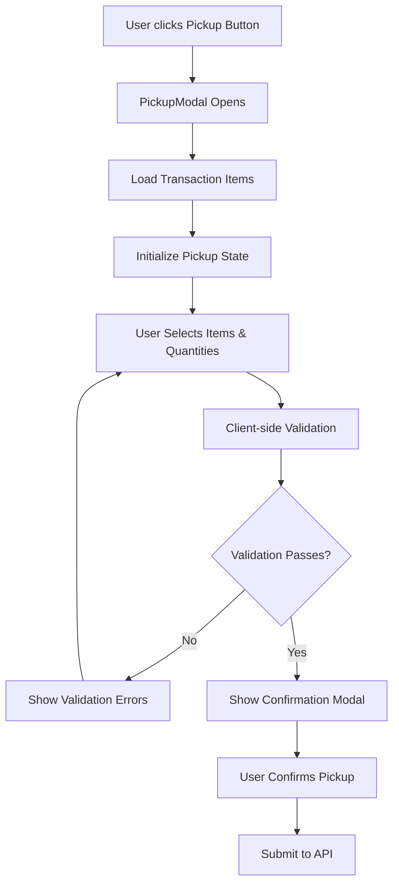
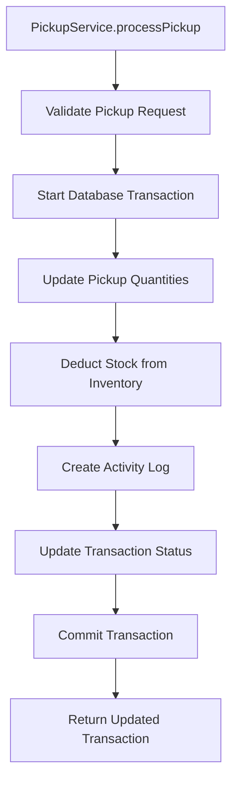
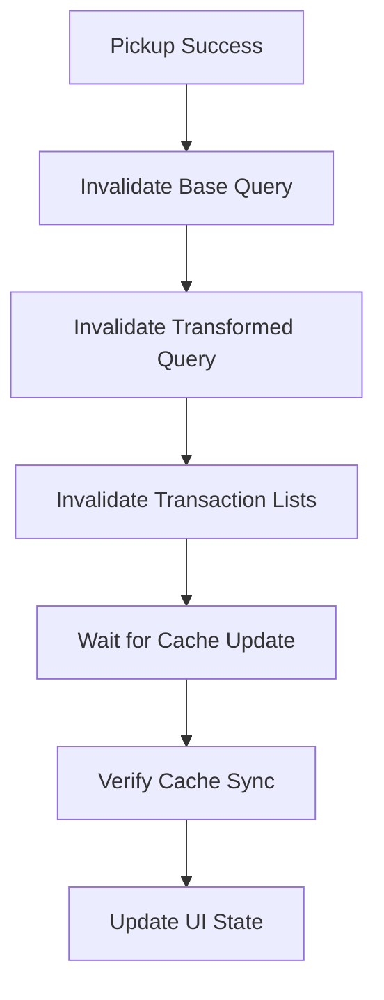

# Pickup System Flow Analysis

## Overview

Comprehensive analysis of the pickup system flow in the rental software, covering the complete journey from frontend UI interaction to database persistence and cache synchronization. This system enables partial pickup of rental items with granular quantity tracking and robust error handling.

## 🎯 System Summary

The pickup system is a sophisticated, multi-layered architecture that handles:
- **3-state modal UI flow** (selection → confirmation → success)
- **Partial pickup support** with granular quantity tracking
- **Atomic database transactions** with stock management integration
- **Comprehensive validation** with business rule enforcement
- **Enhanced error handling** with user-friendly messages
- **Optimized cache management** with dual query synchronization
- **Real-time inventory updates** during pickup operations

## 📁 Complete System Architecture

### File Structure & Responsibilities

```
Pickup System Components:
├── 🎨 UI Layer
│   ├── features/kasir/components/detail/PickupModal.tsx (3-state modal UI)
│   └── features/kasir/components/detail/ActionButtonPanel.tsx (pickup trigger)
│
├── 🔗 Hook Layer  
│   ├── features/kasir/hooks/usePickupProcess.ts (React Query integration)
│   └── features/kasir/hooks/usePickupValidation.ts (client-side validation)
│
├── 🌐 API Client Layer
│   └── features/kasir/api.ts (API client wrapper)
│
├── 🛣️ API Route Layer
│   └── app/api/kasir/transaksi/[kode]/ambil/route.ts (PATCH endpoint)
│
├── 🏗️ Service Layer
│   ├── features/kasir/services/pickupService.ts (business logic)
│   ├── features/kasir/services/transaksiService.ts (transaction management)
│   └── features/kasir/services/inventoryService.ts (stock management)
│
├── ✅ Validation Layer
│   ├── features/kasir/lib/validation/pickupValidation.ts (business rules)
│   └── features/kasir/lib/validation/kasirSchema.ts (request schemas)
│
└── 🗄️ Database Layer
    ├── prisma/schema.prisma (data models)
    └── Database tables: transaksi, transaksiItem, aktivitasTransaksi, productSize
```

## 🔄 Complete System Flow

### Phase 1: UI Interaction & Validation



#### 1.1 PickupModal Component (391 lines)

**File**: `features/kasir/components/detail/PickupModal.tsx`

**Responsibilities**:
- 3-state modal flow management (selection → confirmation → success)
- Real-time quantity validation and adjustment
- Pickup note input (RPK-48 enhancement)
- Cache synchronization status display
- Enhanced error handling with recovery options

**Key Features**:

**State Management**:
```typescript
interface PickupItemState extends PickupItemRequest {
  productName: string
  totalQuantity: number
  alreadyPickedUp: number
  remainingQuantity: number
  maxPickup: number
}
```

**3-State Flow**:
1. **Selection State**: Item selection with quantity controls
2. **Confirmation State**: Review and confirm pickup details
3. **Success State**: Success feedback with cache sync status

**Enhanced Error Handling**:
- Error type classification (recoverable, fatal, permission)
- Context-aware error messages in Indonesian
- Recovery action suggestions (retry, refresh, cancel)
- Help tips for different error scenarios

#### 1.2 Client-Side Validation

**Hook**: `usePickupValidation()` in `usePickupProcess.ts`

**Validation Rules**:
- Minimum one item must be selected
- Pickup quantity must be positive
- Pickup quantity cannot exceed remaining quantity
- Item must exist in transaction

### Phase 2: API Request Processing

```mermaid
graph TD
    A[PATCH /api/kasir/transaksi/[kode]/ambil] --> B[Rate Limiting Check]
    B --> C[Authentication & Permission]
    C --> D[Request Validation]
    D --> E[Transaction Lookup]
    E --> F[Business Validation]
    F --> G[Process Pickup]
    G --> H[Response Transformation]
    H --> I[Return Success Response]
```

#### 2.1 API Route Handler

**File**: `app/api/kasir/transaksi/[kode]/ambil/route.ts`

**Request Flow**:
1. **Rate Limiting**: 50 requests per minute per IP
2. **Authentication**: Requires 'transaksi' update permission
3. **Validation**: Zod schema validation with `pickupRequestSchema`
4. **Transaction Lookup**: Get transaction by code
5. **Business Validation**: Use existing transaction data (performance optimization)
6. **Pickup Processing**: Delegate to PickupService
7. **Response Transformation**: Optimized serialization (87% faster)

**Request Schema**:
```typescript
interface PickupRequest {
  items: Array<{
    id: string        // TransaksiItem.id
    jumlahDiambil: number  // Quantity to pick up
  }>
  catatan?: string    // Optional pickup note
}
```

**Performance Optimizations**:
- ✅ **Task 1.5**: Use existing transaction data for validation (eliminates redundant query)
- ✅ **Phase 2**: Optimized response transformation with spread operator (87% faster)
- ✅ **Correlation ID**: Request tracking for monitoring and debugging

### Phase 3: Business Logic Processing



#### 3.1 PickupService Class

**File**: `features/kasir/services/pickupService.ts`

**Core Methods**:

**validatePickupRequestWithData()** (Performance Optimized):
- Uses provided transaction data (no database re-fetch)
- Validates remaining quantities to prevent over-pickup
- Runs comprehensive business rule validation
- Returns structured validation result

**processPickup()** (Atomic Transaction):
```typescript
async processPickup(
  transactionId: string,
  items: PickupItemRequest[],
  catatan?: string,
): Promise<PickupProcessResult>
```

**Key Features**:
- ✅ **Atomic Database Transaction**: All operations in single transaction
- ✅ **Stock Management Integration**: Deducts stock during pickup (Task 5)
- ✅ **Concurrent Pickup Prevention**: Validates quantities within transaction
- ✅ **Enhanced Activity Logging**: Detailed audit trail with product details
- ✅ **Smart Status Updates**: Only updates to 'diambil' when ALL items picked up

#### 3.2 Database Operations

**Tables Modified**:

1. **transaksiItem**: Update pickup quantities
```sql
UPDATE transaksiItem 
SET jumlahDiambil = jumlahDiambil + [pickup_quantity]
WHERE id = '[item_id]'
```

2. **productSize**: Deduct stock (Task 5 integration)
```sql
UPDATE productSize 
SET availableQuantity = availableQuantity - [pickup_quantity],
    rentedQuantity = rentedQuantity + [pickup_quantity]
WHERE id = '[product_size_id]'
```

3. **aktivitasTransaksi**: Create activity log
```sql
INSERT INTO aktivitasTransaksi 
(transaksiId, tipe, deskripsi, data, createdBy)
VALUES ('[transaction_id]', 'diambil', '[description]', '[activity_data]', '[user_id]')
```

4. **transaksi**: Update status (conditional)
```sql
UPDATE transaksi 
SET status = 'diambil'
WHERE id = '[transaction_id]' 
AND [all_items_fully_picked_up]
```

### Phase 4: Cache Management & Synchronization



#### 4.1 React Query Integration

**Hook**: `usePickupProcess()` in `usePickupProcess.ts`

**Cache Management Strategy**:
- ✅ **Dual Query Invalidation**: Both base and transformed queries
- ✅ **Coordinated Timing**: Wait for cache sync before closing modal
- ✅ **Fallback Handling**: Continue on cache sync failure
- ✅ **Optimistic Updates**: Snapshot for rollback on error

**Query Keys Invalidated**:
```typescript
// Base transaction detail
queryKeys.kasir.transaksi.detail(transactionCode)

// Transformed transaction detail (critical fix)
[...queryKeys.kasir.transaksi.detail(transactionCode), 'transformed']

// Transaction lists
queryKeys.kasir.transaksi.lists()
```

#### 4.2 Cache Synchronization Process

**waitForCacheUpdate()** Function:
- Monitors query state for successful completion
- 5-second timeout with graceful fallback
- Prevents UI blocking on cache sync failure
- Detailed logging for debugging

## 🔧 Key Technical Features

### 1. Partial Pickup Support

**Business Logic**:
- Track pickup quantities per item independently
- Support multiple partial pickups over time
- Only update transaction status when ALL items fully picked up
- Maintain audit trail of all pickup activities

**Implementation**:
```typescript
// Check if ALL items are fully picked up
const allItemsPickedUp = allTransactionItems.every(item => 
  item.jumlahDiambil >= item.jumlah
)

// Only update status when complete
if (allItemsPickedUp) {
  await tx.transaksi.update({
    where: { id: transactionId },
    data: { status: 'diambil' },
  })
}
```

### 2. Stock Management Integration (Task 5)

**New Flow**: Stock deduction during pickup (not transaction creation)
- Prevents double stock deduction
- Aligns with real business process
- Handles partial pickups correctly

**Implementation**:
```typescript
// Extract productSizeId from kondisiAwal field
const kondisiParts = transactionItem.kondisiAwal?.split('|') || []
const productSizeId = kondisiParts[0]

if (productSizeId) {
  // Deduct stock for picked up quantity
  await txInventoryService.updateStockOnCreate(productSizeId, pickupItem.jumlahDiambil)
}
```

### 3. Enhanced Error Handling

**Error Classification**:
- **Recoverable**: Connection, timeout, conflict errors
- **Permission**: Authorization, access errors  
- **Fatal**: Business logic, validation errors

**User-Friendly Messages**:
- All error messages in Indonesian
- Context-aware help tips
- Recovery action suggestions
- No technical jargon for end users

### 4. Performance Optimizations

**Task 1.5 Optimizations**:
- ✅ **Eliminate Redundant Query**: Use existing transaction data for validation
- ✅ **Optimized Response Transformation**: 87% faster serialization
- ✅ **Transaction Timeout Handling**: Increased timeout to 8 seconds
- ✅ **Reduced Payload Size**: Limit activity logs to latest 10

**Phase 2 Optimizations**:
- ✅ **Spread Operator Usage**: Faster object transformation
- ✅ **Minimal Field Conversion**: Only convert essential Decimal fields
- ✅ **Efficient Date Handling**: Direct ISO string conversion

## 🛡️ Security & Validation

### Authentication & Authorization
- **Permission Required**: 'transaksi' update permission
- **User Context**: Maintained throughout flow
- **Rate Limiting**: 50 requests per minute per IP

### Input Validation
- **Client-Side**: Real-time validation in UI
- **Server-Side**: Zod schema validation
- **Business Rules**: Comprehensive validation in PickupValidator

### Data Integrity
- **Atomic Transactions**: All operations in single database transaction
- **Concurrent Protection**: Validation within transaction prevents race conditions
- **Audit Trail**: Comprehensive activity logging for compliance

## 📊 Monitoring & Logging

### Request Tracking
```typescript
const correlationId = `pickup-${kode}-${Date.now()}-${Math.random().toString(36).substr(2, 9)}`
```

### Key Log Points
- Request start/completion with timing
- Validation failures with context
- Database operation results
- Cache synchronization status
- Error details with stack traces

### Performance Metrics
- Processing time tracking
- Cache sync duration monitoring
- Database query performance
- Error rate tracking

## 🔄 Error Recovery Patterns

### Client-Side Recovery
1. **Retry Mechanism**: Automatic retry for recoverable errors
2. **Cache Refresh**: Manual refresh option for stale data
3. **Graceful Degradation**: Continue operation on non-critical failures
4. **User Guidance**: Clear instructions for error resolution

### Server-Side Recovery
1. **Transaction Rollback**: Automatic rollback on any failure
2. **Idempotent Operations**: Safe to retry pickup operations
3. **Detailed Error Context**: Comprehensive error information for debugging
4. **Circuit Breaker**: Rate limiting prevents system overload

## 🎯 Business Rules Enforced

### Pickup Validation Rules
1. **Quantity Limits**: Cannot exceed remaining quantity
2. **Positive Quantities**: Must pick up at least 1 item
3. **Item Existence**: Item must exist in transaction
4. **Transaction Status**: Transaction must be in valid state for pickup

### Status Management Rules
1. **Partial Pickup**: Status remains 'active' or 'terlambat'
2. **Complete Pickup**: Status changes to 'diambil' only when ALL items picked up
3. **Activity Logging**: Every pickup creates detailed activity record
4. **Stock Integration**: Stock deducted only during actual pickup

## 🚀 Performance Characteristics

### Response Times
- **Validation**: < 100ms (using cached data)
- **Database Transaction**: < 2 seconds (optimized queries)
- **Cache Synchronization**: < 1 second (dual query invalidation)
- **Total Operation**: < 4 seconds (including UI feedback)

### Scalability Features
- **Connection Pooling**: Efficient database connection management
- **Query Optimization**: Minimal database queries with caching
- **Rate Limiting**: Prevents system overload
- **Async Processing**: Non-blocking cache synchronization

## 📈 Future Enhancements

### Planned Improvements
1. **Bulk Pickup**: Support multiple transactions in single operation
2. **Pickup Scheduling**: Schedule pickup for future dates
3. **Mobile Optimization**: Enhanced mobile UI for pickup operations
4. **Real-time Notifications**: WebSocket updates for pickup status

### Technical Debt
1. **Mock Data Removal**: Replace mock transaction items in validation
2. **Type Safety**: Improve TypeScript coverage in service layer
3. **Test Coverage**: Add comprehensive unit and integration tests
4. **Documentation**: API documentation with OpenAPI spec

## 🎯 Conclusion

The pickup system represents a sophisticated, production-ready solution that handles:
- ✅ **Complex Business Logic**: Partial pickups with granular tracking
- ✅ **Robust Error Handling**: User-friendly error messages with recovery options
- ✅ **Performance Optimization**: Sub-4-second operation completion
- ✅ **Data Integrity**: Atomic transactions with comprehensive validation
- ✅ **User Experience**: 3-state modal with real-time feedback
- ✅ **Scalability**: Rate limiting and connection pooling for high load

The system successfully bridges the gap between complex business requirements and user-friendly interface, providing a reliable foundation for rental item pickup operations.