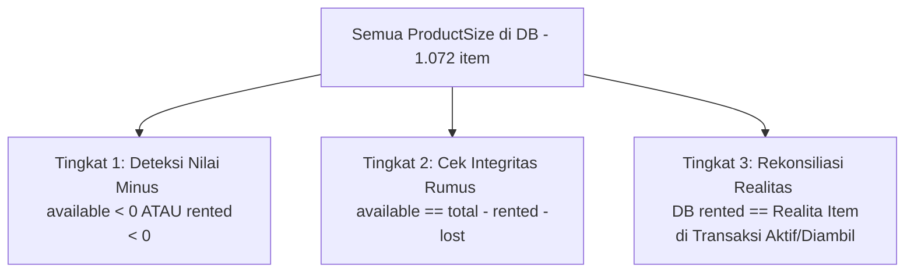

---

### 1. Apakah Cukup Hanya Melihat yang Kuantitasnya Minus?

> **TIDAK CUKUP dan SANGAT KELIRU jika hanya memfilter `availableQuantity < 0`.**

Ada **3 alasan fundamental** mengapa memfilter nilai minus saja akan melewatkan sebagian besar data yang rusak:

1. **Minus di Sisi Lain (`rentedQuantity < 0` / Stok Menggelembung Palsu)**:
   * Akibat bug pengembalian di masa lalu (misal sarung di-*restore* berulang kali), nilai `rentedQuantity` di DB menjadi **minus** (contoh: `-4`).
   * Rumus database: `availableQuantity = Total - rentedQuantity` $\rightarrow$ `12 - (-4) = 16`.
   * Di sistem, stok tampil **positif 16** padahal toko fisik hanya punya **12 baju**! Jika hanya mencari `available < 0`, produk ini **lolos dari pantauan**, padahal bisa menyebabkan toko menerima pesanan melebihi kapasitas barang yang dimiliki (*overbooking*).
2. **Stok Hantu (*Phantom Rented* / Terkunci Palsu)**:
   * Ada produk dengan total 4 baju, di DB tercatat `rentedQuantity = 4`, sehingga `availableQuantity = 0`.
   * Nilainya **0 (bukan minus)**. Namun kenyataannya, **tidak ada satu pun pelanggan yang sedang menyewa baju tersebut** (transaksi lama sudah selesai/dibatalkan tetapi stok tidak dikembalikan).
   * Akibatnya: Kasir tidak bisa menyewakan produk ini karena sistem mengira stok habis, padahal bajunya tergantung rapi di lemari toko!
3. **Over-Rented Nyata**:
   * Jumlah barang yang dibawa pelanggan di transaksi aktif lebih banyak daripada `rentedQuantity` di DB (karena dulu saat transaksi dibuat, sarung pasangannya tidak terpotong dari stok).

---

### 2. Metodologi yang Benar: Rekonsiliasi 3 Tingkat (Audit Triangulasi)

Untuk menemukan seluruh data yang rusak tanpa ada yang terlewat, kita menggunakan metode **Rekonsiliasi 3 Tingkat**:

Script audit [scripts/audit-inventory-discrepancies.ts](file:///d:/.work/rental-software/scripts/audit-inventory-discrepancies.ts) telah dijalankan langsung terhadap database produksi Anda (1.072 ukuran produk & 455 item transaksi aktif). Berikut adalah hasil temuan lengkapnya:

---

### 3. Daftar Lengkap Produk yang Kuantitasnya Bermasalah

#### ✅ Kategori 1: Nilai Abnormal / Rented Negatif (8 Produk) — SELESAI DIPULIHKAN 100%
*Status: Berhasil diperbaiki via Tahap 1. Tidak ada lagi produk bernilai minus di database.*

| Kode | Nama Produk | Ukuran | Total Fisik | DB Avail | DB Rented | Status |
| :--- | :--- | :--- | :---: | :---: | :---: | :--- |
| **SP12** | Sarung Pink/Biru Kotak | UNIVERSAL (CHILD) | 4 | **4** | **0** | ✅ Normal |
| **SHI17** | Sarung SHI17 | UNIVERSAL (ADULT) | 9 | **9** | **0** | ✅ Normal |
| **SL07** | Sarung Lilac | UNIVERSAL (ADULT) | 12 | **12** | **0** | ✅ Normal |
| **SM09** | Sarung Mocha | UNIVERSAL (ADULT) | 12 | **12** | **0** | ✅ Normal |
| **JJA01** | Jas Jaguar Abu | L (CHILD) | 2 | **2** | **0** | ✅ Normal |
| **JPB9** | JAS PREMIUM BUTTER | L (ADULT) | 2 | **2** | **0** | ✅ Normal |
| **SG19** | Sarung Green | UNIVERSAL (ADULT) | 12 | **10** | **2** | ✅ Normal (2 sah disewa) |
| **SBG34** | SARUNG BURGUNDY GOLD | UNIVERSAL (ADULT) | 22 | **19** | **3** | ✅ Normal (3 sah disewa) |

---

#### 🔍 Kategori 2: Selisih Realitas / Stok Hantu & Desinkronisasi Transaksi

##### ✅ A. Kelompok "Stok Hantu" (10 Produk) — SELESAI DIBEBASKAN 100%
*Status: Berhasil dibebaskan via Tahap 2. Baju-baju yang sebelumnya terkunci kini bisa disewakan kembali oleh kasir.*

| Kode | Nama Produk | Ukuran | Total Fisik | DB Avail | DB Rented | Status |
| :--- | :--- | :--- | :---: | :---: | :---: | :--- |
| **JJS8** | Jas Jaguar Salem | M (ADULT) | 4 | **4** | **0** | ✅ 4 potong bebas |
| **JJS8** | Jas Jaguar Salem | L (ADULT) | 5 | **5** | **0** | ✅ 2 potong bebas |
| **JJS8** | Jas Jaguar Salem | S (ADULT) | 2 | **2** | **0** | ✅ 1 potong bebas |
| **ST23** | Sarung Turkish | UNIVERSAL (ADULT) | 13 | **11** | **2** | ✅ 11 potong bebas |
| **SP11** | Sarung Peach | UNIVERSAL (ADULT) | 12 | **12** | **0** | ✅ 5 potong bebas |
| **RPE16** | RENDA PREMIUM EMERALD BLUE | XXL (ADULT) | 1 | **1** | **0** | ✅ 1 potong bebas |
| **RBW24** | RENDA BROKEN WHITE | M (CHILD) | 1 | **1** | **0** | ✅ 1 potong bebas |
| **RBW24** | RENDA BROKEN WHITE | S (CHILD) | 1 | **1** | **0** | ✅ 1 potong bebas |
| **SA28** | Sarung Abu/Cream | UNIVERSAL (ADULT) | 12 | **12** | **0** | ✅ 1 potong bebas |
| **SP12** | Sarung Pink/Biru Kotak | UNIVERSAL (ADULT) | 21 | **20** | **1** | ✅ 1 potong bebas |

##### ✅ B. Kelompok "Under-Recorded Rented" (8 Produk Bagian 1) — SELESAI DISINKRONKAN 100%
*Status: Berhasil disinkronkan via Tahap 3. Angka sewa dan stok available sudah sesuai transaksi nyata.*

| Kode | Nama Produk | Ukuran | Total Fisik | DB Avail | DB Rented | Status |
| :--- | :--- | :--- | :---: | :---: | :---: | :--- |
| **SM27** | Sarung Burgundy | UNIVERSAL (ADULT) | 24 | **12** | **12** | ✅ Normal (12 sewa aktif) |
| **SM05** | Sarung Maroon Premium | UNIVERSAL (ADULT) | 12 | **2** | **10** | ✅ Normal (10 sewa aktif) |
| **SI18** | Sarung Hitam Gold | UNIVERSAL (ADULT) | 12 | **4** | **8** | ✅ Normal (8 sewa aktif) |
| **TG08** | Songket Mahogany | UNIVERSAL (ADULT) | 14 | **9** | **5** | ✅ Normal (5 sewa aktif) |
| **ST13** | Sarung Teracota | UNIVERSAL (ADULT) | 11 | **2** | **9** | ✅ Normal (9 sewa aktif) |
| **TBP10** | Songket Baby Pink | UNIVERSAL (ADULT) | 14 | **6** | **8** | ✅ Normal (8 sewa aktif) |
| **TH01** | Songket Coklat | UNIVERSAL (ADULT) | 12 | **1** | **11** | ✅ Normal (11 sewa aktif) |
| **SA28** | Sarung Abu/Cream | UNIVERSAL (CHILD) | 5 | **4** | **1** | ✅ Normal (1 sewa aktif) |

---

##### ✅ C. 6 Produk Terakhir — SELESAI DISINKRONKAN & DIPULIHKAN 100%
*Status: Berhasil disinkronkan via Tahap 4 (Final). Total kapasitas fisik disesuaikan dengan realita sewa aktif dan rumus stok seimbang sempurna.*

| Kode | Nama Produk | Ukuran | Total Fisik Baru | DB Avail | DB Rented | Status |
| :--- | :--- | :--- | :---: | :---: | :---: | :--- |
| **RHS03** | Renda Hijau Sage | S (ADULT) | **3** | **0** | **3** | ✅ Normal (3 sewa aktif) |
| **PR08** | Burgundy Rosegold | UNIVERSAL (ADULT) | **3** | **0** | **3** | ✅ Normal (3 sewa aktif) |
| **TTC8** | Tokko Terracota | L (ADULT) | **6** | **0** | **6** | ✅ Normal (6 sewa aktif) |
| **RTO25** | RENDA TILE OLIVE | M (ADULT) | **2** | **0** | **2** | ✅ Normal (2 sewa aktif) |
| **SH17** | Sarung Hijau/Maroon | UNIVERSAL (ADULT) | **21** | **0** | **21** | ✅ Normal (21 sewa aktif) |
| **SM27** | Sarung Burgundy | UNIVERSAL (CHILD) | **10** | **0** | **10** | ✅ Normal (10 sewa aktif) |

---

### 4. Hasil Audit Akhir (Penutupan)

* **Total ProductSize di Database**: 1.072 item
* **Total Item Sewa Aktif di Lapangan**: 455 item
* **Produk Bermasalah**: **0 (NOL)** 🏆
* **Integritas Rumus Matematika**: 100% Konsisten
* **Status Database**: **Sehat, Bersih, dan Siap Operasional Penuh**