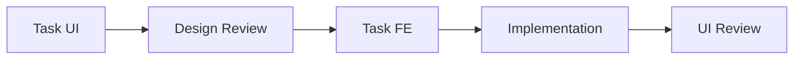
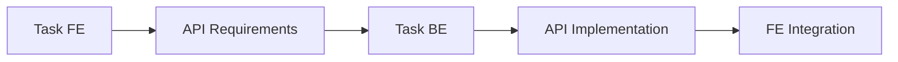
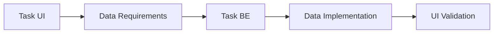

# 🔗 Relasi Antar Format Task Docs

## Tujuan Dokumen

Dokumen ini menjelaskan bagaimana tiga format task docs (UI, FE, BE) saling berhubungan dan berkolaborasi dalam project Maguru sesuai dengan arsitektur 3-layer yang telah didefinisikan.

---

## 📋 Overview Format Task Docs

### 1. **Task UI** (`task-ui-xxx.md`)

- **Role**: UI/UX Designer
- **Fokus**: Wireframe, mockup, design system, accessibility
- **Output**: Design specs untuk FE Developer

### 2. **Task FE** (`task-fe-xxx.md`)

- **Role**: Frontend Developer
- **Fokus**: React components, custom hooks, state management
- **Output**: UI implementation dan API integration

### 3. **Task BE** (`task-be-xxx.md`)

- **Role**: Backend Developer
- **Fokus**: API routes, database, business logic
- **Output**: Data layer dan API endpoints

---

## 🔄 Alur Kolaborasi

### **Flow 1: UI → FE Handoff**



**Proses:**

1. **UI/UX Designer** membuat `task-ui-xxx.md` dengan wireframe dan design specs
2. **FE Developer** review design untuk feasibility
3. **FE Developer** membuat `task-fe-xxx.md` yang mereferensikan task UI
4. **FE Developer** implementasi sesuai design specs
5. **UI/UX Designer** review hasil implementasi

**Cross-Reference:**

- Task FE harus mereferensikan Task UI terkait di bagian "Related Tasks"
- Task UI harus menyebutkan Task FE yang akan mengimplementasikan design

### **Flow 2: FE ↔ BE Collaboration**



**Proses:**

1. **FE Developer** mendefinisikan API requirements di `task-fe-xxx.md`
2. **BE Developer** membuat `task-be-xxx.md` yang memenuhi requirements
3. **BE Developer** implementasi API endpoints
4. **FE Developer** integrasi dengan API yang sudah dibuat

**Cross-Reference:**

- Task BE harus mereferensikan Task FE yang membutuhkan API
- Task FE harus mereferensikan Task BE yang menyediakan API

### **Flow 3: UI → BE (Kebutuhan Data Khusus)**



**Proses:**

1. **UI/UX Designer** mengidentifikasi kebutuhan data khusus untuk UI
2. **BE Developer** membuat `task-be-xxx.md` untuk menyediakan data
3. **BE Developer** implementasi data layer
4. **UI/UX Designer** validasi apakah data memenuhi kebutuhan UI

---

## 📁 Struktur Folder & Penamaan

### **Struktur Folder**

```
features/[feature-name]/docs/
├── task-ui/           # UI/UX task documentation
│   ├── task-ui-001.md
│   └── task-ui-002.md
├── task-fe/           # Frontend task documentation
│   ├── task-fe-001.md
│   └── task-fe-002.md
├── task-be/           # Backend task documentation
│   ├── task-be-001.md
│   └── task-be-002.md
├── result-docs/       # Implementation results
└── test-docs/         # Testing documentation
```

### **Penamaan File**

- **UI**: `task-ui-[ID].md` (contoh: `task-ui-21.md`)
- **FE**: `task-fe-[ID].md` (contoh: `task-fe-22.md`)
- **BE**: `task-be-[ID].md` (contoh: `task-be-23.md`)

---

## 🔗 Cross-Reference Guidelines

### **Di Task UI Docs**

```markdown
## Related Tasks

- **Frontend Implementation**: [Link ke task-fe-xxx.md]
- **Backend Data**: [Link ke task-be-xxx.md] (jika ada kebutuhan data khusus)
```

### **Di Task FE Docs**

```markdown
## Related Tasks

- **UI Design**: [Link ke task-ui-xxx.md]
- **Backend API**: [Link ke task-be-xxx.md]
```

### **Di Task BE Docs**

```markdown
## Related Tasks

- **Frontend Requirements**: [Link ke task-fe-xxx.md]
- **UI Data Requirements**: [Link ke task-ui-xxx.md] (jika ada)
```

---

## 🎯 Arsitektur Compliance

### **Task UI → Presentation Layer**

- Fokus pada visual design dan user experience
- Menyediakan design specs untuk komponen React
- Memastikan accessibility dan responsive design

### **Task FE → Presentation + Logic Layer**

- **Presentation**: `features/[fitur]/components/`
- **Logic**: `features/[fitur]/hooks/`
- **Integration**: `features/[fitur]/api.ts`

### **Task BE → Data Layer**

- **API Routes**: `app/api/[fitur]/route.ts`
- **Database**: `prisma/` schema dan migrations
- **Business Logic**: API handlers dan data processing

---

## 📋 Approval Process

### **Sequential Approval**

1. **Task UI** → Review oleh FE Developer
2. **Task FE** → Review oleh UI/UX Designer dan BE Developer
3. **Task BE** → Review oleh FE Developer dan Product Owner

### **Parallel Development**

- Task FE dan BE bisa dikembangkan parallel jika API contract sudah disepakati
- Regular sync meeting untuk memastikan alignment

---

## 🔄 Iteration & Updates

### **Design Changes**

- Jika ada perubahan design, update Task UI dan notifikasi Task FE terkait
- Task FE mungkin perlu update jika ada perubahan signifikan

### **API Changes**

- Jika ada perubahan API, update Task BE dan notifikasi Task FE terkait
- Task FE mungkin perlu update untuk menyesuaikan dengan API baru

### **Implementation Feedback**

- FE Developer bisa memberikan feedback ke UI/UX Designer tentang feasibility
- BE Developer bisa memberikan feedback ke FE Developer tentang API design

---

## 📊 Tracking & Reporting

### **JIRA Integration**

- Setiap task docs harus terintegrasi dengan JIRA ticket
- Update status di JIRA sesuai progres dokumentasi

### **Dependencies Tracking**

- Track dependencies antar task (UI → FE → BE)
- Identifikasi blocking issues early

### **Progress Reporting**

- Regular update tentang progress setiap layer
- Highlight any blocking issues atau delays

---

## 🎯 Best Practices

### **Communication**

- Regular sync meeting antar role
- Clear documentation of decisions dan changes
- Use shared terminology sesuai glossary project

### **Quality Assurance**

- Review process untuk setiap task docs
- Validation bahwa implementasi sesuai dengan specs
- Testing strategy yang mencakup semua layer

### **Documentation**

- Keep task docs updated dengan perubahan
- Document lessons learned untuk referensi masa depan
- Maintain consistency across all formats

---

## 📝 Contoh Cross-Reference

### **Scenario: Product Management Feature**

```markdown
# Task UI-001: Design Product List Page

## Related Tasks

- Frontend Implementation: [task-fe-001.md]
- Backend Data: [task-be-001.md]

# Task FE-001: Implement Product List Page

## Related Tasks

- UI Design: [task-ui-001.md]
- Backend API: [task-be-001.md]

# Task BE-001: Product API Endpoints

## Related Tasks

- Frontend Requirements: [task-fe-001.md]
- UI Data Requirements: [task-ui-001.md]
```

---

**Dengan relasi yang jelas ini, tim dapat bekerja secara kolaboratif dan efisien sesuai dengan arsitektur yang telah didefinisikan.**
