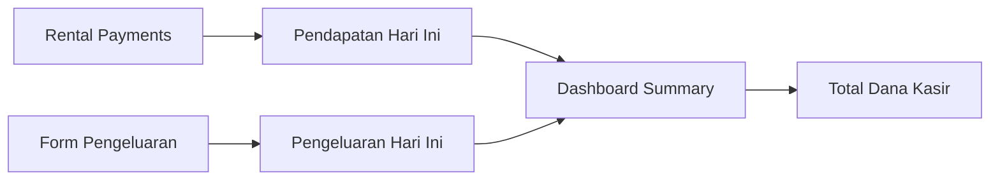

# Dana Kasir Feature Documentation

## =� Feature Overview

**Nama Fitur**: Dana Kasir Management
**Target Role**: Kasir, Owner
**Status**: Planning Phase
**Priority**: High
**Estimasi**: 5 hari implementasi

### <� Tujuan Utama

Memberikan sistem manajemen dana kasir harian yang terintegrasi dengan transaksi penyewaan untuk monitoring pendapatan dan pengeluaran secara real-time.

## <� Arsitektur Fitur

### Core Components

1. **Dashboard Dana Kasir**
   - Location: `app/(kasir)/dana-kasir/page.tsx`
   - Function: Display summary pendapatan & pengeluaran hari ini
   - Enhancement: Add tombol "dana-kasir"

2. **Form Pengeluaran Kasir**
   - Input field: Harga (format Rupiah)
   - Input field: Deskripsi (text bebas)
   - Select field: Kategori (pre-defined)
   - Actions: Create, Edit, Delete (kasir only)

3. **Navigation Integration**
   - Owner sidebar: Tambah menu "Dana Kasir"
   - Route: `/dana-kasir` untuk owner access

## =� Data Flow



## = Role-Based Access Control

| **Fitur** | **Kasir** | **Owner** |
|-----------|----------|----------|
| View Pendapatan |  (hari ini) |  (semua kasir) |
| View Pengeluaran |  (hari ini) |  (semua kasir) |
| Add/Edit Pengeluaran |  | L |
| Add Pendapatan |  |  |

## =� Database Schema

### New Tables Required

#### PengeluaranKasir
```sql
CREATE TABLE pengeluaran_kasir (
  id UUID PRIMARY KEY DEFAULT gen_random_uuid(),
  kasir_id UUID NOT NULL REFERENCES users(id),
  harga DECIMAL(12,2) NOT NULL,
  kategori VARCHAR(50) NOT NULL,
  deskripsi TEXT,
  created_at TIMESTAMP DEFAULT CURRENT_TIMESTAMP,
  updated_at TIMESTAMP DEFAULT CURRENT_TIMESTAMP
);
```

### Categories Pre-defined
- Operasional
- Maintenance
- Transport
- Lainnya

## <� UI/UX Requirements

### Dashboard Layout
- **Split View**: Pendapatan (left) | Pengeluaran (right)
- **Summary Cards**: Total masing-masing kategori
- **Real-time Updates**: Auto-refresh setiap 30 detik
- **Mobile Responsive**: Adaptasi untuk tampilan mobile

### Form Design
- **Simple Input**: Minimal fields untuk fast input
- **Validation**: Format currency otomatis
- **Error Handling**: Clear error messages
- **Success Feedback**: Toast notifications

## =' Technical Implementation

### Phase 1: Foundation (Day 1-2)
1. Database schema migration
2. API routes for CRUD pengeluaran
3. Base form component
4. Validation utilities

### Phase 2: Integration (Day 3-4)
5. Dashboard enhancement
6. Navigation updates
7. Role-based middleware
8. Real-time data fetching

### Phase 3: Polish & Testing (Day 5)
9. UI/UX refinement
10. Unit & integration tests
11. Performance optimization
12. Documentation updates

## =� API Endpoints

### Pengeluaran Management
- `GET /api/kasir/pengeluaran` - List pengeluaran hari ini
- `POST /api/kasir/pengeluaran` - Create pengeluaran baru
- `PUT /api/kasir/pengeluaran/:id` - Update pengeluaran
- `DELETE /api/kasir/pengeluaran/:id` - Delete pengeluaran

### Dashboard Data
- `GET /api/kasir/dana-summary` - Summary pendapatan & pengeluaran
- `GET /api/kasir/pendapatan` - List transaksi hari ini

##  Success Metrics

### Functional Requirements
-  Kasir dapat input pengeluaran < 30 detik
-  Real-time sync pendapatan dari transaksi existing
-  Role-based access berfungsi benar
-  Owner dapat monitoring semua dana kasir

### Technical Requirements
-  Response time < 2 detik untuk semua operasi
-  Mobile responsive design
-  Proper error handling dan validation
-  80%+ test coverage

## = Dependencies

### Existing Features
- `features/kasir/` - Transaction system
- `app/api/kasir/transaksi` - Payment data source
- Clerk authentication - Role management
- Prisma ORM - Database operations

### Required Packages
- Tidak ada package baru (gunakan existing stack)
- React Query untuk data fetching
- TailwindCSS untuk styling
- Radix UI untuk components

## =� Deployment Considerations

### Database Migration
- Run migration saat production deployment
- Backup data sebelum migration
- Test migration di staging environment

### Feature Flag
- Implement feature flag untuk gradual rollout
- Monitor performance impact
- Quick rollback capability

## =� User Stories

### As Kasir
- **Story 1**: "Saya ingin mencatat pengeluaran operasional toko dengan cepat"
- **Story 2**: "Saya ingin melihat total pendapatan hari ini dari transaksi sewa"
- **Story 3**: "Saya ingin menambah deskripsi detail untuk setiap pengeluaran"

### As Owner
- **Story 4**: "Saya ingin monitoring semua dana kasir dari berbagai kasir"
- **Story 5**: "Saya ingin melihat summary pendapatan vs pengeluaran harian"
- **Story 6**: "Saya ingin export laporan dana kasir untuk analisis"

## <� Next Steps

1. **Database Schema Design** - Create migration files
2. **Component Analysis** - Review existing dashboard structure
3. **API Development** - Implement CRUD operations
4. **UI Implementation** - Build form components
5. **Integration Testing** - End-to-end workflow validation

---

**Created**: 2025-01-29
**Author**: Ardiansyah Arifin
**Status**: Ready for Implementation
**Review**: Pending approval from Product Owner