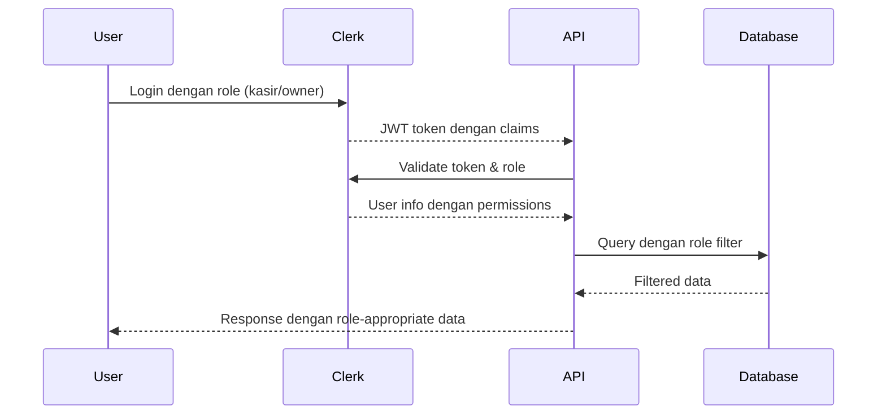

# Dana Kasir - System Architecture Design

## <× High-Level Architecture Overview

### **Design Principles**
1. **Consistency**: Mengikuti pola arsitektur yang sudah ada (3-tier architecture)
2. **Simplicity**: "Keep it Simple" - minimal dependencies dan kompleksitas
3. **Integration**: Fitur sebagai enhancement dari existing system
4. **Scalability**: Design yang dapat dikembangkan di masa depan
5. **Security**: Role-based access control yang konsisten

### **System Architecture Diagram**
```mermaid
graph TB
    subgraph "Existing System"
        A[Clients - Web/Mobile] --> B[Next.js App Router]
        B --> C[API Routes]
        C --> D[Service Layer]
        D --> E[Prisma ORM]
        E --> F[PostgreSQL Database]

        subgraph "Existing Features"
            G[Transaksi Management] --> H[Product Inventory]
            H --> I[Customer Management]
            I --> J[Payment Processing]
    end

    subgraph "Dana Kasir Feature"
        K[Dana Kasir Dashboard] --> L[Pengeluaran Form]
        K --> M[Pengeluaran API]
        K --> N[Dana Summary API]
        M --> M
        N --> O[Pengeluaran Service]
        O --> P[PengeluaranKasir Model]
        P --> E
        L --> M
    end

    E --> P
    Q[Clerk Authentication] --> C
    Q --> K
    R[Owner Sidebar] --> K

    style A fill:#e1f5fe
    style K fill:#3b82f6
    style P fill:#6366f1
    style Q fill:#10b981
```

## =Ê Component Architecture Design

### **Layer Responsibility Matrix**

| **Layer** | **Responsibility** | **Existing Pattern** | **Dana Kasir Extension** |
|-----------|------------------|-------------------|------------------------|
| **Presentation** | UI components, routing, state management | `TransactionsDashboard`, `OwnerSidebar` | `DanaKasirDashboard`, `PengeluaranForm` |
| **Business Logic** | Service layer, validation, business rules | `TransaksiService`, inventory management | `PengeluaranService`, dana calculations |
| **Data Access** | Database operations, ORM, transactions | Prisma models, migrations | `PengeluaranKasir` model, migration scripts |

### **Component Integration Strategy**
```typescript
// Interface Contracts untuk integrasi yang konsisten
interface DanaKasirComponent {
  // Reuse existing patterns
  authentication: ClerkAuthMiddleware
  responseFormatter: typeof createSuccessResponse
  validation: ZodSchema
  serviceLayer: BaseServicePattern
}

// Integration dengan existing dashboard
interface DashboardEnhancement {
  existingTransactions: TransactionData[]
  newPengeluaran: PengeluaranData[]
  summaryCalculation: DanaSummary
}
```

## =Ä Database Schema Design

### **New Model: PengeluaranKasir**
```sql
-- Tabel untuk pengeluaran kasir harian
CREATE TABLE pengeluaran_kasir (
  id UUID PRIMARY KEY DEFAULT gen_random_uuid(),
  kasir_id UUID NOT NULL REFERENCES users(id) ON DELETE CASCADE,
  harga DECIMAL(12,2) NOT NULL CHECK (harga > 0),
  kategori VARCHAR(50) NOT NULL DEFAULT 'operasional',
  deskripsi TEXT,
  tanggal_pengeluaran DATE NOT NULL DEFAULT CURRENT_DATE,
  created_at TIMESTAMP WITH TIME ZONE DEFAULT NOW(),
  updated_at TIMESTAMP WITH TIME ZONE DEFAULT NOW()
);

-- Pre-defined Categories
CREATE TYPE kategori_pengeluaran AS ENUM (
  'operasional',
  'maintenance',
  'transport',
  'lainnya'
);

-- Enhanced model definition
ALTER TABLE pengeluaran_kasir
ALTER COLUMN kategori TYPE kategori_pengeluaran;
```

### **Database Integration Points**
```sql
-- Relasi dengan existing User model (Kasir)
ALTER TABLE pengeluaran_kasir
ADD CONSTRAINT fk_pengeluaran_kasir_kasir
FOREIGN KEY (kasir_id) REFERENCES users(id) ON DELETE CASCADE;

-- Indexes untuk optimasi query
CREATE INDEX idx_pengeluaran_kasir_kasir_tanggal ON pengeluaran_kasir(kasir_id, tanggal_pengeluaran);
CREATE INDEX idx_pengeluaran_kasir_kategori ON pengeluaran_kasir(kategori);
CREATE INDEX idx_pengeluaran_kasir_created_at ON pengeluaran_kasir(created_at);
```

### **Migration Strategy**
```sql
-- Migration: 001_add_pengeluaran_kasir.sql
-- Backward compatible: Tidak mengubah existing tables
-- Rollback: DROP TABLE jika perlu rollback
-- Deployment: Run migration sebelum API deployment
```

## = API Layer Specification

### **Route Structure & Endpoints**
```typescript
// API Routes untuk Dana Kasir Management
// app/api/kasir/pengeluaran/route.ts
interface PengeluaranAPI {
  'GET /api/kasir/pengeluaran': GetPengeluaranListResponse
  'POST /api/kasir/pengeluaran': CreatePengeluaranResponse
  'PUT /api/kasir/pengeluaran/[id]': UpdatePengeluaranResponse
  'DELETE /api/kasir/pengeluaran/[id]': DeletePengeluaranResponse
  'GET /api/kasir/dana-summary': DanaSummaryResponse
}

// app/api/kasir/dana-summary/route.ts
interface DanaSummaryAPI {
  'GET /api/kasir/dana-summary': {
    pendapatan_hari_ini: number
    pengeluaran_hari_ini: number
    saldo_akhir: number
    total_transaksi: number
    ringkasan_pengeluaran: KategoriWise[]
  }
}
```

### **Request/Response Contracts**
```typescript
// Request schemas dengan Zod validation
const createPengeluaranSchema = z.object({
  harga: z.number().positive("Harga harus positif"),
  kategori: z.enum(["operasional", "maintenance", "transport", "lainnya"]),
  deskripsi: z.string().optional().max(500, "Deskripsi maksimal 500 karakter")
})

// Response format yang konsisten
interface APIResponse<T> {
  success: boolean
  data?: T
  error?: {
    message: string
    code: string
    details?: ValidationError[]
  }
  pagination?: PaginationMeta
}
```

### **Authentication & Authorization**
```typescript
// Menggunakan existing middleware patterns
import { requirePermission } from '@/lib/auth-middleware'

// Role-based access control
const permissionMatrix = {
  // Kasir: CRUD untuk data miliknya, Read untuk semua
  'kasir': {
    'create': ['kasir', 'write'],
    'read': ['kasir', 'read'],
    'update': ['kasir', 'write'],
    'delete': ['kasir', 'write']
  },
  // Owner: Read-only akses ke semua data kasir
  'owner': {
    'read': ['kasir', 'read'],
    'summary': ['owner', 'read']
  }
}
```

## <¨ UI/UX Component Design

### **Dashboard Layout Enhancement**
```typescript
// Component structure untuk Dana Kasir Dashboard
interface DanaKasirDashboardProps {
  kasirId: string
  userRole: 'kasir' | 'owner'
}

// Layout yang konsisten dengan existing dashboard
const DashboardLayout = {
  header: 'Dana Kasir Management',
  sections: [
    'summary_cards',      // Pendapatan vs Pengeluaran
    'transaction_list',   // Daftar transaksi hari ini
    'pengeluaran_form',  // Form input pengeluaran
    'action_buttons'     // Tambah Transaksi button
  ]
}
```

### **Form Component Design**
```typescript
// Simple form dengan validasi real-time
interface PengeluaranFormProps {
  onSubmit: (data: PengeluaranData) => Promise<void>
  initialData?: Partial<PengeluaranData>
  isLoading?: boolean
}

// Menggunakan existing UI patterns
const FormFields = {
  harga: {
    type: 'currency',
    validation: 'required|min:1000',
    placeholder: 'Rp 0'
  },
  kategori: {
    type: 'select',
    options: ['operasional', 'maintenance', 'transport', 'lainnya'],
    validation: 'required'
  },
  deskripsi: {
    type: 'textarea',
    validation: 'max:500',
    placeholder: 'Deskripsi pengeluaran...'
  }
}
```

### **Navigation Integration**
```tsx
// Update Owner Sidebar dengan menu Dana Kasir
// components/layout/OwnerSidebar.tsx
<Link href="/dana-kasir">
  <Button variant="ghost" className="w-full justify-start hover:bg-red-50 hover:text-red-700">
    <DollarSign className="mr-3 h-4 w-4" />
    Dana Kasir
  </Button>
</Link>
```

## = Security Architecture

### **Authentication Flow**


### **Access Control Implementation**
```typescript
// Data filtering berdasarkan role
interface DataFilter {
  kasirAccess: 'own' | 'all'
  ownerAccess: 'read-only' | 'full'
}

// Service layer filtering
class PengeluaranService {
  async getPengeluaran(kasirId: string, userRole: string) {
    const whereClause = userRole === 'kasir'
      ? { kasir_id: kasirId }
      : {} // Owner dapat lihat semua

    return this.prisma.pengeluaranKasir.findMany({
      where: whereClause,
      orderBy: { created_at: 'desc' }
    })
  }
}
```

### **Input Validation & Sanitization**
```typescript
// Zod schemas untuk semua input validation
const pengeluaranValidation = {
  create: createPengeluaranSchema,
  update: updatePengeluaranSchema,
  query: queryPengeluaranSchema
}

// Security measures
const securityMeasures = {
  inputSanitization: 'Zod auto-sanitization',
  sqlInjectionPrevention: 'Prisma ORM parameterized queries',
  rateLimiting: 'withRateLimit() middleware',
  dataValidation: 'Server-side validation',
  authMiddleware: 'Clerk.requireAuth()'
}
```

## ¡ Performance Optimization

### **Database Performance Strategy**
```sql
-- Query optimization dengan proper indexing
CREATE INDEX CONCURRENTLY idx_pengeluaran_kasir_performance ON pengeluaran_kasir(
  kasir_id,
  tanggal_pengeluaran DESC,
  kategori
);

-- Query patterns untuk optimal performance
-- Hari ini: WHERE tanggal_pengeluaran = CURRENT_DATE
-- Range: WHERE tanggal_pengeluaran BETWEEN ? AND ?
-- By kasir: WHERE kasir_id = ? AND created_at >= ?
```

### **Caching Strategy**
```typescript
// React Query configuration untuk optimal caching
const queryConfig = {
  staleTime: 30 * 1000,        // 30 detik
  cacheTime: 5 * 60 * 1000,       // 5 menit
  refetchOnWindowFocus: true,
  refetchOnReconnect: true
}

// API response caching
const cachingStrategy = {
  danaSummary: '1 menit cache untuk heavy calculations',
  pengeluaranList: '30 detik cache untuk list data',
  transaksiIntegration: 'Real-time untuk transaksi baru'
}
```

### **Monitoring & Metrics**
```typescript
// Performance monitoring points
interface PerformanceMetrics {
  apiResponseTime: '< 2 detik untuk semua operasi',
  databaseQueryTime: '< 100ms untuk typical operations',
  cacheHitRate: '> 80% untuk frequently accessed data',
  memoryUsage: '< 100MB untuk dashboard operations',
  errorRate: '< 1% untuk semua operations'
}
```

## = Implementation Roadmap

### **Phase 1: Foundation (Week 1-2)**
- **Priority 1**: Database schema migration
- **Priority 2**: Service layer implementation
- **Priority 3**: Basic CRUD API endpoints
- **Priority 4**: Unit tests untuk core functionality

### **Phase 2: Integration (Week 3-4)**
- **Priority 5**: Dashboard component development
- **Priority 6**: Form component creation
- **Priority 7**: API integration with existing transaction system
- **Priority 8**: Role-based access control implementation

### **Phase 3: Enhancement (Week 5)**
- **Priority 9**: Advanced reporting features
- **Priority 10**: Mobile responsiveness optimization
- **Priority 11**: Performance monitoring integration
- **Priority 12**: Comprehensive testing (unit, integration, E2E)

### **Deployment Strategy**
```typescript
// Feature flags untuk gradual rollout
const featureFlags = {
  danaKasirEnabled: process.env.ENABLE_DANA_KASIR === 'true',
  newDashboardLayout: process.env.ENABLE_NEW_DASHBOARD === 'true',
  advancedReporting: process.env.ENABLE_ADVANCED_REPORTING === 'true'
}

// Rollback capabilities
const rollbackPlan = {
  databaseMigration: 'Rollback migration available',
  apiCompatibility: 'v1 API backward compatible',
  uiFallback: 'Original dashboard layout available'
}
```

##  Quality Gates & Success Criteria

### **Functional Requirements**
-  **Input Speed**: Pengeluaran input < 30 detik
-  **Real-time Updates**: Sync pendapatan & pengeluaran < 5 detik
-  **Role Access**: Permissions berfungsi dengan benar
-  **Data Accuracy**: Summary calculations akurat 100%

### **Technical Requirements**
-  **API Performance**: Response time < 2 detik
-  **Database Queries**: Typical operations < 100ms
-  **Mobile Responsive**: Layout berfungsi di mobile
-  **Test Coverage**: 80%+ untuk semua komponen
-  **Error Handling**: Proper error codes dan messages

### **Integration Requirements**
-  **Backward Compatibility**: Tidak breaking existing API
-  **Consistent Patterns**: Mengikuti existing code patterns
-  **Security Standards**: Mengikuti existing security practices
-  **Documentation**: API docs terupdate dan lengkap

---

**Design Version**: 1.0
**Last Updated**: 2025-01-29
**Architect**: Claude Code Assistant
**Status**: Ready for Implementation
**Next Phase**: Database Schema Implementation