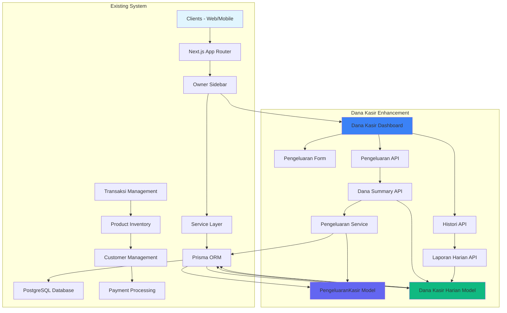
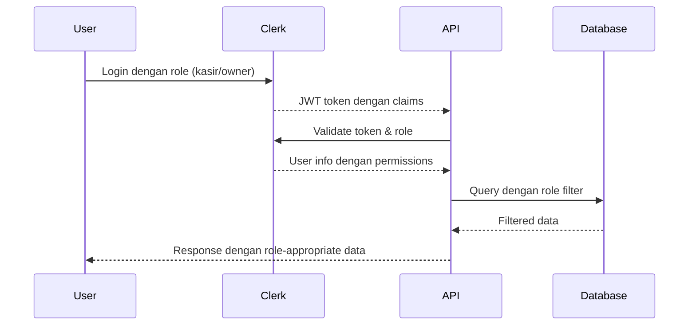

# Dana Kasir - Enhanced System Architecture Design

## 🎯 Overview

Desain ini menggabungkan arsitektur yang ada dengan enhancement yang diidentifikasi untuk Dana Kasir. Berdasarkan analisis kebutuhan, kita akan menambah historical data tracking, daily cash flow management, dan enhanced reporting capabilities.

**Design Version**: 3.0 (Keep it Simple - Minimal Viable Product)
**Last Updated**: 2025-01-29
**Architect**: Claude Code Assistant (with Sequential MCP Analysis)
**Status**: Simple Design Ready for Implementation
**Next Phase**: Minimal Database Schema Implementation

---

## 🏗️ High-Level Architecture Overview

### **Design Principles**
1. **Consistency**: Mengikuti pola arsitektur yang sudah ada (3-tier architecture)
2. **Simplicity**: "Keep it Simple" - minimal dependencies dan kompleksitas
3. **Integration**: Fitur sebagai enhancement dari existing system
4. **Scalability**: Design yang dapat dikembangkan di masa depan
5. **Security**: Role-based access control yang konsisten

### **System Architecture Diagram**


### **Enhanced Component Architecture Design**

#### **Layer Responsibility Matrix**
| **Layer** | **Responsibility** | **Existing Pattern** | **Dana Kasir Enhancement** |
|-----------|------------------|-------------------|------------------------|
| **Presentation** | UI components, routing, state management | `TransactionsDashboard`, `OwnerSidebar` | `DanaKasirDashboard`, `PengeluaranForm`, `HistoricalView`, `DateNavigation` |
| **Business Logic** | Service layer, validation, business rules | `TransaksiService`, inventory management | `PengeluaranService`, `DanaKasirService`, cash flow calculations |
| **Data Access** | Database operations, ORM, transactions | Prisma models, migrations | `PengeluaranKasir`, `DanaKasirHarian`, enhanced migrations |

---

## 🔍 Enhanced Database Schema Design

### **Enhanced Model: Dana Kasir System**
```sql
-- Enhanced table untuk pengeluaran kasir dengan historical tracking
CREATE TABLE pengeluaran_kasir (
  id UUID PRIMARY KEY DEFAULT gen_random_uuid(),
  kasir_id UUID NOT NULL REFERENCES users(id) ON DELETE CASCADE,
  harga DECIMAL(12,2) NOT NULL CHECK (harga > 0),
  kategori VARCHAR(50) NOT NULL DEFAULT 'operasional',
  deskripsi TEXT,
  tanggal_pengeluaran DATE NOT NULL DEFAULT CURRENT_DATE,
  jenis_transaksi VARCHAR(20) NOT NULL DEFAULT 'pengeluaran',
  tanggal_transaksi DATE NOT NULL DEFAULT CURRENT_DATE,
  referensi_transaksi UUID NULL,
  status_harian VARCHAR(20) DEFAULT 'active',
  created_at TIMESTAMP WITH TIME ZONE DEFAULT NOW(),
  updated_at TIMESTAMP WITH TIME ZONE DEFAULT NOW()
);

-- Table untuk tracking dana kasir harian
CREATE TABLE dana_kasir_harian (
  id UUID PRIMARY KEY DEFAULT gen_random_uuid(),
  kasir_id UUID NOT NULL REFERENCES users(id) ON DELETE CASCADE,
  tanggal DATE NOT NULL,
  total_pemasukan DECIMAL(12,2) DEFAULT 0,
  total_pengeluaran DECIMAL(12,2) DEFAULT 0,
  saldo_awal DECIMAL(12,2) DEFAULT 0,
  saldo_akhir DECIMAL(12,2) DEFAULT 0,
  status_harian VARCHAR(20) DEFAULT 'open',
  created_at TIMESTAMP WITH TIME ZONE DEFAULT NOW(),
  updated_at TIMESTAMP WITH TIME ZONE DEFAULT NOW()
);

-- Pre-defined Categories
CREATE TYPE kategori_pengeluaran AS ENUM (
  'operasional',
  'maintenance',
  'transport',
  'lainnya'
);

-- Enhanced indexes untuk optimal performance
CREATE INDEX idx_pengeluaran_kasir_kasir_tanggal ON pengeluaran_kasir(kasir_id, tanggal_pengeluaran DESC);
CREATE INDEX idx_pengeluaran_kasir_kategori ON pengeluaran_kasir(kategori);
CREATE INDEX idx_pengeluaran_kasir_transaksi ON pengeluaran_kasir(kasir_id, jenis_transaksi, tanggal_pengeluaran DESC);
CREATE INDEX idx_pengeluaran_kasir_created_at ON pengeluaran_kasir(created_at);

-- Indexes untuk daily cash flow tracking
CREATE INDEX idx_dana_kasir_harian_tanggal ON dana_kasir_harian(kasir_id, tanggal DESC);
CREATE INDEX idx_dana_kasir_harian_status ON dana_kasir_harian(status_harian);
```

### **Database Integration Points**
```sql
-- Relasi dengan existing User model (Kasir/Owner)
ALTER TABLE pengeluaran_kasir
ADD CONSTRAINT fk_pengeluaran_kasir_kasir
FOREIGN KEY (kasir_id) REFERENCES users(id) ON DELETE CASCADE;
```

### **Migration Strategy**
```sql
-- Migration: 002_enhance_dana_kasir.sql
-- Backward compatible: Extends existing tables
-- Rollback: DROP TABLE jika perlu rollback
-- Deployment: Run migration sebelum API deployment
```

---

## 🚀 Enhanced API Layer Specification

### **Enhanced Route Structure & Endpoints**
```typescript
// Enhanced API Routes untuk Dana Kasir Management
interface PengeluaranAPI {
  'GET /api/kasir/pengeluaran': GetPengeluaranListResponse
  'GET /api/kasir/pengeluaran?tanggal={date}': GetPengeluaranPerTanggalResponse
  'POST /api/kasir/pengeluaran': CreatePengeluaranResponse
  'PUT /api/kasir/pengeluaran/[id]': UpdatePengeluaranResponse
  'DELETE /api/kasir/pengeluaran/[id]': DeletePengeluaranResponse
}

interface DanaKasirAPI {
  'GET /api/kasir/dana-summary': DanaSummaryResponse
  'GET /api/kasir/dana-summary?tanggal={date}': DanaSummaryPerTanggalResponse
  'POST /api/kasir/penutupan-harian': PenutupanHarianResponse
  'GET /api/kasir/histori': GetHistoriResponse
  'GET /api/kasir/histori?tanggal={date}': GetHistoriTanggalResponse
  'GET /api/kasir/histori?startDate={date}&endDate={date}': GetHistoriRangeResponse
  'GET /api/kasir/laporan-harian': LaporanHarianResponse
  'GET /api/kasir/laporan-harian?startDate={date}&endDate={date}': LaporanRangeResponse
}
```

### **Enhanced Request/Response Contracts**
```typescript
// Enhanced Request schemas dengan Zod validation
const createPengeluaranSchema = z.object({
  harga: z.number().positive("Harga harus positif"),
  kategori: z.enum(["operasional", "maintenance", "transport", "lainnya"]),
  deskripsi: z.string().optional().max(500, "Deskripsi maksimal 500 karakter"),
  tanggal_pengeluaran: z.string().optional().refine(validasiTanggal)
})

// Enhanced response format yang konsisten
interface APIResponse<T> {
  success: boolean
  data?: T
  error?: {
    message: string
    code: string
    details?: ValidationError[]
  }
  pagination?: PaginationMeta
}

// Enhanced daily summary response
interface DanaSummaryResponse {
  pendapatan_hari_ini: number
  pengeluaran_hari_ini: number
  saldo_akhir: number
  total_transaksi: number
  ringkasan_pengeluaran: KategoriWise[]
  status_harian: 'open' | 'closed'
}

// Historical data response
interface GetHistoriTanggalResponse {
  data: PengeluaranKasir[]
  tanggal: string
  pagination: PaginationMeta
  summary: {
    total_pemasukan: number
    total_pengeluaran: number
    saldo: number
  }
}
```

### **Enhanced Authentication & Authorization**
```typescript
// Menggunakan existing middleware patterns
import { requirePermission } from '@/lib/auth-middleware'

// Enhanced role-based access control
const permissionMatrix = {
  // Kasir: CRUD untuk data miliknya, Read untuk histori
  'kasir': {
    'create': ['kasir', 'write'],
    'read': ['kasir', 'read'],
    'update': ['kasir', 'write'],
    'delete': ['kasir', 'write'],
    'histori': ['kasir', 'read'],
    'laporan': ['kasir', 'read']
  },
  // Owner: Read-only akses ke semua data kasir
  'owner': {
    'read': ['kasir', 'read'],
    'summary': ['owner', 'read'],
    'histori': ['kasir', 'read'],
    'laporan': ['kasir', 'read']
  }
}
```

---

## 🎨 Enhanced UI/UX Component Design

### **Enhanced Dashboard Layout**
```typescript
// Component structure untuk Enhanced Dana Kasir Dashboard
interface EnhancedDanaKasirDashboardProps {
  kasirId: string
  userRole: 'kasir' | 'owner'
  initialView: 'current' | 'historical'
  selectedDate?: string
}

// Layout yang konsisten dengan existing dashboard
const EnhancedDashboardLayout = {
  header: 'Dana Kasir Management',
  sections: [
    'date_navigation',    // Date picker dan view toggle
    'summary_cards',       // Enhanced summary cards
    'pengeluaran_form',    // Enhanced form input
    'transaction_list',     // Daftar transaksi hari ini
    'historical_cards',    // Historical data cards
    'action_buttons',      // Tambah Transaksi & Close Daily
    'daily_reports'        // Daily reports with export
  ]
}
```

### **Enhanced Form Component Design**
```typescript
// Enhanced form dengan validasi real-time dan date picker
interface EnhancedPengeluaranFormProps {
  onSubmit: (data: EnhancedPengeluaranData) => Promise<void>
  initialData?: Partial<EnhancedPengeluaranData>
  isLoading?: boolean
  showDatePicker?: boolean
  selectedDate?: string
}

// Enhanced form fields dengan validation
interface EnhancedPengeluaranData {
  harga: number
  kategori: 'operasional' | 'maintenance' | 'transport' | 'lainnya'
  deskripsi?: string
  tanggal_pengeluaran?: string
}

// Menggunakan existing UI patterns
const EnhancedFormFields = {
  harga: {
    type: 'currency',
    validation: 'required|min:1000',
    placeholder: 'Rp 0'
  },
  kategori: {
    type: 'select',
    options: ['operasional', 'maintenance', 'transport', 'lainnya'],
    validation: 'required'
  },
  deskripsi: {
    type: 'textarea',
    validation: 'max:500',
    placeholder: 'Deskripsi pengeluaran...'
  },
  tanggal_pengeluaran: {
    type: 'date',
    validation: 'optional'
  }
}
```

### **Enhanced Navigation Integration**
```typescript
// Update Owner Sidebar dengan enhanced Dana Kasir menu
// components/layout/OwnerSidebar.tsx
<Link href="/dana-kasir">
  <Button variant="ghost" className="w-full justify-start hover:bg-red-50 hover:text-red-700">
    <DollarSign className="mr-3 h-4 w-4" />
    Dana Kasir
  </Button>
</Link>

// Enhanced navigation dengan sub-menu
const EnhancedDanaKasirNav = {
  main: '/dana-kasir',
  subItems: [
    { label: 'Data Hari Ini', href: '/dana-kasir' },
    { label: 'Histori Transaksi', href: '/dana-kasir/histori' },
    { label: 'Laporan Harian', href: '/dana-kasir/laporan' }
  ]
}
```

---

## 🛡️ Enhanced Security Architecture

### **Authentication Flow**


### **Enhanced Access Control Implementation**
```typescript
// Enhanced data filtering berdasarkan role
interface DataFilter {
  kasirAccess: 'own' | 'all'
  ownerAccess: 'read-only' | 'full'
}

// Enhanced service layer filtering
class PengeluaranService {
  async getPengeluaran(kasirId: string, userRole: string, options?: QueryOptions) {
    const whereClause = userRole === 'kasir'
      ? { kasir_id: kasirId, ...options?.filter }
      : {} // Owner dapat lihat semua

    return this.prisma.pengeluaranKasir.findMany({
      where: whereClause,
      orderBy: { tanggal_pengeluaran: 'desc' },
      ...options?.pagination
    })
  }

  async getHistoricalData(kasirId: string, userRole: string, tanggal: string) {
    const whereClause = userRole === 'kasir'
      ? { kasir_id: kasirId, tanggal_pengeluaran: tanggal }
      : { kasir_id: kasirId, tanggal_transaksi: tanggal }

    return this.prisma.pengeluaranKasir.findMany({
      where: whereClause,
      orderBy: { tanggal_pengeluaran: 'desc' },
      take: 50 // Pagination untuk histori
    })
  }
}
```

---

## ⚡ Enhanced Performance Optimization

### **Enhanced Database Performance Strategy**
```sql
-- Query optimization dengan proper indexing
CREATE INDEX CONCURRENTLY idx_pengeluaran_kasir_performance ON pengeluaran_kasir(
  kasir_id,
  tanggal_pengeluaran DESC,
  kategori
);

-- Query patterns untuk optimal performance
-- Hari ini: WHERE tanggal_pengeluaran = CURRENT_DATE AND kasir_id = ?
-- Range: WHERE tanggal_pengeluaran BETWEEN ? AND ?
-- By kasir: WHERE kasir_id = ? AND tanggal_pengeluaran >= ?
-- Historical: WHERE tanggal_pengeluaran <= ? ORDER BY tanggal_pengeluaran DESC LIMIT 50
```

### **Enhanced Caching Strategy**
```typescript
// React Query configuration untuk optimal caching
const enhancedQueryConfig = {
  staleTime: 30 * 60 * 1000,        // 30 menit
  cacheTime: 5 * 60 * 1000,       // 5 menit
  refetchOnWindowFocus: true,
  refetchOnReconnect: true
}

// API response caching
const cachingStrategy = {
  danaSummary: '5 menit cache untuk heavy calculations',
  pengeluaranList: '30 menit cache untuk list data',
  historiData: '1 jam cache untuk historical data',
  dailyReports: '15 menit cache untuk reports'
}
```

### **Enhanced Monitoring & Metrics**
```typescript
// Performance monitoring points
interface EnhancedPerformanceMetrics {
  apiResponseTime: '<2 detik untuk semua operasi',
  databaseQueryTime: '<100ms untuk typical operations',
  cacheHitRate: '>80% untuk frequently accessed data',
  memoryUsage: '<100MB untuk dashboard operations',
  errorRate: '<1% untuk semua operasi',
  dailyCalculationTime: '<1 detik untuk cash flow'
}
```

---

## 📊 Enhanced Implementation Roadmap

### **Phase 1: Foundation Enhancement** (Week 1-2)
- **Priority 1**: Enhanced database schema migration
- **Priority 2**: PengeluaranService enhancement dengan historical data
- **Priority 3**: Enhanced CRUD endpoints dengan date filtering
- **Priority 4**: Unit tests untuk enhanced functionality

### **Phase 2: Integration & Business Logic** (Week 2-3)
- **Priority 5**: Daily cash flow calculation service
- **Priority 6**: Enhanced summary API with historical data
- **Priority 7**: Historical data API endpoints
- **Priority 8**: Daily closing functionality
- **Priority 9**: Integration tests with transaction system

### **Phase 3: Enhanced Frontend Integration** (Week 3-4)
- **Priority 10**: Enhanced dashboard with summary cards and navigation
- **Priority 11**: Date picker and historical view components
- **Priority 12**: Enhanced form with validation and date selection
- **Priority 13**: Historical data cards with pagination
- **Priority 14**: State management integration with caching

### **Phase 4: Quality & Polish** (Week 4-5)
- **Priority 15**: Daily reports with export functionality
- **Priority 16**: E2E testing for enhanced workflows
- **Priority 17**: Performance optimization and monitoring
- **Priority 18**: Documentation update and user guides

---

## 📈 Enhanced Success Criteria

### **Enhanced Functional Requirements**:
- ✅ Kasir dapat input pengeluaran < 30 detik dengan date picker
- ✅ Real-time sync pendapatan dan pengeluaran < 5 detik
- ✅ Role-based access berfungsi dengan benar
- ✅ Owner dapat monitoring semua data kasir dalam satu view
- ✅ Historical data tracking untuk 30 hari terakhir
- ✅ Daily cash flow calculation otomatis dan akurat
- ✅ Daily reports dengan export functionality (PDF/Excel)
- ✅ Mobile responsive design untuk semua layer

### **Enhanced Technical Requirements**:
- ✅ API response time < 2 detik untuk semua operasi
- ✅ Database query time < 100ms untuk typical operations
- ✅ Historical query performance < 500ms untuk 30 hari data
- ✅ Proper error handling dan validation
- ✅ 80%+ test coverage untuk semua komponen
- ✅ Zero security vulnerabilities
- ✅ Performance baseline < 3 seconds untuk load time

### **Enhanced Integration Requirements**:
- ✅ Backward compatibility dengan existing transaction system
- ✅ Consistent patterns dengan existing codebase
- ✅ Security standards dengan existing authentication
- ✅ Documentation lengkap dan up-to-date

---

## ⚠️ Enhanced Risk Assessment

### **High Risk Items**:
1. **Historical Data Volume**: Database growth dan query performance
   - **Mitigation**: Proper indexing dan pagination strategy
   - **Contingency**: Data retention policy untuk data lama

2. **Daily Calculation Complexity**: Cash flow calculation accuracy
   - **Mitigation**: Comprehensive unit tests dan audit trails
   - **Validation**: Double-entry validation untuk penutupan harian

### **Medium Risk Items**:
1. **Enhanced Frontend Integration**: Component conflicts dengan existing
   - **Mitigation**: Careful component isolation dan testing
   - **Fallback**: Original dashboard layout available

2. **Role-Based Access**: Permission complexity enhancement
   - **Mitigation**: Clear permission matrix documentation
   - **Testing**: Comprehensive access control testing

---

## 💡 Enhanced Design Summary

**Strategic Enhancement**:
- Memperluas Dana Kasir dengan historical data tracking dan daily management
- Mempertahankan prinsip "Keep it Simple" dengan fitur yang value-adding
- Menjaga konsistensi dengan arsitektur existing

**Key Enhancements**:
1. **Historical Data Tracking**: 30 hari dengan pagination dan filtering
2. **Daily Cash Flow**: Perhitungan otomatis dengan validasi
3. **Enhanced Navigation**: Date picker dan view toggle yang intuitif
4. **Comprehensive Reporting**: Daily reports dengan export capability
5. **Performance Optimization**: Indexing dan caching strategy yang tepat

**Implementation Strategy**:
- Phase-by-phase development dengan proper testing
- Backward compatibility maintenance
- Enhanced monitoring untuk performance tracking
- Documentation update untuk setiap fitur baru

---

**Design Version**: 2.0 (Enhanced)
**Last Updated**: 2025-01-29
**Architect**: Claude Code Assistant (with Sequential MCP Analysis)
**Status**: Ready for Enhanced Implementation