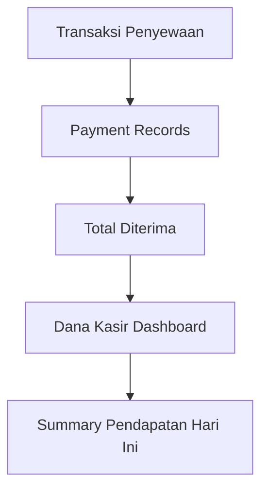
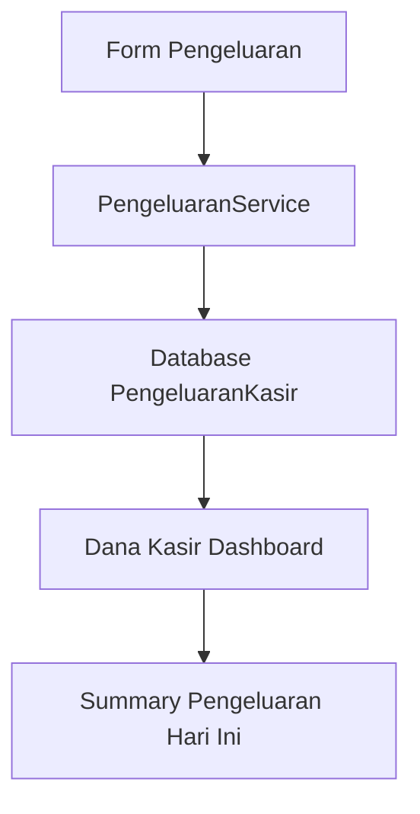
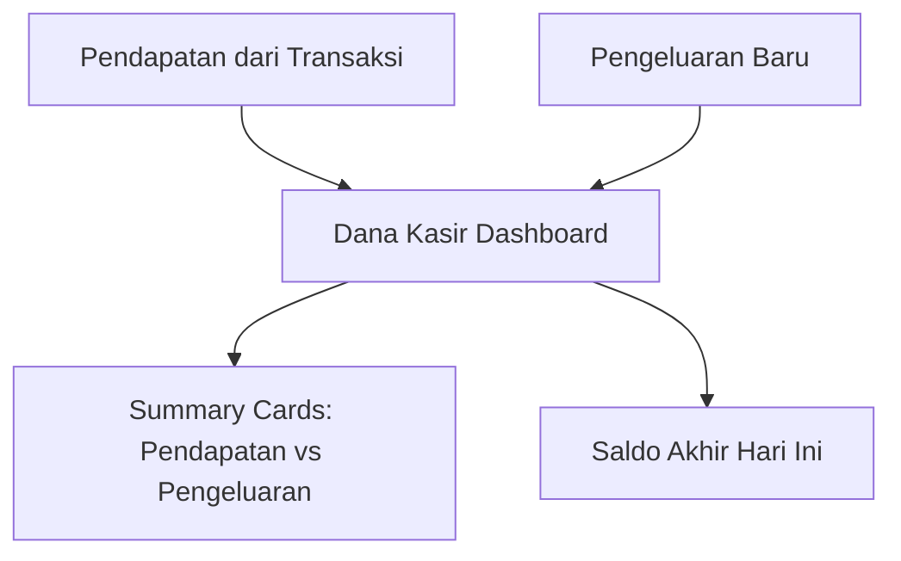

# Dana Kasir - Technical Requirements Analysis

## =
 Codebase Analysis Summary

Berdasarkan analisis mendalam terhadap struktur kode yang ada (`app/api/kasir/transaksi`, `app/api/kasir/transaksi/[kode]`, `app/api/products/[id]/history`, `features/kasir/services/transaksiService.ts`, dan `prisma/schema.prisma`), berikut adalah temuan utama untuk implementasi fitur Dana Kasir:

## =� Current Architecture Assessment

### **Existing Strengths**
1. **3-Tier Architecture**: Presentation � Business Logic � Data Access pattern yang konsisten
2. **Authentication System**: Clerk integration dengan role-based access control yang sudah mature
3. **Database Design**: Prisma ORM dengan proper indexing, UUID primary keys, dan well-defined relations
4. **API Patterns**: RESTful endpoints dengan consistent error handling dan response formatting
5. **Service Layer**: Clean dependency injection dengan business logic separation
6. **Inventory Management**: Sistem yang sudah ada untuk manajemen stok produk

### **Identified Gaps for Dana Kasir**
1. **Missing Database Model**: Tidak ada model untuk PengeluaranKasir
2. **Missing Historical Data**: Perlu tracking histori pengeluaran per hari
3. **Missing Daily Closing**: Perlu mekanisme penutupan harian dana kasir
4. **Missing Daily Report**: Perlu laporan harian yang lengkap (pemasukan, pengeluaran, selisih)
5. **Missing Payment Source Tracking**: Perlu tracking sumber pendapatan (hanya dari rental payments)
6. **API Endpoints**: Perlu CRUD operations dan histori untuk pengeluaran kasir
7. **UI Components**: Dashboard kasir perlu enhancement dengan cards lengkap (pemasukan, pengeluaran, saldo, histori)
8. **Business Logic**: Perlu service layer untuk perhitungan dana kasir, closing, dan reporting
9. **Navigation**: Owner sidebar perlu menu item untuk akses Dana Kasir
10. **Missing Date Navigation**: Perlu navigasi tanggal untuk melihat histori dan laporan

## <� Implementation Strategy

### **Phase 1: Database Schema Extension (Risk: LOW)**
```sql
-- Model baru untuk PengeluaranKasir
CREATE TABLE pengeluaran_kasir (
  id UUID PRIMARY KEY DEFAULT gen_random_uuid(),
  kasir_id UUID NOT NULL REFERENCES users(id),
  harga DECIMAL(12,2) NOT NULL,
  kategori VARCHAR(50) NOT NULL,
  deskripsi TEXT,
  created_at TIMESTAMP DEFAULT CURRENT_TIMESTAMP,
  updated_at TIMESTAMP DEFAULT CURRENT_TIMESTAMP
);

-- Indexes untuk optimasi
CREATE INDEX idx_pengeluaran_kasir_kasir_created ON pengeluaran_kasir(kasir_id, created_at);
CREATE INDEX idx_pengeluaran_kasir_kategori ON pengeluaran_kasir(kategori);
```

### **Phase 2: API Development (Risk: MEDIUM)**
**Pattern yang akan diikuti:**
- Authentication: `requirePermission('kasir', 'read')` untuk read, `requirePermission('kasir', 'write')` untuk create/update
- Validation: Zod schema dengan error handling yang konsisten
- Response: `createSuccessResponse(data, message, statusCode)`
- Rate Limiting: `withRateLimit()` middleware

**API Endpoints yang diperlukan:**
```typescript
// GET /api/kasir/pengeluaran - List pengeluaran hari ini
// POST /api/kasir/pengeluaran - Create pengeluaran baru
// PUT /api/kasir/pengeluaran/:id - Update pengeluaran
// DELETE /api/kasir/pengeluaran/:id - Delete pengeluaran
// GET /api/kasir/dana-summary - Summary pendapatan vs pengeluaran
```

### **Phase 3: Service Layer Implementation (Risk: MEDIUM)**
**PengeluaranService akan mengikuti pola TransaksiService:**
```typescript
export class PengeluaranService {
  constructor(private prisma: PrismaClient, private userId: string) {}

  async createPengeluaran(data: CreatePengeluaranRequest): Promise<PengeluaranKasir>
  async getPengeluaranHariIni(kasirId: string): Promise<PengeluaranKasir[]>
  async getDanaSummary(kasirId: string, tanggal: Date): Promise<DanaKasirSummary>
}
```

### **Phase 4: UI Integration (Risk: MEDIUM)**
**Dashboard Enhancement di `app/(kasir)/dashboard/page.tsx`:**
- Summary cards: Total Pendapatan Hari Ini, Total Pengeluaran Hari Ini, Saldo
- Form Pengeluaran: Simple input dengan validation
- Button "Tambah Transaksi" dengan justify-content layout

**Owner Sidebar Update di `components/layout/OwnerSidebar.tsx`:**
```tsx
<Link href="/dana-kasir">
  <Button variant="ghost" className="w-full justify-start hover:bg-red-50 hover:text-red-700">
    <DollarSign className="mr-3 h-4 w-4" />
    Dana Kasir
  </Button>
</Link>
```

## = Role-Based Access Control

### **Access Matrix**
| **Operation** | **Kasir Role** | **Owner Role** |
|-------------|----------------|---------------|
| View Pendapatan |  (harian) |  (semua kasir) |
| View Pengeluaran |  (miliknya) |  (semua kasir) |
| Create Pengeluaran |  | L (read-only) |
| Edit Pengeluaran |  | L (read-only) |
| Delete Pengeluaran |  | L (read-only) |

### **Implementation menggunakan Clerk Middleware:**
```typescript
// Untuk create/update/delete pengeluaran
const authResult = await requirePermission('kasir', 'write')
if (authResult.error) return authResult.error

// Untuk view pengeluaran (owner view all, kasir view own)
const authResult = await requirePermission('kasir', 'read')
// Implementasi filter logic di service layer
```

## =� Data Flow Analysis

### **Pendapatan Sources (Existing System):**


### **Pengeluaran Flow (New Feature):**


### **Dashboard Integration:**


## <� Quality Assurance Requirements

### **Code Quality Standards:**
- **TypeScript Strict Mode**: Menggunakan tipe yang aman
- **Zod Validation**: Schema validation untuk semua input
- **Error Handling**: Consistent error codes dan messages
- **Logging**: Activity logging untuk audit trails
- **Testing**: Unit tests untuk service layer, integration tests untuk API

### **Performance Considerations:**
- **Database Indexing**: Index untuk query berdasarkan tanggal dan kasir
- **Pagination**: Limit results untuk prevent overload
- **Caching**: React Query untuk client-side caching
- **Rate Limiting**: API rate limiting untuk security

## =� Implementation Roadmap

### **Week 1: Foundation**
1. **Database Migration**: Buat Prisma migration untuk PengeluaranKasir
2. **Service Layer**: Implementasi PengeluaranService dengan business logic
3. **API Routes**: CRUD endpoints untuk pengeluaran dengan authentication

### **Week 2: Integration**
4. **Dashboard Update**: Tambah summary cards dan form pengeluaran
5. **Navigation**: Tambah Dana Kasir menu di owner sidebar
6. **State Management**: Integrasi dengan React Query

### **Week 3: Polish & Testing**
7. **Validation**: Comprehensive form validation dan error handling
8. **Testing**: Unit tests, integration tests, dan E2E tests
9. **Documentation**: Update API documentation dan user guides
10. **Performance**: Optimization dan monitoring setup

## = Integration Points dengan Existing System

### **Reuse Existing Patterns:**
1. **Authentication**: Clerk `requirePermission()` middleware
2. **Response Format**: `createSuccessResponse()` helper function
3. **Error Handling**: Existing error codes dan logging patterns
4. **Database Operations**: Prisma transaction patterns
5. **UI Components**: TailwindCSS dan Radix UI consistency

### **Avoiding Technical Debt:**
1. **Tidak Duplikasi Code**: Gunakan existing utilities dan helpers
2. **Consistent Naming**: Follow existing naming conventions
3. **Database Consistency**: Gunakan schema patterns yang sama
4. **API Consistency**: Follow existing RESTful patterns

##  Success Metrics

### **Functional Requirements:**
-  Kasir dapat input pengeluaran < 30 detik
-  Real-time sync antara pendapatan dan pengeluaran
-  Role-based access berfungsi dengan benar
-  Owner dapat monitoring semua dana kasir dalam satu view

### **Technical Requirements:**
-  Response time < 2 detik untuk semua operasi
-  Mobile responsive design
-  Proper error handling dan validation
-  80%+ test coverage
-  Database query performance < 100ms untuk typical operations

---

**Analisis Date**: 2025-01-29
**Analyst**: Claude Code with Sequential MCP
**Scope**: Dana Kasir feature implementation
**Status**: Ready for implementation with detailed technical specifications