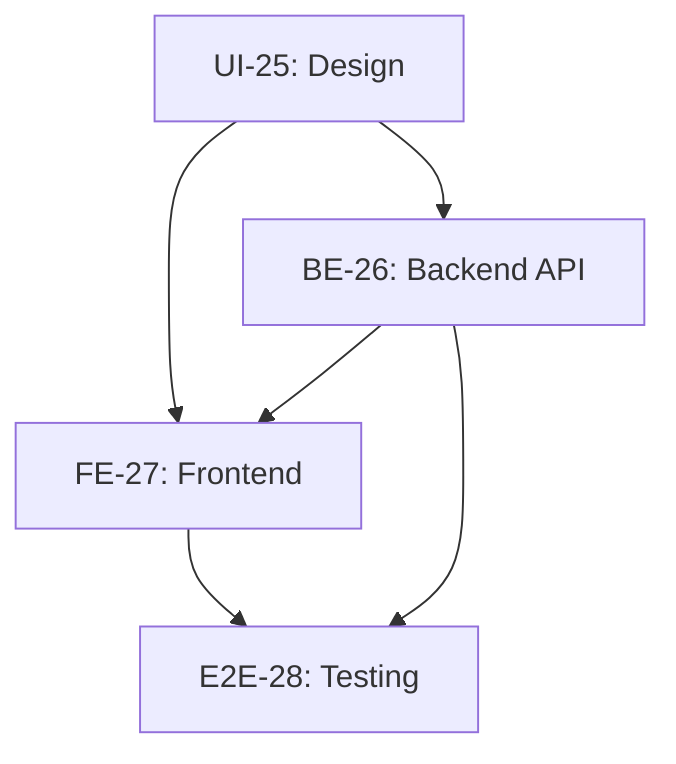

# Task Documentation - Story RPK-21: Pendaftaran Penyewa dan Transaksi Penyewaan

## Overview

Dokumentasi ini berisi breakdown lengkap untuk Story-4 RPK-21: "Sebagai kasir, saya ingin mendaftarkan penyewa baru dan membuat transaksi penyewaan agar proses sewa dapat dimulai."

## Task Breakdown

### 1. [Task UI-25: Desain Interface](./task-ui-25.md)
**Type**: UI/UX Design  
**Priority**: High  
**Effort**: 4 hours

**Scope**:
- Form pendaftaran penyewa dengan layout 2 kolom
- Interface pemilihan produk dengan grid layout dan filter
- Transaction summary dengan kode transaksi unik
- Responsive design untuk mobile, tablet, desktop
- Accessibility compliance (WCAG AA)

**Deliverables**:
- Wireframe dan mockup lengkap
- Design specifications untuk developer handoff
- Component specifications untuk implementation

### 2. [Task BE-26: Backend API Implementation](./task-be-26.md)
**Type**: Backend Development  
**Priority**: High  
**Effort**: 6 hours

**Scope**:
- Database schema untuk tabel `penyewa` dan `transaksi`
- API endpoints untuk CRUD operations
- Auto-generation kode transaksi (format: TXN-YYYYMMDD-XXX)
- Clerk authentication integration
- Input validation dan error handling

**Deliverables**:
- Prisma schema updates
- API route handlers (`app/api/kasir/*`)
- Unit tests untuk business logic
- API documentation

### 3. [Task FE-27: Frontend React Implementation](./task-fe-27.md)
**Type**: Frontend Development  
**Priority**: High  
**Effort**: 6 hours

**Scope**:
- React components: CustomerRegistrationForm, ProductSelector, TransactionSummary
- Custom hooks: usePenyewa, useTransaksi, useProduk, useRentalProcess
- React Query integration untuk data fetching
- Form validation dengan real-time feedback
- Responsive UI implementation

**Deliverables**:
- React components dalam `features/kasir/components/`
- Custom hooks dalam `features/kasir/hooks/`
- API client dalam `features/kasir/api.ts`
- TypeScript types dalam `features/kasir/types.ts`

### 4. [Task E2E-28: End-to-End Testing](./task-e2e-28.md)
**Type**: Testing  
**Priority**: Medium  
**Effort**: 4 hours

**Scope**:
- Playwright test scenarios untuk complete user flow
- Happy path testing: registration → product selection → transaction
- Error handling dan validation testing
- Cross-browser dan mobile testing
- Performance dan accessibility testing

**Deliverables**:
- Playwright test files dalam `__tests__/playwright/kasir/`
- Page Object Model untuk maintainable tests
- Test data seeding dan cleanup utilities
- CI/CD integration

## Implementation Order

1. **Start with UI-25**: Design specifications diperlukan untuk implementation
2. **Parallel BE-26 & FE-27**: Backend dan frontend dapat dikerjakan parallel setelah design selesai
3. **Final E2E-28**: Testing memerlukan complete implementation untuk full flow testing

## Architecture Compliance

### 3-Tier Architecture Alignment

**Presentation Layer** (`features/kasir/components/`):
- CustomerRegistrationForm
- ProductSelector  
- TransactionSummary
- RentalProcessPage

**Logic Layer** (`features/kasir/hooks/`):
- usePenyewa - Customer management logic
- useTransaksi - Transaction creation logic
- useProduk - Product selection logic
- useRentalProcess - Orchestration logic

**Data Layer** (`app/api/kasir/` & `features/kasir/api.ts`):
- API route handlers untuk backend operations
- API client untuk frontend data fetching
- Database operations via Prisma ORM

### Cross-References Matrix

| From Task | To Task | Relationship | Details |
|-----------|---------|-------------|---------|
| UI-25 | FE-27 | Design → Implementation | Component specs, design tokens, responsive behavior |
| UI-25 | BE-26 | Design → Data Requirements | Form fields, validation rules, data structure |
| BE-26 | FE-27 | API → Client Integration | Endpoint contracts, request/response types |
| FE-27 | E2E-28 | Implementation → Testing | Test selectors, user flow validation |
| BE-26 | E2E-28 | API → Integration Testing | Database verification, API response validation |
| UI-25 | E2E-28 | Design → UX Testing | Accessibility testing, responsive validation |

## Success Criteria

### Business Value
- [ ] Kasir dapat mendaftarkan penyewa baru dengan efisien
- [ ] Transaksi penyewaan dapat dibuat dengan kode unik otomatis
- [ ] Data tersimpan dengan akurat dalam database
- [ ] Interface user-friendly dan responsive

### Technical Quality  
- [ ] Code coverage minimal 80% untuk business logic
- [ ] API response time < 2 detik
- [ ] Frontend loading time < 3 detik
- [ ] Accessibility WCAG AA compliance
- [ ] Cross-browser compatibility (Chrome, Firefox, Safari)

### Integration Quality
- [ ] Complete user flow berfungsi end-to-end
- [ ] Error handling graceful di semua layer
- [ ] Data consistency antara frontend dan backend
- [ ] Real-time validation dan feedback bekerja optimal

## Risk Mitigation

### Technical Risks
- **Database Schema Changes**: Careful migration planning dengan backup strategy
- **API Contract Changes**: Versioning strategy untuk backward compatibility
- **Performance Issues**: Load testing dan optimization dari awal development

### Business Risks
- **User Experience**: Continuous user testing dengan actual kasir
- **Data Accuracy**: Comprehensive validation di client dan server side
- **Workflow Disruption**: Gradual rollout dengan rollback capability

## Getting Started

### Prerequisites
- Node.js 18+ dan npm
- PostgreSQL database setup
- Clerk authentication configuration
- Environment variables configured

### Development Setup
1. Install dependencies: `npm install`
2. Setup database: `npm run db:setup`
3. Run development server: `npm run dev`
4. Run tests: `npm run test`

### Task Execution
1. **UI Designer**: Start dengan task-ui-25.md, create design specifications
2. **Backend Developer**: Implement task-be-26.md, focus pada API dan database
3. **Frontend Developer**: Implement task-fe-27.md, integrate UI dengan API
4. **QA/Developer**: Execute task-e2e-28.md, ensure quality dan integration

---

**Story**: RPK-21 - Pendaftaran Penyewa dan Transaksi Penyewaan  
**Total Estimated Effort**: 20 hours  
**Sprint**: [Current Sprint]  
**Last Updated**: [Current Date]