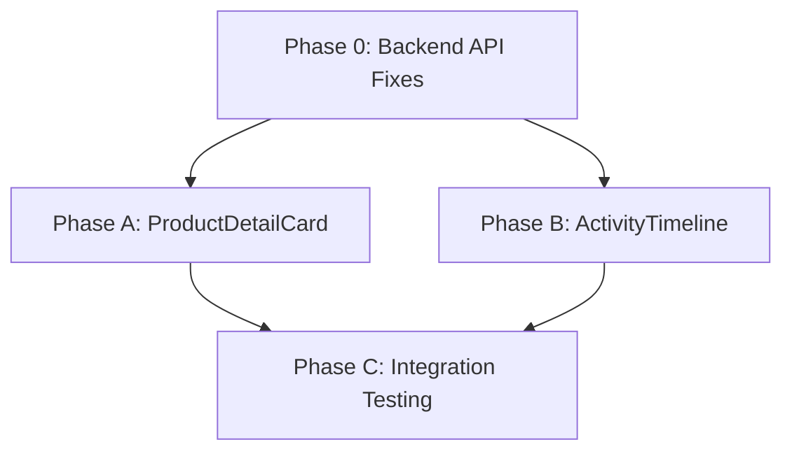

# RPK-44: Enhance Transaction Detail UI for Return System Display

## <� **Task Overview**

**Objective**: Update transaction detail page UI components to properly display return system data after TSK-24 unified return system implementation.

**Context**: TSK-24 successfully implemented a unified multi-condition return system with comprehensive backend support. The transaction detail page (`app/(kasir)/dashboard/transaction/[kode]/page.tsx`) now needs UI enhancements to display return-related information effectively.

**Implementation Status**: ⚠️ **BLOCKED** - API analysis reveals critical gaps, backend fixes required

**Critical Update**: Analysis of `/api/kasir/transaksi/[kode]` reveals return activities missing from transaction timeline. See `features/kasir/docs/analyze.md` for detailed findings.

---

## =� **Background & Context**

### **Completed Foundation (TSK-24)** ⚠️ **Updated with API Analysis**
-  Unified multi-condition return system architecture
-  Comprehensive return data in API responses
-  Return processing with penalty calculations
-  Activity logging for return events
-  Database schema supporting return condition tracking

### **🔍 API Analysis Findings (2025-08-12)**
-  ✅ Item-level return data available (`totalReturnPenalty`, `conditionBreakdown`)
-  ✅ Multi-condition return support implemented  
-  ❌ **MISSING**: Return activities not recorded in transaction timeline
-  ❌ **MISSING**: Timeline entries for `dikembalikan` and `penalty_added` events
-  📊 **Analysis Report**: `features/kasir/docs/analyze.md`

### **Current Implementation Gaps**
- ⏸️ ProductDetailCard lacks return status indicators (**✅ Can Proceed** - Data Available)
- ⏸️ No return condition breakdown visualization (**✅ Can Proceed** - Data Available)
- ⏸️ Penalty information not visible to users (**✅ Can Proceed** - Data Available)
- 🚨 ActivityTimeline doesn't display return events (**🚫 BLOCKED** - API Missing)
- 🚨 No visual feedback for return completion status (**🚫 BLOCKED** - API Missing)

---

## <� **Task Objectives**

### **Primary Goal**
Enhance transaction detail UI to display comprehensive return system information, making return data accessible and user-friendly for kasir operators.

### **Key Requirements (Updated based on API Analysis)**
1. **ProductDetailCard Enhancement**: Show return status and condition breakdown (**✅ Ready**)
2. **API Enhancement**: Implement return activity logging in backend (**🚨 Prerequisite**)
3. **ActivityTimeline Enhancement**: Display return events with multi-condition details (**⏸️ Blocked**)
4. **Data Integration**: Leverage existing API response data for ProductDetailCard
5. **UI Consistency**: Maintain existing design patterns and accessibility standards

---

## 🔧 **Dependencies & Prerequisites**

### **Critical Backend Fixes Required**
Before ActivityTimeline enhancement can proceed, the following API fixes are mandatory:

1. **Return Activity Creation** - `features/kasir/services/returnService.ts`
   - Implement activity logging in `processUnifiedReturn()`
   - Create `dikembalikan` activity entries with condition details
   - **Estimated Effort**: 3-4 hours

2. **Penalty Activity Logging** - Same service file
   - Add penalty-specific activities when penalties > 0
   - Include penalty breakdown in activity metadata
   - **Estimated Effort**: 2-3 hours

3. **Activity Type Mapping** - `features/kasir/hooks/useTransactionDetail.ts`
   - Update `mapActivityTypeToAction()` for return activities
   - **Estimated Effort**: 1 hour

### **Implementation Readiness Matrix**
| Component | Status | Blocker | Can Proceed |
|-----------|--------|---------|-------------|
| ProductDetailCard | ✅ Ready | None | Yes - Data available |
| ActivityTimeline | 🚫 Blocked | API activities missing | No - Requires backend fixes |
| Data Integration | ✅ Partial | Timeline activities only | Yes - For ProductDetailCard |

---

## =📊 **Available Return Data Structure**

### **Transaction Detail API Response**
```typescript
interface TransactionDetailResponse {
  // Existing transaction data...
  items: Array<{
    // Existing item data...
    conditionBreakdown?: Array<{
      kondisiAkhir: string        // "Baik", "Kotor", "Rusak ringan", etc.
      jumlahKembali: number       // Quantity returned in this condition
      penaltyAmount: number       // Penalty for this condition
      modalAwalUsed?: number      // Original price used for penalty calculation
    }>
    totalReturnPenalty: number    // Total penalty for all conditions
    isMultiCondition: boolean     // Whether multiple conditions exist
    returnStatus?: string         // "completed", "partial", "pending"
  }>
  
  // Activity timeline includes return events
  timeline: Array<{
    action: string                // "returned", "penalty_added", etc.
    description: string           // Human-readable description
    details?: {
      conditions?: Array<{        // Return condition details
        kondisiAkhir: string
        jumlahKembali: number
        penaltyAmount: number
      }>
      totalPenalty?: number       // Total penalty amount
      itemsAffected?: string[]    // Product names affected
    }
    timestamp: string
    performedBy: string
  }>
}
```

### **Return Processing Modes**
- **Simple Return**: Single condition for all returned items
- **Multi-Condition Return**: Different conditions for item quantities
- **Unified Processing**: All returns use consistent data structure

---

## =' **Implementation Requirements** 🔄 **Updated Systematic Workflow**

### **Phase 0: Backend API Fixes (Prerequisites)** 🚨 **CRITICAL FIRST**
**Before any ActivityTimeline frontend work can proceed**, the following backend enhancements must be completed:

#### **Step 1: Return Activity Creation** (3-4 hours)
```typescript
// In features/kasir/services/returnService.ts - processUnifiedReturn()
await this.createReturnActivity(transaksiId, {
  tipe: 'dikembalikan',
  deskripsi: `Item returned: ${processedItems.length} items processed`,
  data: {
    conditions: processedItems.map(item => ({
      kondisiAkhir: item.kondisiAkhir,
      jumlahKembali: item.conditionBreakdown?.reduce((sum, c) => sum + c.jumlahKembali, 0) || 1,
      penaltyAmount: item.penalty
    })),
    totalPenalty: penalty,
    itemsAffected: processedItems.map(item => item.produkName)
  }
});
```

#### **Step 2: Penalty Activity Logging** (2-3 hours)
Add penalty-specific activities when penalties > 0

#### **Step 3: Activity Type Mapping Update** (1 hour)
```typescript
// In features/kasir/hooks/useTransactionDetail.ts
const mapping = {
  // ... existing mappings
  dikembalikan: 'returned',
  penalty_diterapkan: 'penalty_added', 
  pengembalian_selesai: 'return_completed'
}
```

### **Phase A: ProductDetailCard Enhancement** ✅ **Can Proceed Parallel**

#### **Return Status Indicators**
```typescript
// Add to ProductDetailCard props
interface ProductDetailCardProps {
  item: {
    // Existing props...
    conditionBreakdown?: ConditionBreakdown[]
    totalReturnPenalty: number
    returnStatus?: 'completed' | 'partial' | 'pending'
    isMultiCondition: boolean
  }
}
```

#### **UI Components to Add**
1. **Return Status Badge**
   - Color-coded status (Green: completed, Blue: partial, Yellow: pending)
   - Clear status text with icons
   - Quantity breakdown (returned/total)

2. **Condition Breakdown Display**
   - Expandable section for multi-condition returns
   - Individual condition entries with quantities
   - Visual indicators for condition severity

3. **Penalty Information**
   - Per-condition penalty amounts
   - Total penalty summary
   - Calculation reasoning display

#### **Visual Design Requirements**
```jsx
// Return status section
<div className="bg-blue-50 border border-blue-200 rounded-lg p-3">
  <div className="flex items-center justify-between">
    <div className="flex items-center gap-2">
      <CheckCircle className="h-4 w-4 text-blue-600" />
      <span className="text-sm font-medium text-blue-900">Status Pengembalian</span>
    </div>
    <Badge variant={statusVariant}>{statusText}</Badge>
  </div>
  
  {/* Condition breakdown when applicable */}
  {isMultiCondition && (
    <div className="mt-3 space-y-2">
      {conditionBreakdown.map((condition, idx) => (
        <div key={idx} className="flex justify-between text-xs">
          <span>{condition.kondisiAkhir}: {condition.jumlahKembali} item</span>
          <span className="font-medium">
            {formatCurrency(condition.penaltyAmount)}
          </span>
        </div>
      ))}
    </div>
  )}
  
  {totalReturnPenalty > 0 && (
    <div className="mt-2 pt-2 border-t border-blue-200">
      <div className="flex justify-between text-sm font-medium">
        <span>Total Denda:</span>
        <span className="text-red-600">{formatCurrency(totalReturnPenalty)}</span>
      </div>
    </div>
  )}
</div>
```

### **Phase B: ActivityTimeline Enhancement** 🚫 **BLOCKED - Requires Phase 0**

#### **Return Event Display**
1. **Return Activity Types**
   - `returned`: Item return processing
   - `penalty_added`: Penalty calculation and application
   - `return_completed`: Full return completion

2. **Enhanced Event Details**
   - Multi-condition breakdown in timeline entries
   - Expandable details for complex returns
   - Penalty calculation reasoning

#### **Timeline Entry Structure**
```jsx
// Return event display in ActivityTimeline
{activity.action === 'returned' && (
  <div className="mt-2 p-3 bg-blue-50 rounded-lg">
    <div className="text-sm font-medium text-blue-900 mb-2">
      Detail Pengembalian
    </div>
    
    {activity.details?.conditions?.map((condition, idx) => (
      <div key={idx} className="flex justify-between text-xs text-blue-700">
        <span>{condition.kondisiAkhir}: {condition.jumlahKembali} item</span>
        {condition.penaltyAmount > 0 && (
          <span className="font-medium text-red-600">
            Denda: {formatCurrency(condition.penaltyAmount)}
          </span>
        )}
      </div>
    ))}
    
    {activity.details?.totalPenalty > 0 && (
      <div className="mt-2 pt-2 border-t border-blue-200">
        <div className="flex justify-between text-sm font-medium">
          <span>Total Denda:</span>
          <span className="text-red-600">
            {formatCurrency(activity.details.totalPenalty)}
          </span>
        </div>
      </div>
    )}
  </div>
)}
```

### **Phase C: Data Integration** ⚠️ **Partial - ProductDetailCard Ready**

#### **API Data Transformation**
1. **Hook Enhancement**: Update `useTransactionDetail` to handle return data
2. **Type Safety**: Ensure proper TypeScript types for return information
3. **Error Handling**: Graceful fallbacks for missing return data
4. **Loading States**: Proper loading indicators for return information

#### **Component Integration**
```typescript
// Enhanced transaction detail hook
export function useTransactionDetail(transactionId: string) {
  return useQuery({
    queryKey: [...queryKeys.kasir.transaksi.detail(transactionId), 'with-returns'],
    queryFn: async () => {
      const response = await transactionApi.getDetail(transactionId)
      
      // Transform return data for UI consumption
      return {
        ...response,
        items: response.items.map(item => ({
          ...item,
          hasReturnData: Boolean(item.conditionBreakdown?.length),
          returnCompleteness: calculateReturnCompleteness(item),
          returnSummary: generateReturnSummary(item.conditionBreakdown)
        }))
      }
    }
  })
}
```


---

## =� **Files to Modify**

### **Primary Components**
1. `features/kasir/components/detail/ProductDetailCard.tsx`
   - Add return status indicators
   - Implement condition breakdown display
   - Show penalty information

2. `features/kasir/components/detail/ActivityTimeline.tsx`
   - Enhance return event display
   - Add multi-condition timeline entries
   - Improve penalty information in activities

### **Supporting Files**
3. `features/kasir/hooks/useTransactionDetail.ts`
   - Enhanced data transformation for return information
   - Add return-specific calculations

4. `features/kasir/types/index.ts`
   - Update TypeScript types for return data
   - Add new interface definitions

5. `features/kasir/lib/utils/client.ts`
   - Add return-specific utility functions
   - Calculation helpers for return display

### **Test Files**
6. `features/kasir/components/detail/__tests__/ProductDetailCard.test.tsx`
7. `features/kasir/components/detail/__tests__/ActivityTimeline.test.tsx`
8. `features/kasir/hooks/__tests__/useTransactionDetail.test.tsx`

---

##  **Success Criteria**

### **Functional Requirements**
-  Return status clearly visible in ProductDetailCard
-  Multi-condition returns properly displayed
-  Penalty information accessible and understandable
-  ActivityTimeline shows complete return process history
-  UI updates reflect return data accurately

### **Technical Requirements**
-  Type-safe implementation with proper TypeScript types
-  Error handling for missing or incomplete return data
-  Performance: <100ms render time for return information
-  Accessibility: WCAG 2.1 AA compliance maintained
-  Responsive design across device sizes

### **User Experience Requirements**
-  Intuitive display of return information
-  Clear visual hierarchy for condition breakdowns
-  Consistent design patterns with existing UI
-  Helpful penalty calculation explanations
-  Real-time updates after return processing

### **Quality Assurance**
-  Comprehensive test coverage (>90% for new code)
-  Visual regression testing for UI changes
-  Cross-browser compatibility validation
-  Performance testing for large return datasets

---

## =' **Implementation Approach**

### **Development Strategy**
1. **Component-First**: Enhance existing components without architectural changes
2. **Data-Driven**: Leverage existing API responses and data structures
3. **Progressive Enhancement**: Add return features without breaking existing functionality
4. **Type-Safe**: Maintain strict TypeScript compliance throughout

### **Validation Process**
1. **Manual Testing**: Test with actual return transactions
2. **Edge Cases**: Verify handling of various return scenarios
3. **Regression Testing**: Ensure existing functionality remains intact
4. **Performance Validation**: Monitor component render performance

### **Rollout Plan**
1. **Development**: Implement components in feature branch
2. **Testing**: Comprehensive testing with test return data
3. **Review**: Code review and validation
4. **Integration**: Merge to main branch after approval

---

## =� **References**

### **Related Documentation**
- `features/kasir/docs/task-docs/TSK-24/design.md` - Return system architecture
- `features/kasir/docs/task.md` - Original task requirements
- `app/(kasir)/dashboard/transaction/[kode]/page.tsx` - Transaction detail page

### **API Documentation**
- `/api/kasir/transaksi/[kode]` - Transaction detail endpoint
- `/api/kasir/transaksi/[kode]/pengembalian` - Return processing endpoint

### **Type Definitions**
- `features/kasir/types/Return.ts` - Return system types
- `features/kasir/types/index.ts` - Main type definitions

---

## <� **Expected Deliverables**

1. **Enhanced ProductDetailCard** with return status and condition display
2. **Improved ActivityTimeline** with comprehensive return event details
3. **Updated TypeScript types** for return data structures
4. **Comprehensive test coverage** for new functionality
5. **Documentation updates** reflecting UI enhancements

### **Definition of Done**
- [ ] All UI components display return data correctly
- [ ] Multi-condition returns are clearly visualized
- [ ] Penalty information is accessible and understandable
- [ ] Test coverage meets quality standards (>90%)
- [ ] Code review completed and approved
- [ ] Manual testing with actual return transactions verified
- [ ] Performance and accessibility requirements met

---

**Task Created**: 2025-08-12  
**Task Updated**: 2025-08-12 ⚠️ **Critical API Analysis Applied**  
**Priority**: High  
**Estimated Effort**: **18-24 hours total** (6-8h backend + 12-16h frontend)
**Dependencies**: 
- TSK-24 (Completed) ✅
- **NEW**: Backend API activity logging fixes (6-8 hours) 🚨
**Assignee**: TBD

## 🔄 **Systematic Implementation Workflow**

### **Sequential Dependencies:**


### **Parallel Work Opportunities:**
- **Phase 0** (Backend) can run parallel to **Phase A** (ProductDetailCard)
- **Phase B** (ActivityTimeline) requires **Phase 0** completion
- All phases require **Phase 0** for complete functionality

### **Critical Path:**
**Backend API Fixes → ActivityTimeline Enhancement → Full Integration**

### **Risk Mitigation Strategy:**
1. **Implement ProductDetailCard first** (independent of API fixes)
2. **Complete backend fixes before ActivityTimeline work**
3. **Incremental testing** at each phase completion
4. **Rollback plan** if API integration fails

---

*This task document serves as the definitive specification for enhancing transaction detail UI to properly display return system data. It provides comprehensive technical requirements, implementation guidance, and success criteria for the development team.*